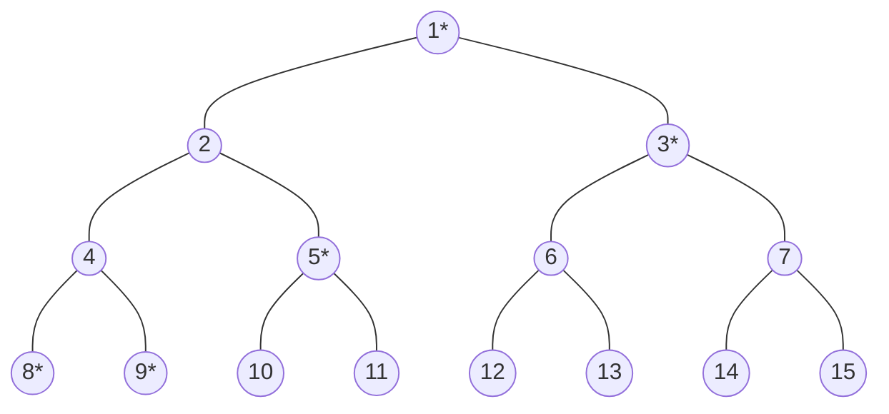
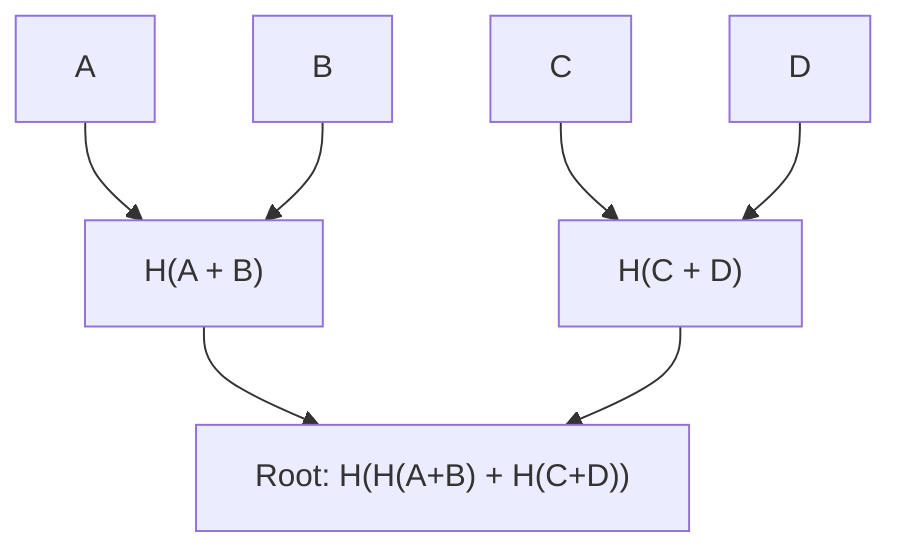

# 默克尔化与哈希树根 (Merkleization and Hash Tree Roots)

在以太坊共识机制 (Ethereum consensus mechanism) 中，所有参与节点一致且高效地对系统状态达成共识是至关重要的。[简洁序列化 (Simple Serialize, SSZ)](/wiki/CL/SSZ.md) 框架通过默克尔化 (Merkleization) 促进了这一过程，该过程将已序列化的数据转换为 Merkle 树结构。默克尔化方案的目标是确保受限环境（轻客户端 (light clients)、执行环境 (execution environments) 等）能够获取轻量级证明 (light-weight proofs)，并使用这些证明来做出重要决策。本维基页面探讨了默克尔化的错综复杂之处，以及它在以可扩展且安全的方式确保跨节点共享状态 (shared state) 方面的重要性。


## 术语与方法 (Terminology and Methods)

- **默克尔化 (Merkleization)：** 指构建 Merkle 树并导出其根的过程。
- **哈希树根 (Hash Tree Root)：** 默克尔化的一种特定应用，用于计算复杂 SSZ 容器 (container) 的根哈希。


## 对默克尔化的需求 (The Need for Merkleization)

密码学哈希函数 (Cryptographic hash functions) 通过为信标状态 (Beacon state) 生成紧凑、唯一的表示形式来提供解决方案。通过对信标链 (Beacon chain) 的序列化状态进行哈希，节点可以通过交换这些微小的哈希输出来快速且高效地对比状态。


## 默克尔化的过程 (Process of Merkleization)

默克尔化包括将已序列化的数据分解为 32 字节的块 (chunks)，这些块充当 Merkle 树的叶子节点 (leaves)。然后将这些块成对组合并进行哈希，并在整棵树上重复此过程，直到导出一个单一的哈希值——即 Merkle 根 (Merkle root)。该根哈希作为整个数据集的唯一指纹 (unique fingerprint)。关键步骤如下：

- **分块 (Chunking)：** 将序列化数据分割成 32 字节的块 (chunks)。
- **树构建 (Tree Construction)：** 将块两两配对，并对每一对进行哈希，以形成树的下一层。重复此步骤，直到只剩下一个哈希：即 Merkle 根 (Merkle root)。
- **填充 (Padding)：** 如果块的数量不是 2 的幂 (power of two)，则添加额外的零值块 (zero-value chunks) 以使树圆满，从而确保树是平衡的。


## 默克尔化的优势 (Benefits of Merkleization)

- **性能效率 (Performance Efficiency)：** 虽然该树需要进行大约两倍于原始数据量的哈希操作，但缓存机制 (caching mechanisms) 可以存储不经常变化的子树 (subtrees) 的根。这显著降低了计算开销 (computational overhead)，因为只有被更改的数据部分需要重新哈希。
- **轻客户端支持 (Light Client Support)：** Merkle 树结构支持创建默克尔证明 (Merkle proofs)——即证明特定部分状态的包含和完整性而无需整个数据集的微小数据片段。这一特性对于在资源受限的环境下运行并依赖这些证明与以太坊安全交互的轻客户端 (light clients) 而言至关重要。

如果您想了解更多关于 Merkle 树结构的信息，可以参考 [这里](https://eth2book.info/capella/part2/building_blocks/merkleization/) 和 [这里](https://github.com/protolambda/eth2-docs?tab=readme-ov-file#ssz-hash-tree-root-and-merkleization)。


## 通用索引 (Generalized Indices)

为了便于在树内进行直接引用和验证，每个节点（包括叶子节点 (leaves) 和内部节点 (internals)）都被分配了一个通用索引 (generalized index)。该索引是根据节点在树中的位置推导出来的：

```mermaid
graph TD;
    1((1 / 深度 0 (Depth 0)))
    2((2 / 深度 1 (Depth 1)))
    3((3 / 深度 1 (Depth 1)))
    4((4 / 深度 2 (Depth 2)))
    5((5 / 深度 2 (Depth 2)))
    6((6 / 深度 2 (Depth 2)))
    7((7 / 深度 2 (Depth 2)))

    1 --> 2
    1 --> 3
    2 --> 4
    2 --> 5
    3 --> 6
    3 --> 7
```

*图：Merkle 树通用索引与深度层级。*

- **根索引 (Root Index)：** 1 (深度 (depth) = 0)
- **后续层级 (Subsequent Levels)：** $2^{depth} + index$，其中 index 是该深度下节点的从零开始的索引位置。


## 使用通用索引的多重证明 (Multiproofs Using Generalized Indices)

使用通用索引的多重证明 (Multiproofs Using Generalized Indices) 提供了一种高效的方法来验证 Merkle 树内的特定元素，而无需知道整棵树的结构。在以太坊及密码学应用中，数据完整性和验证速度是重中之重，因此这一概念至关重要。让我们通过一个例子来分解该过程，以了解多重证明是如何工作的：

**理解结构**
- Merkle 树是分层结构，其中每个节点要么是叶子节点 (leaf node)（包含实际数据），要么是内部节点 (internal node)（包含其子节点哈希）。
- 通用索引以数字形式表示每个节点在树中的位置，计算公式为 $2^{depth} + index$，从根节点（索引 1）开始。

**本例的树布局 (Tree Layout)**
- 树的结构如下，其中 `*` 表示为索引 9 处的元素生成证明所需的节点：



*图：Merkle 树布局*

**确定所需节点**
- **识别所需哈希 (Identifying Required Hashes)**：要验证索引 9 处的数据，您需要索引 8、9、5、3 和 1 处的哈希。
- **成对哈希 (Pairwise Hashing)**：组合索引 8 和 9 的哈希以计算对应于其父节点 (parent node) 的哈希，该哈希应当是 `hash(4)`。
- **进一步的哈希组合 (Further Hash Combinations)**：
  - 然后将 `hash(4)` 与来自索引 5 的哈希组合，以生成其父节点的哈希 `hash(2)`。
  - 将该结果 with 来自索引 3 的哈希组合，以递推到下一层级。
- **最终验证 (Final Verification)**：将上一步的组合结果与另一分支的根（索引 3）进行哈希，以产生最终的树根 (`hash 1`)。
- **完整性检查 (Integrity Check)**：如果计算出的根与已知的正确根 (`hash 1`) 匹配，则验证索引 9 处的数据是准确的。如果数据不正确，生成的根将会有所不同，这表明存在错误或被篡改。

在共识规范中，有一些辅助函数可以用于计算多重证明和通用索引。您可以在 [这里](https://github.com/ethereum/consensus-specs/blob/dev/ssz/merkle-proofs.md#merkle-multiproofs) 找到。


## 计算哈希树根 (Calculating Hash Tree Roots)

SSZ 对象的哈希树根 (hash tree root) 是递归计算的。对于基本类型和基本类型的集合，数据会被打包成块并直接进行默克尔化 (Merkleized)。对于容器 (containers) 等复合类型，该过程涉及对每个组件的树根进行哈希。在下面的章节中，我们将通过实际工作示例来理解该过程。

### 打包与分块 (Packing and Chunking)

打包与分块 (Packing and Chunking) 通过格式化已序列化的数据并将其分割为若干分块，从而实现 SSZ 的默克尔化 (Merkleization)，然后对这些分块进行哈希以构建 Merkle 树。以下是该过程的工作原理：

**序列化数据**
- **序列化 (Serialization)** 包括使用 SSZ 序列化规则将数据结构（基本类型、列表、向量或位列表/位向量）转换为线性字节数组 (linear byte array)。
- 每个元素根据其类型进行序列化。

**填充序列化数据 (Padding the Serialization)**
- 序列化后，字节数组可能无法与 Merkle 树中使用的 32 字节块大小完全对齐。
- **填充 (Padding)** 被添加到已序列化的数据中，以将最后一个分段扩展为完整的 32 字节块。该填充由零字节 (0x00) 组成。

**分割成块 (Dividing into Chunks)**
- 填充后的已序列化数据随后被拆分为多个 32 字节的段或“块 (chunks)”。
- 这些块是默克尔化过程中使用的基本单元。

**填充为满二叉树 (Padding to Full Binary Tree)**
- 上一步得到的块数可能不是 2 的幂，而这是形成平衡二叉树（满二叉树 (full binary tree)）所必需的。
- 根据需要添加额外的零块（完全用零字节填充的块），以使总数达到最接近的 2 的幂。
- 这确保了生成的 Merkle 树是完整且平衡的，从而便于高效的密码学操作。

**应用默克尔化过程 (Applying the Merkleization Process)**
- 准备好这些块后，它们将被排列为二叉 Merkle 树的叶子节点。
- 默克尔化通过将成对的块逐层进行哈希，直到只剩下一个哈希。这个最终的哈希被称为 Merkle 根 (Merkle root)。

**实际示例 (Practical Example)：**
假设我们有一个需要进行打包和分块的整数列表：
- **整数 (Integers)**：[10, 20, 30, 40]（假设每个整数占用 8 字节）。
- **已序列化数据 (Serialized Data)**：由这些整数创建的连续字节数组。
- **填充 (Padding)**：如果总序列化长度不是 32 的倍数，则添加填充字节。
- **分块 (Chunks)**：将数据分割为 32 字节的块。
- **为树进行零填充 (Zero Padding for Tree)**：如果块的数量不是 2 的幂，则追加额外的零填充块。
- **默克尔化 (Merkleization)**：然后将这些块作为 Merkle 树中的叶子节点以计算根。


### 混入长度 (Mixing in the Length)

混入长度 (Mixing in the Length) 是默克尔化过程中的关键步骤，特别是在处理列表 (lists) 和向量 (vectors) 时。此步骤可确保最终的哈希树根能够准确反映数据的内容和结构，包括其长度。让我们分解一下该概念是如何应用的以及它为何重要。

**混入长度的目的 (Purpose of Mixing in the Length)**

混入长度用于确保内容相似但长度不同的两个不同列表或向量生成不同的哈希树根。这至关重要，因为如果不将长度并入哈希，在仅对内容进行哈希的情况下，两个列表（一个比另一个长，但在较短列表的长度范围内完全相同）将具有相同的哈希树根。这可能会导致潜在的安全漏洞 (security vulnerabilities) 以及数据验证过程中的不一致。

**混入长度的示例 (An example of Mixing in the Length)**

下面的示例说明了如果不包含列表的长度，尽管代表了两个不同长度的列表，`a_root_hash` 和 `b_root_hash` 的 Merkle 根哈希仍然保持相同。然而，当并入长度时，Merkle 根哈希 `a_mix_len_root_hash` 与 `a_root_hash` 和 `b_root_hash` 均不相同。这种区分在默克尔化中处理不同长度的列表或向量时非常关键。

```python
>>> from eth2spec.utils.ssz.ssz_typing import uint256, List
>>> from eth2spec.utils.merkle_minimal import merkleize_chunks
>>> a = List[uint256, 4](33652, 59750, 92360)
>>> a_len = a.length()
>>> a = List[uint256, 4](33652, 59750, 92360).encode_bytes()
>>> b = List[uint256, 4](33652, 59750, 92360, 0).encode_bytes()
>>> a_root_hash = merkleize_chunks([a[0:32], a[32:64], a[64:96]])
>>> b_root_hash = merkleize_chunks([b[0:32], b[32:64], b[64:96], b[96:128]])
>>> a_mix_len_root_hash = merkleize_chunks([merkleize_chunks([a[0:32], a[32:64], a[64:96]]), a_len.to_bytes(32, 'little')])
>>> print('a_root_hash = ', a_root_hash)
a_root_hash =  0x3effe553b6091b1982a6850fd2a788943363e6f879ff796057503b76802edd9d
>>> print('b_root_hash = ', b_root_hash)
b_root_hash =  0x3effe553b6091b1982a6850fd2a788943363e6f879ff796057503b76802edd9d
>>> print('a_mix_len_root_hash = ', a_mix_len_root_hash)
a_mix_len_root_hash =  0xeca15347139a6ad6e7eabfbcfd3eb3bf463af2a8194c94aef742eadfcc3f1912
>>> 
```


## SSZ 默克尔化中的摘要与展开 (Summaries and Expansions in SSZ Merkleization)

在以太坊权益证明 (Ethereum PoS) 中，摘要 (summaries) 和展开 (expansions) 的概念对于高效管理状态数据而言必不可少。摘要提供了数据结构的紧凑表示形式，封装了基本的验证信息，而无需完整的细节。另一方面，展开提供了完整的数据集，以便进行彻底的处理或在需要详细信息时使用。以下是它们的优势：

- **效率与速度 (Efficiency and Speed)**：通过采用摘要，验证者可以快速验证状态变化或验证交易，而无需处理整个数据集。这种方法显着加快了验证速度并减少了计算开销 (computational overhead)。
- **减少数据负载 (Reduced Data Load)**：摘要最大限度地减少了存储和传输的数据量，从而节省了带宽和存储资源。这对于容量受限的节点（例如依赖摘要来提高运行效率的轻客户端 (light clients)）特别有利。
- **安全增强 (Security Enhancements)**：摘要中包含的密码学哈希可确保数据的完整性，从而能够在不访问完整数据集的情况下实现安全可靠的验证过程。
- **一个示例 (An Example)**：
  - **BeaconBlock 与 BeaconBlockHeader**：`BeaconBlockHeader` 容器充当摘要，允许节点快速验证区块的完整性，而无需来自 `BeaconBlock` 容器的完整区块数据。`BeaconBlock` 是展开。
  - **提议者罚没 (Proposer Slashing)**：验证者使用区块摘要来高效地识别 and 处理冲突的区块提议 (conflicting block proposals)，从而便于做出迅速且准确的罚没决定。


## 基本类型的默克尔化 (Merkleization for Basic Types)

让我们通过一个例子来理解基本类型的默克尔化 (Merkleization)。下面是一个简单的 Merkle 树，我们将遵循默克尔化过程来获得默克尔根哈希 (merkle root hash)。



*图：示例 Merkle 树。*

在上述 Merkle 树中，树的叶子节点是四个数据块 A、B、C 和 D。

- **定义数据 (Define the Data)：**
  - 在本例中，我们处理四个基本数据项：A、B、C 和 D。它们被概念化为数字（分别为 `10`、`20`、`30` 和 `40`），并将在 Merkle 树中表示为 32 字节的块 (chunks)。
- **将数据转换为 32 字节块 (Convert Data to 32-byte Chunks)：**
  - 每个数据项使用 SSZ 类型系统中的 `uint256` 类型序列化为 32 字节格式。序列化涉及将数据转换为一致且经过填充的格式，以确保每个数据项长度为 32 字节。
- **配对并哈希叶子节点 (Pair and Hash the Leaves)：**
  - 接下来，将这些已序列化数据块成对拼接并进行哈希。
- **对结果进行哈希以形成根 (Hash the Results to Form the Root)：**
  - 最后，将上一步中的哈希（`ab` 和 `cd`）拼接并进行哈希，以形成 Merkle 根。
- **输出 Merkle 根 (Output the Merkle Root)：**
  - 然后将 Merkle 根转换为十六进制字符串以使其可读。

这个最终的 Merkle 根是数据 `A`、`B`、`C` 和 `D` 的唯一表示形式。输入数据的任何更改都会导致不同的 Merkle 根，这说明了哈希函数对输入数据的敏感性。这一特性对于确保以太坊中的数据完整性至关重要。

```python
>>> from eth2spec.utils.ssz.ssz_typing import uint256
>>> from eth2spec.utils.hash_function import hash
>>> a = uint256(10).to_bytes(length = 32, byteorder='little')
>>> b = uint256(20).to_bytes(length = 32, byteorder='little')
>>> c = uint256(30).to_bytes(length = 32, byteorder='little')
>>> d = uint256(40).to_bytes(length = 32, byteorder='little')
>>> ab = hash(a + b)
>>> cd = hash(c + d)
>>> abcd = hash(ab + cd)
>>> abcd.hex()
'1e3bd033dcaa8b7e8fa116cdd0469615b29b09642ed1cb5b4a8ea949fc7eee03'
```


## 复合类型的默克尔化 (Merkleization for Composite Types)

在本节中，我们学习如何对 `IndexedAttestation` 复合类型进行默克尔化，并使用详细示例来说明该过程。此示例提供了应用于复合、列表和向量类型的默克尔化过程的清晰实例。它还展示了摘要和展开是如何通过此过程得到有效演示的。

**定义与结构**

`IndexedAttestation` 是一个复合类型，定义如下：

```python
class IndexedAttestation(Container):
    attesting_indices: List[ValidatorIndex, MAX_VALIDATORS_PER_COMMITTEE]
    data: AttestationData
    signature: BLSSignature
```

`IndexedAttestation` 由三个主要组件组成：

  - **attesting_indices**：一个 `ValidatorIndex` 列表，表示参与见证的验证者。
  - **data**：一个 `AttestationData` 容器，保存与见证相关的各种数据。
  - **signature**：一个 `BLSSignature`，它是对见证的签名。

**默克尔化过程 (Merkleization Process)**

`IndexedAttestation` 的默克尔化涉及计算每个组件的哈希树根，并将 these 根组合在一起，形成容器的整体哈希树根。

**默克尔化 `attesting_indices`：**

- **序列化与填充 (Serialization and Padding)**：首先，对索引列表进行序列化。鉴于此列表的潜在长度（最高可达 `MAX_VALIDATORS_PER_COMMITTEE`），它通常需要填充以与哈希所需的 32 字节块对齐。
- **哈希 (Hashing)**：使用 `merkleize_chunks` 函数对已序列化数据进行哈希处理，该函数处理填充并构建 multi-layer Merkle 树。
- **混入长度 (Mixing in Length)**：由于 SSZ 中的列表长度可以变化但具有相同的类型结构，因此列表的长度也会被哈希（混入），以确保不同大小的列表具有唯一的哈希表示。

```python
attesting_indices_root = merkleize_chunks(
           [
               merkleize_chunks([a.attesting_indices.encode_bytes() + bytearray(8)], 512),
               a.attesting_indices.length().to_bytes(32, 'little')
           ])
```

**默克尔化数据 (`AttestationData`)：**
- **处理嵌套结构 (Handling Nested Structures)**：`AttestationData` 本身包含多个字段（如 `slot`、`index`、`beacon_block_root`、`source` 和 `target`），每个字段都单独进行序列化和默克尔化。
- **组合哈希 (Combining Hashes)**：然后组合这些字段的哈希以产生 `AttestationData` 的根哈希。

```python
data_root = merkleize_chunks(
    [
        a.data.slot.to_bytes(32, 'little'),
        a.data.index.to_bytes(32, 'little'),
        a.data.beacon_block_root,
        merkleize_chunks([a.data.source.epoch.to_bytes(32, 'little'), a.data.source.root]),
        merkleize_chunks([a.data.target.epoch.to_bytes(32, 'little'), a.data.target.root]),
    ])
```

**默克尔化签名 (Merkleizing signature)：**

- **简单哈希 (Simple Hashing)**：`BLSSignature` 是一个固定长度的字段，可直接哈希为三个 32 字节的块，然后对其进行默克尔化以获取签名的根。

```python
signature_root = merkleize_chunks([a.signature[0:32], a.signature[32:64], a.signature[64:96]])
```

**组合组件根 (Combining Component Roots)：**

- 然后将从各个组件计算出的根组合起来，以计算整个 `IndexedAttestation` 容器的哈希树根。
```python
indexed_attestation_root = merkleize_chunks([attesting_indices_root, data_root, signature_root])
```

**验证最终根 (Verification of Final Root)：**

- 正确实现 `IndexedAttestation` 的默克尔化可确保数据结构的任何部分的更改都会反映在最终的根哈希中，从而提供了一种稳健的机制来检测差异并确保网络中所有节点的数据一致性。

```python
assert a.hash_tree_root() == indexed_attestation_root
```

现在，您可以直观地看到 `IndexedAttestation` 默克尔化的全景图：


**IndexedAttestation 的默克尔化**

这里是完整的工作代码：

```python
from eth2spec.capella import mainnet
from eth2spec.capella.mainnet import *
from eth2spec.utils.ssz.ssz_typing import *
from eth2spec.utils.merkle_minimal import merkleize_chunks

# 初始化一个 IndexedAttestation 类型 (Initialise an IndexedAttestation type)
a = IndexedAttestation(
    attesting_indices = [33652, 59750, 92360],
    data = AttestationData(
        slot = 3080829,
        index = 9,
        beacon_block_root = '0x4f4250c05956f5c2b87129cf7372f14dd576fc152543bf7042e963196b843fe6',
        source = Checkpoint (
            epoch = 96274,
            root = '0xd24639f2e661bc1adcbe7157280776cf76670fff0fee0691f146ab827f4f1ade'
        ),
        target = Checkpoint(
            epoch = 96275,
            root = '0x9bcd31881817ddeab686f878c8619d664e8bfa4f8948707cba5bc25c8d74915d'
        )
    ),
    signature = '0xaaf504503ff15ae86723c906b4b6bac91ad728e4431aea3be2e8e3acc888d8af'
                + '5dffbbcf53b234ea8e3fde67fbb09120027335ec63cf23f0213cc439e8d1b856'
                + 'c2ddfc1a78ed3326fb9b4fe333af4ad3702159dbf9caeb1a4633b752991ac437'
)

# 容器的根是其字段根的默克尔化 (A container's root is the merkleization of the roots of its fields.)
# 这是 IndexedAttestation (This is IndexedAttestation.)
assert(a.hash_tree_root() == merkleize_chunks(
    [
        a.attesting_indices.hash_tree_root(),
        a.data.hash_tree_root(),
        a.signature.hash_tree_root()
    ]))

# 列表先被序列化，然后在默克尔化前（虚拟地）填充到其满额块数 (A list is serialised then (virtually) padded to its full number of chunks before Merkleization.)
# 最后，其实际长度通过进一步的哈希/默克尔化混入 (Finally its actual length is mixed in via a further hash/merkleization.)
assert(a.attesting_indices.hash_tree_root() ==
       merkleize_chunks(
           [
               merkleize_chunks([a.attesting_indices.encode_bytes() + bytearray(8)], 512),
               a.attesting_indices.length().to_bytes(32, 'little')
           ]))

# 容器的根是其字段根的默克尔化 (A container's root is the merkleization of the roots of its fields.)
# 这是 AttestationData (This is AttestationData.)
assert(a.data.hash_tree_root() == merkleize_chunks(
    [
        a.data.slot.hash_tree_root(),
        a.data.index.hash_tree_root(),
        a.data.beacon_block_root.hash_tree_root(),
        a.data.source.hash_tree_root(),
        a.data.target.hash_tree_root()
    ]))

# 通过“手动”计算其字段的根，来展开上述 AttestationData 的根 (Expanding the above AttestationData roots by "manually" calculating the roots of its fields.)
assert(a.data.hash_tree_root() == merkleize_chunks(
    [
        a.data.slot.to_bytes(32, 'little'),
        a.data.index.to_bytes(32, 'little'),
        a.data.beacon_block_root,
        merkleize_chunks([a.data.source.epoch.to_bytes(32, 'little'), a.data.source.root]),
        merkleize_chunks([a.data.target.epoch.to_bytes(32, 'little'), a.data.target.root]),
    ]))

# Signature 类型具有简单的默克尔化 (The Signature type has a simple Merkleization.)
assert(a.signature.hash_tree_root() ==
       merkleize_chunks([a.signature[0:32], a.signature[32:64], a.signature[64:96]]))

# 将所有部分组合在一起，我们得到了 IndexedAttestation 的“手动”默克尔化 (Putting everything together, we have a "by-hand" Merkleization of the IndexedAttestation.)
assert(a.hash_tree_root() == merkleize_chunks(
    [
        # a.attesting_indices.hash_tree_root()
        merkleize_chunks(
            [
                merkleize_chunks([a.attesting_indices.encode_bytes() + bytearray(8)], 512),
                a.attesting_indices.length().to_bytes(32, 'little')
            ]),
        # a.data.hash_tree_root()
        merkleize_chunks(
            [
                a.data.slot.to_bytes(32, 'little'),
                a.data.index.to_bytes(32, 'little'),
                a.data.beacon_block_root,
                merkleize_chunks([a.data.source.epoch.to_bytes(32, 'little'), a.data.source.root]),
                merkleize_chunks([a.data.target.epoch.to_bytes(32, 'little'), a.data.target.root]),
            ]),
        # a.signature.hash_tree_root()
        merkleize_chunks([a.signature[0:32], a.signature[32:64], a.signature[64:96]])
    ]))

print("Success!")
```

您可以按照 [运行规格说明 (running the specs)](https://eth2book.info/capella/appendices/running/) 中的说明来执行上述代码。


## 资源 (Resources)

- [Hash Tree Roots and Merkleization](https://eth2book.info/capella/part2/building_blocks/merkleization/)
- [SSZ](https://ethereum.org/en/developers/docs/data-structures-and-encoding/ssz/)
- [Protolambda on Merkleization](https://github.com/protolambda/eth2-docs?tab=readme-ov-file#ssz-hash-tree-root-and-merkleization)
- [Running the specs](https://eth2book.info/capella/appendices/running/)