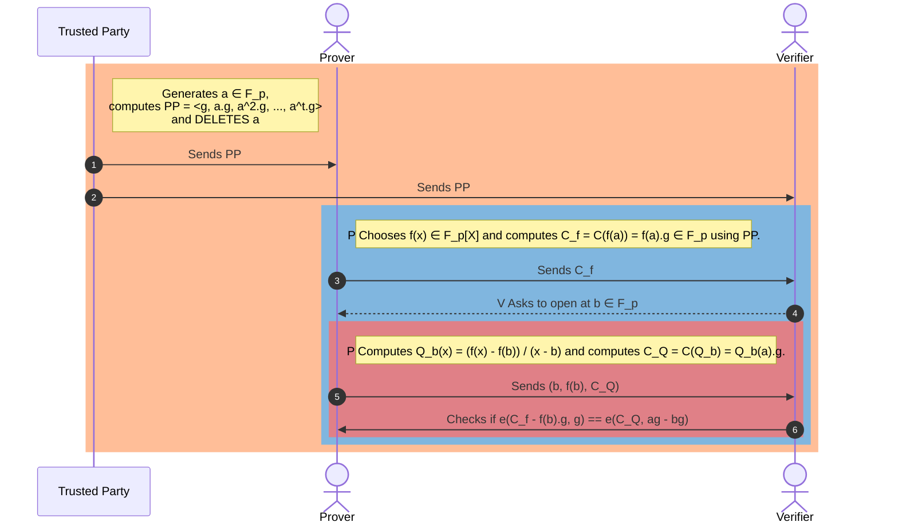

# KZG 多项式承诺方案

## [TLDR](#tldr)
KZG（Kate, Zaverucha, and Goldwasser）承诺方案就像一个密码学保险库，用于安全地锁定多项式（数学方程），以便您事后可以证明您拥有它们而不泄露其秘密。如同做出一个密封的承诺，无需打开并展示内容即可验证。使用基于椭圆曲线的高级数学，它实现了高效的、可验证的承诺，这是使区块链交易更加私密和可扩展的关键部分。该方案对以太坊的升级尤为重要，它能帮助快速安全地验证交易，同时不损害隐私。

KZG 是一种强大的密码学工具，支持以太坊生态系统和其他密码学应用中的广泛用例。其独特特性在证明方案中得到利用，以增强各种应用的可扩展性和隐私性。

## [动机](#motivation)

### [ZKSNARKs](#zksnarks)
学习多项式承诺方案（Polynomial Commitment Schemes, PCS）很重要，因为它们在创建零知识简洁非交互式知识论证（Zero-Knowledge Succinct Non-Interactive Arguments of Knowledge, ZKSNARKs）中扮演着关键角色。ZKSNARKs 是一种特殊的密码学方法，允许某人（证明者，prover）向他人（验证者，verifier）证明他们知道某个特定信息（如一个数字），而不透露该信息。这是通过结合使用 PCS 和交互式预言机证明（Interactive Oracle Proofs, IOP）来实现的。

*现代 ZKSNARK = 函数承诺方案（Functional Commitment Scheme） + 兼容的交互式预言机证明（IOP）*

### [以太坊生态系统中的用例](#use-cases-in-ethereum-ecosystem)
KZG 承诺方案已成为以太坊生态系统中的一项关键技术，特别是在 Proto-Danksharding 及其预期的 Danksharding 演进背景下。该承诺方案是以太坊内许多零知识（Zero-Knowledge, ZK）相关应用的基石，实现了对数据的高效安全验证，而不泄露底层信息。

使用 KZG（Kate, Zaverucha, and Goldberg）方案的基于以太坊的应用包括：

- **Proto-Danksharding (EIP-4844)**：此提案旨在通过使用 KZG 作为其多项式承诺方案，降低在以太坊 Layer 1 上为 rollup 发布数据的成本。它引入了一种"携带 blob 的交易"类型来容纳大量数据 blob，只有数据 blob 的承诺可以从执行层访问。

- **数据可用性采样（Data Availability Sampling）**：PCS 启用了以太坊路线图中的一项关键功能，即数据可用性采样（DAS），这允许验证者在不下载全部数据的情况下确认数据 blob 的正确性和可用性。此能力由 PCS 的独特属性促成，实现了以太坊 Danksharding 等区块链应用中的高效验证过程。

- **PSE 的 Summa，偿付能力证明协议**：以太坊基金会 PSE 小组的项目 Summa 在其偿付能力证明协议中利用 KZG 承诺。这允许中心化交易所和托管人证明其总资产超过其负债，同时保持用户余额信息的私密性。
  
- **Scroll 的 zkRollups**：Scroll 是以太坊的原生 zkEVM Layer 2，使用 KZG 生成对封装计算的多项式集合的承诺。这允许验证者请求在随机点进行评估，以验证多项式表示的计算的准确性。

- **Jellyfish**：Jellyfish 在承诺阶段使用 KZG 承诺方案生成对多项式的承诺。它利用 KZG 的同态属性来高效评估多项式在任意点的值，而不透露其系数。

- **Hyperplonk**：Hyperplonk 利用多线性 KZG 承诺，表明其在需要多线性多项式承诺的场景中的应用。

## [目标](#goal)
既然我们有了学习 PCS 的动机，让我们开始定义我们的目标，即我们要用 KZG 方案解决的具体问题是什么。

假设我们有一个函数或多项式 $f(x)$ 定义为 $f(x) = f_0 + f_1x + f_2x^2 + \\ldots + f_dx^t$。$f(x)$ 的次数为 $t$。

我们使用 KZG 方案的主要目标是：我们想向某人证明我们知道这个多项式，而不透露该多项式，即不透露多项式的系数。

在实践中，我们实际做的是证明我们知道该多项式在点 $x=a$ 处的特定取值。

我们将其写为 $f(a)$，对于某个 $x=a$。

## [前置知识](#prerequisite-knowledge)
在进一步理解 KZG 方案之前，我们需要了解一些重要概念。幸运的是，仅凭高中的数学知识，我们就可以获得对 KZG 方案的工程级理解。我们将尝试对一些高级概念及其重要属性建立直觉，而无需深入了解。这有助于我们看清 KZG 协议流程，而不会被高等数学所困。

我们需要知道：

### [模运算](#modular-arithmetic)
模拟时钟可以说明模运算——小时后在到达上限后会循环回来。对于 KZG，知道简单的算术——加、减、乘、除——以及使用取模运算就足够了，就像时钟在 12 或 24 小时后重置一样。

### [素数阶有限域](#finite-field-of-order-prime)
素数阶 $p$ 的有限域，记为 $\\mathbb F_p$，是一组特殊的数字，{ $\\{1, 2, 3, \\ldots, p-1\\}$ }，在其中你可以做所有通常的数学运算（加法、减法、乘法和除法，除以零除外）并且仍然遵循算术规则。

这个集合的"阶"是它包含的元素数量，对于素数阶 $p$ 的有限域，这个数字是一个素数。创建 $\\mathbb F_p$ 的最常见方法是取所有大于等于 $0$ 的整数并将其除以 $p$，只保留余数。这给了我们一个从 $0$ 到 $p-1$ 的数字集合，可以用于算术运算。例如，如果 $p = 5$，集合将是 {0, 1, 2, 3, 4}，你可以以遵循算术规则的方式对这些数字进行加、减、乘、除。这个集合是一个阶为 5 的有限域，我们记为 $\\mathbb F_5$，因为它恰好有 5 个元素，且这是一个素数。

当我们在有限域 $\\mathbb F_p$ 中执行模运算时，我们有一个很好的"回绕"属性，即域在达到 $(p - 1)$ 后表现得仿佛"回绕"一样。

一般来说，当我们定义一个有限域时，我们定义域的阶 $p$ 和像加法或乘法这样的算术运算。如果是加法，我们将域记为 $(\\mathbb F_p, +)$。如果是乘法，我们记为 $(\\mathbb F^*_p, +)$。`*` 告诉我们将零元素从域中排除，以便我们可以满足有限域的所有必需属性，即主要是我们可以对数进行除法并找到所有元素的逆元。如果包括零元素，我们无法找到零元素的逆元。

在下一节中，我们将学习群的生成元（generator）如何使 KZG 承诺方案作为一种高效、安全且可验证的多项式承诺方法发挥作用，使其成为密码学协议（特别是在这些属性非常重要的区块链技术中）的强大工具。

### [群](#group)
群在概念上类似于有限域，尽管有一些小变化。一个重要区别是，在群中，我们在集合上只有一种算术运算，通常是加法或乘法，而有限域同时有加法和乘法。与有限域类似，群元素必须有逆元并满足其所有要求，如下例所解释的。

表示法为 ($\\mathbb G, +)$ 表示以加法为群运算的群，($\\mathbb G^*, .)$ 表示以乘法为运算的群；`*` 告诉排除零元素以避免除以零。

在下一节中，我们用一个例子来定义群。这将有助于建立关于何时我们称一组数字为群的直觉。

### [群的生成元](#generator-of-a-group)
生成元是群内的一个元素，当通过群的运算将其与自身重复结合时，可以最终产生群内的所有其他元素。

从数学意义上讲，如果你有一个群 ($\\mathbb G, .)$  和 $\\mathbb G$ 中的一个元素 $g$，如果 $g$ 的所有幂的集合 $(g, g^2, g^3, ...)$ 对于有限群等于 $\\mathbb G$，或者对于无限群通过这种重复运算覆盖了 $\\mathbb G$ 的所有元素，那么我们说 $g$ 是 $\\mathbb G$ 的生成元。

这个概念最好用一个例子来解释。

我们将使用群元素 { ${0,1,2,3,4,5,6}$ } 的 ($\\mathbb G_7, +)$ 和群元素 { ${1,2,3,4,5,6}$ } 的 ($\\mathbb G^*_7, .)$，模 $7$，来找到群的生成元。

**加法群的生成元**

我们的集合 ($\\mathbb G_7, +)$，元素为 { ${0,1,2,3,4,5,6}$ }，是一个群，因为它满足群的定义。

- **封闭性：** 当你将集合中任意两个数字相加并取除以 $7$ 的余数时，结果仍然在集合中。
- **结合性：** 对于集合中的任意数字 $a, b$ 和 $c$，$(a+b)+c$ 始终等于 $a+(b+c)$，即使模 $7$ 也是。
- **单位元：** 数字 $0$ 充当单位元，因为当你将 $0$ 加到集合中的任意数字上时，你得到相同的数字。
- **逆元：** 集合中的每个数字都有一个逆元，使得当你将它们相加时，你回到单位元 $0$。例如，$3$ 的逆元是 $4$，因为 $3 + 4 = 7$，模 $7$ 为 $0$。

现在来看生成元。由于我们的群具有素数阶 $7$，除了单位元 $0$ 之外的任何元素都是生成元。让我们选择元素 $1$ 作为生成元，即 $g = 1$。由于我们在处理加法群，带有生成元 g 的群元素将是 $\\{0, g, 2g, 3g, 4g, 5g, 6g\\}$。

从 $1$ 开始并模 $7$ 地自加，我们得到：
- $1 + 1 = 2$（即 $2*1$ 模 7）
- $1 + 1 + 1 = 3$（即 $3*1$ 模 7）
- $1 + 1 + 1 + 1 = 4$（即 $4*1$ 模 7）
- $1 + 1 + 1 + 1 + 1 = 5$（即 $5*1$ 模 7）
- $1 + 1 + 1 + 1 + 1 + 1 = 6$（即 $6*1$ 模 7）
- $1 + 1 + 1 + 1 + 1 + 1 + 1 = 7$，模 7 为 $0$（即 $7*1$ 模 7）

如你所见，通过反复模 $7$ 加 $1$，我们可以生成群中的每个其他元素。因此，$1$ 是群 ($\\mathbb G_7, +)$ 的生成元。类似地，我们可以选择 $2, 3, 4, 5, 6$ 中的任意数字作为生成元，通过执行模 $7$ 的重复加法，我们仍会生成整个群。这是具有素数个元素的群的一个特殊属性。

**乘法群的生成元**
对于模素数 $p$ 的整数乘法群，群 ($\\mathbb G_p, .$) 由整数 { ${1, 2, 3, \\ldots, p-1}$ } 组成，其中运算是模 $p$ 乘法。我们选择一个小的素数使其简单，比如 $p = 7$。所以，模 $7$ 乘法下的群 ($\\mathbb G^*_7, .)$ 由元素 { ${1, 2, 3, 4, 5, 6}$ } 组成。记住，除以零元素被排除，这就是为什么表示法中有 `*`。

以下是群结构：

- **封闭性：** 任意两个元素的乘积，模 $7$ 约简后，仍然是集合中的元素。
- **结合性：** 对于集合中的任意数字 $a, b, c$，$(a \\cdot b) \\cdot c$ 始终等于 $a \\cdot (b \\cdot c)$，即使考虑模 $7$ 也如此。
- **单位元：** 数字 $1$ 充当单位元，因为当你将集合中的任意数字乘以 $1$ 时，你得到相同的数字。
- **逆元：** 集合中的每个数字在集合中都有一个乘法逆元，使得当你将它们相乘时，你得到单位元 $1$。例如，$3$ 的乘法逆元是 $5$，因为 $3 \\cdot 5 = 15$，模 $7$ 为 $1$。

让我们通过反复模 $7$ 乘法来验证每个元素是否确实是生成元：

- 从 $2$ 开始，每次乘以 $2$ 并取结果模 $7$：
  - $2^1 = 2$
  - $2^2 = 4$
  - $2^3 = 8 \\equiv 1 \\mod 7$
  - $2^4 = 16 \\equiv 2 \\mod 7$（在此处我们循环回开头，表明 $2$ 不是生成元）

- 让我们试试 $3$：
  - $3^1 = 3$
  - $3^2 = 9 \\equiv 2 \\mod 7$
  - $3^3 = 27 \\equiv 6 \\mod 7$
  - $3^4 = 81 \\equiv 4 \\mod 7$
  - $3^5 = 243 \\equiv 5 \\mod 7$
  - $3^6 = 729 \\equiv 1 \\mod 7$（由于我们在遍历所有元素后达到了单位元，$3$ 是生成元）

你可以验证 $5$ 也是模 $7$ 下乘法群 ($\\mathbb G^*_7, .)$ 的生成元。

### [为什么域中模运算选择素数](#why-primes-for-modulo-operations-in-fields)
选择素数作为有限域中运算的模数提供了几个好处并简化了域算术的各个方面：

1. **良好定义的除法：** 在有限域中，每个非零元素必须有乘法逆元。如果模数是素数，集合  { ${1, 2, 3, \\ldots, p-1}$ } 中的每个数字都有模 $p$ 的乘法逆元。此属性允许域内良好定义的除法运算，如果模数不是素数则不可能（除了如阶为 $p^n$ 的伽罗瓦域（Galois fields）等特殊情况，其中 $p$ 是素数）。

2. **构造简单：** 当模数是素数时，域的构造很简单。域的元素简单地为整数集合  { ${1, 2, 3, \\ldots, p-1}$ }，并且域运算（加法、减法、乘法和除法）模 $p$ 执行。对于非素数模数，构造域需要更复杂的结构，如多项式环。

3. **保证域属性：** 使用素数模数保证了所需域属性的满足。这些包括——加法与乘法单位元的存在、每个元素的加法与乘法逆元的存在，以及加法与乘法的交换律、结合律和分配律。素数模数确保满足所有这些属性。

4. **非零元素的均匀分布：** 在具有素数模数的有限域中，非零元素在乘法方面具有均匀分布。这意味着域的乘法表没有"间隙"，每个元素在乘法表的每行和每列中恰好出现一次（除了零元素的行和列）。

5. **简化算法：** 数论和密码学中的许多算法在处理素数域时更简单、更高效。例如，找到乘法逆元可以使用扩展欧几里得算法（Extended Euclidean Algorithm）高效完成，不需要非素数域所必需的复杂多项式算术。

6. **密码学安全：** 在密码学背景下，某些问题（如离散对数问题）的难度在素数域中得到了充分理解。这种难度对于密码系统的安全性至关重要。对于合数模数（特别是当因子未知时），其结构可能引入漏洞或使问题难度变得不那么可预测。
7. **计算优化：** 某些素数，如 31 或形式为 $2^n - 1$ 的素数，易于 CPU 针对乘法运算进行优化。这种优化可以带来更快的计算时间，在性能是关键因素的应用中很有益处。

使用素数作为有限域的模数简化了域算术并确保满足所有域属性，这对于理论和实际应用（特别是在密码学中）都至关重要。

### [密码学假设](#cryptographic-assumptions)
要使用 KZG 承诺方案，我们需要两个额外的假设。我们不会深入探讨为什么需要这些假设，但会给出直觉，为什么这些密码学假设是使 KZG 更安全所必需的。

**离散对数（Discrete Logarithm）**

假设我们在群 $\\mathbb G^\\*_p$ 中有一个生成元 $g$，$a$ 是有限域 $\\mathbb F^*_p$ 中的任意元素，$g^a$ 是群 $\\mathbb G^\\*_p$ 中的某个元素。离散对数假设指出，给定 $g$ 和 $g^a$，几乎不可能找到 $a$。这意味着我们无法轻易找到能给出这些元素的指数 $a$。

**对离散对数问题建立直觉**

想象你有一种特殊的锁，用数字运作（我们称这个锁为"生成元"，命名为 $g$）。这个锁是一个魔法锁和钥匙集合的一部分，全部生活在一个叫做 $\\mathbb G^\\*_p$ 的魔法土地上。现在，你选择一个秘密数字 $a$，并用它使你的锁 $g$ 转动一定次数。锁到达一个新的位置，让我们称其为 $g^a$。

如果有人路过看到你的锁在 $g^a$ 处，即使他们知道它从 $g$ 开始以及它所属的魔法土地，要弄清楚你转动了多少次（找到你的秘密数字 $a$）是极其困难的。

简而言之，离散对数问题告诉我们，即使知道秘密数字就很容易转动锁，但逆行——看到结果并试图猜测秘密数字——就像大海捞针。这个概念在密码学中至关重要，确保某些秘密极难被发现。

**强 Diffie-Hellman（Strong Diffie-Hellman）**

假设我们在群 $\\mathbb G^\\*_p$ 中有一个生成元 $g$，$a, b$ 是有限域 $\\mathbb F^*_p$ 中的任意元素，$g^a$、$g^b$ 是群 $\\mathbb G^\\*_p$ 中的一些元素。强 Diffie-Hellman 假设指出，$g^a$ 和 $g^b$ 与 $g^{ab}$ 是不可区分的。这意味着给定 $g^a$ 和 $g^b$，我们无法提取关于 $g^{ab}$ 的任何额外信息。

**对强 Diffie-Hellman 建立直觉**

想象你在一个以魔法饼干闻名的世界里，有一种秘密配料（我们的"生成元"，$g$）使它们特别。两位烘焙大师，Alice 和 Bob，各自知道使用这种配料的独特秘诀，分别由他们自己的秘方 $a$ 和 $b$ 表示。

当 Alice 使用她的秘方烘焙饼干时，她创造了一批特殊的 $g^a$。Bob 用他的秘方做同样的事，得到另一批独特的 $g^b$。

现在，假设 Alice 和 Bob 决定合作，将他们的秘方结合，创造一批超级秘密饼干 $g^{ab}$。强 Diffie-Hellman 假设说的是，即使有人尝过 Alice 和 Bob 各自的批次，他们也无法辨别他们结合的超级秘密批次会是什么味道。结合秘方的味道与不知道 Alice 和 Bob 秘方的精确组合情况下的任何其他批次都无法区分。

因此，实质上，强 Diffie-Hellman 假设告诉我们，仅仅知道各个秘密（秘方）的结果并不能帮助任何人破解组合这些秘密的结果。这是安全通信的基石，确保即使有人知道单独的片段，组合的秘密仍然安全且无法猜测。

### [配对函数](#pairing-function)
假设我们在群 $\\mathbb G^\\*_p$ 中有一个生成元 $g$，$a, b$ 是有限域 $\\mathbb F^*_p$ 中的任意元素，$g^a$、$g^b$ 是群 $\\mathbb G^\\*_p$ 中的一些元素。

配对函数是一种数学函数，它通过将不同的输入对映射到不同的值来接受两个输入并产生单个输出。它有两个重要的属性，双线性（bilinearity）和非退化性（non-degeneracy）。

- 双线性意味着我们可以以可逆的方式移动。
- 非退化性意味着，如果我们将配对函数应用于相同的元素，结果不是群的单位元。

让我们更严格地定义这些属性。

配对函数 $e:$  $\\mathbb G_1 X \\mathbb G_2 \\rightarrow \\mathbb G_T$  满足，

双线性属性： $e(g^a, g^b) = e(g, g^{ab}) = e(g^{ab}, g) = e(g,g)^{ab}$

非退化属性： $e(g,g) \\neq 1$，意味着输出不是单位元。

当 $\\mathbb G_1$ 和 $\\mathbb G_2$ 是同一个群时，我们称之为对称配对函数。否则，它是非对称配对函数。

以下是一些从实用角度学习配对函数的极好资源[^3][^8][^9]。

**对配对函数建立直觉**

想象两个独立的岛屿，每个岛屿上居住着一种独特的魔法生物。第一个岛上住着独角兽，每只都有独特的颜色，第二个岛上住着龙，每条都有独特的火焰颜色。配对函数就像一座魔法桥，将一只独角兽与一条龙连接，创造出一种独特的新魔法生物——龙角兽（Dracorn），体现了两者的特征。

以下是如何思考这个配对函数而不被技术细节困扰：

- **两个群：** 将独角兽和龙视为属于两个不同的群（在数学术语中，通常称为群 $\\mathbb G_1$ 和 $\\mathbb G_2$）。
- **配对函数：** 魔法桥充当配对函数。当独角兽和龙在这座桥上相遇时，配对函数将它们组合成龙角兽。这只龙角兽有一种特殊的光芒，独特地对应于那只特定独角兽和龙的组合（可逆）。
- **唯一结果：** 就像每对独角兽和龙都会产生一只具有独特光芒的龙角兽一样，在数学中，配对函数从每个群中取一个元素并在第三个群中产生一个唯一输出（通常记为 $\\mathbb G_T$）。

**为什么这很神奇？** 因为即使独角兽和龙有无数种可能的组合，每种组合（配对）都产生一只独特的龙角兽。这在密码学中很强大，因为它允许支撑许多安全协议的复杂操作，确保每种组合都是独特的，并可追溯到其原始配对。

**简单来说，** 想象你有两套钥匙（独角兽和龙），当你从每套中各取一把钥匙组合在一起时，你得到一把独特的锁（龙角兽）。神奇之处在于这种组合是多么可预测而又安全，允许依赖于这些唯一结果的确定性安全交互，而无需揭示原始钥匙。

配对函数通过允许这种"跨群"交互安全且可预测地发生，使得某些类型的数字签名和加密中使用的高级密码学技术成为可能。

## [承诺的属性](#properties-of-commitments)
承诺方案（commitment schemes）就像数字世界的秘密守护巫师。它们让某人可以对一条信息（我们称之为秘密消息）做出承诺，这种方式将他们与自己的承诺绑定在一起，而不让其他任何人知道秘密是什么。以下是它的工作方式：

- **做出承诺（Commitment）：** 你决定一条秘密消息并使用特殊咒语（承诺方案）创建一个魔法封印（承诺）。这个封印证明你有一个秘密，但保持秘密隐藏。
- **保密（Hiding）：** 即使你已经做出了这个封印，也没有其他人能看到你的秘密消息是什么。就像你把它锁在一个箱子里，只有你有钥匙。
- **证明诚实（Binding）：** 承诺的魔力在于你之后无法在不破坏封印的情况下更改你的秘密消息。这意味着一旦你做出了承诺，你就被绑定了。

之后，当需要揭示你的秘密时，你可以展示原始消息并证明它与你之前做的封印匹配。这让另一个人（验证者）可以检查并确认你的秘密消息与你一开始承诺的是同一个，证明你信守了诺言。

绑定和隐藏属性极其重要，它们与我们之前用离散对数和强 Diffie-Hellman 假设所做的密码学假设相关联。

但就目前而言，我们不需要深入技术细节。如果你想了解更多，这里有一个来自 Dan Boneh 教授关于 PCS 的极好资源[^4]。

有了这些背景，我们准备好解释 KZG 协议流程并理解其构造。

## [KZG 协议流程](#kzg-protocol-flow)
让我们重申我们正在用 KZG 协议解决的问题。

我们想要证明我们知道一个函数或多项式在点 $x=a$ 处的特定取值，而不透露它。

在 KZG 承诺方案中，可信第三方（Trusted Third Party）、证明者（Prover）和验证者（Verifier）的角色对其功能和安全至关重要。以下是每个角色对过程的贡献：

1. **可信第三方（设置机构）：** 此实体负责 KZG 方案的初始设置阶段。他们基于只有他们知道的秘密生成公共参数（Public Parameters, PP）或公共参考字符串（Common Reference String, CRS），这些参数将用于承诺和证明。此秘密对构造承诺至关重要，但必须在设置后被丢弃（或保持极其安全）以确保系统完整性。对此方的信任至关重要，因为如果秘密被不当处理或泄露，可能危及整个系统。此方的角色在生成 CRS 并分发给证明者和验证者后即告结束。在此之后，他们不参与协议的任何进一步步骤，无论是证明还是验证。

2. **证明者：** 证明者是想对某段数据（如多项式）做出承诺而不透露它的人。使用可信第三方提供的 CRS，证明者计算对其数据的承诺。当需要证明其数据的某些属性（如在特定点的多项式求值）时，证明者可以基于其承诺生成一个证明。此证明显示其数据具有某些属性，而不透露数据本身。

3. **验证者：** 验证者是对检查证明者关于其秘密数据的主张感兴趣的一方。验证者使用证明者提供的证明，以及来自可信第三方的 CRS，来验证证明者关于其数据的主张是否为真。这是在验证者从未直接访问秘密数据的情况下完成的。KZG 方案的优势确保，如果证明正确验证，验证者可以对证明者的主张充满信心，前提是可信第三方已正确执行其角色且秘密未被泄露。

这三方之间的交互允许在多种密码学应用（包括区块链协议和安全计算）中安全高效地验证数据属性，提供透明度和隐私之间的平衡。

以下是一个详细的序列图，解释了典型 KZG 协议的流程。

### [可信设置](#trusted-setup)
可信第三方选择一个随机元素 $a \\in \\mathbb{F}_p$。他们计算公共参数（PP）或公共参考字符串（CRS），如 < $g, {a^1}.g, {a^2}.g, \\ldots, {a^t}.g$ >。然后，他们**删除** $a$。这个删除 $a$ 的步骤对保护系统极其重要。

然后，可信方将 CRS 发送给证明者和验证者。

在实践中，这个过程被包装在多方计算（Multi-Party Computation, MPC）中，其中秘密的生成方式确保只要至少有一个参与者保持诚实，秘密的随机性就能得到保证。

可信设置是一次性过程，生成密码学协议运行所需的数据。每次运行协议时都必须使用这些数据，但一旦生成并且秘密被遗忘，就不需要仪式创建者的进一步参与。设置的可信性来自于用于生成数据的秘密在设置后被安全丢弃，确保数据在未来使用中保持安全。

现代协议通常使用 tau 的幂（powers-of-tau）设置，甚至涉及数千名参与者。最终输出的安全性取决于至少一个未公布其秘密的参与者的诚实。这种方法在实践中被认为是"足够接近去信任"，使其成为需要可信设置的密码学协议的实用解决方案。

以太坊有非常详细的可信设置仪式文档[^2]。

### [初始配置](#initial-configuration)
假设证明者有一个在有限域 $\\mathbb F_p$ 中的函数或多项式 $f(x)$ 定义为 $f(x) = f_0 + f_1x + f_2x^2 + \\ldots + f_dx^t$。$f(x)$ 的次数为 $t$，小于 $p$，即有限域 $\\mathbb F_p$ 的阶。

我们通常将其记为 $f(x) \\in \\mathbb{F}_p[x]$。

$\\mathbb{G}_p$ 是一个阶为 $p$ 的椭圆曲线群，带有生成元 $g$。

通常，素数阶 $p$ 选择使得 $p \\gt 2^k$，对于某个安全参数 k。素数 $p$ 在实践中非常大。

证明者还选择一个满足双线性和非退化属性的配对函数。配对表示如下：

$e:$  $\\mathbb G_1 X \\mathbb G_2 \\rightarrow \\mathbb G_T$

为简化这一步，证明者选择一个多项式 $f(x) \\in \\mathbb{F}_p[x]$，$f(x)$ 的次数最多为 $t$，小于 $p$，即有限域 $\\mathbb{F}_p$ 的阶。证明者还在椭圆曲线群 $\\mathbb{G}_p$ 上选择一个配对函数 $e$。

### [多项式的承诺](#commitment-of-the-polynomial)
假设，多项式 $f(x)$ 的承诺记为 $C_f$。承诺就像哈希函数。

所以 $C_f = {f(a)} \\cdot g  = {(f_0 + f_1a + f_2a^2 + \\ldots + f_ta^t)} \\cdot g$。这里 $f(a)$ 是多项式在 $x=a$ 处的取值。

尽管证明者不知道 $a$，他或她仍然可以计算多项式在 $x=a$ 处的承诺。

所以我们有，$C_f = {f(a)} \\cdot g  = {(f_0 + f_1a + f_2a^2 + \\ldots + f_ta^t)} \\cdot g$。

$C_f =  {f_0} \\cdot g + {f_1a} \\cdot g + {f_2a^2} \\cdot g + \\ldots + {f_ta^t} \\cdot g $。

$C_f =  {f_0} \\cdot g +  {f_1} \\cdot (ag) + {f_2} \\cdot ({a^2}g) + \\ldots  + {f_t} \\cdot ({a^t}g)$。

从 CRS 中，证明者知道这些值 < $g, {a^1}.g, {a^2}.g, \\ldots, {a^t}.g$ >，他或她可以计算此值作为多项式的承诺 $C_f$ 并发送给验证者。

### [多项式的打开](#opening-of-the-polynomial)
在收到来自证明者的多项式承诺 $C_f$ 后，验证者进行协议的下一步：从域 $\\mathbb F_p$ 中选择一个随机点 $b$。然后验证者请求证明者在该特定点打开或揭示多项式的值。

**"打开多项式"是什么意思？**
在 $x=b$ 处打开多项式涉及计算多项式在该点的值，数学上表示为 $f(b)$。这通过使用选择的点 $b$ 求多项式值来完成：

$f(b) = f_0 + f_1b + f_2b^2 + \\ldots + f_tb^t$。

假设此计算结果为 $f(b) = d$。证明者现在的任务是向验证者提供一个求值证明（Evaluation Proof），该证明是 $f(b)$ 确实等于 $d$ 的证据。

让我们逐步解析。

**计算求值证明：**
证明者确定商多项式（Quotient polynomial），记为 $Q(x)$，并计算对它的承诺。这一步对于创建可验证的证明至关重要。因为我们知道 $f(b)=d$，多项式 $(f(x)−d)$ 将在 $x=b$ 处有一个根，意味着 $(f(x)−d)$ 可被 $x−b$ 整除而无余数——这是小贝祖定理（Little Bezout's Theorem）[^1]的推论。

用数学术语表达，商多项式为：
$Q(x) = \\frac{f(x) - f(b)}{x - b} = \\frac{f(x) - d}{x - b}$

商多项式 $Q(x)$ 的承诺表示为 $C_Q$。使用可信设置期间提供的公共参考字符串（CRS），证明者计算 $C_Q$：
$C_Q = {Q(a)} \\cdot g$。

只要 $(f(x) - f(b))$ 能被 $(x−b)$ 整除，证明者就可以计算 $C_Q$。如果不是这种情况，$Q(x)$ 将不是一个合适的多项式，即商多项式将有分母和一些负指数，证明者无法仅使用 CRS 计算求值证明 $C_Q$。

最后，证明者将元组 < $b, f(b), C_Q$ > 发送给验证者，完成协议的此阶段。

### [验证证明](#verification-proof)
让我们首先总结验证者在协议中到目前为止拥有哪些数据。

**手中数据：** 验证者知道：
- 多项式的承诺，$C_f$。
- 打开点 $b$。
- 多项式在 $b$ 处的值，记为 $f(b)$。
- 商多项式在 $b$ 处的承诺，记为 $C_Q = {Q(a)} \\cdot g$。

**承诺方案的属性：**
- **完备性（Completeness）：** 如果一个承诺方案任何真实的事情都是可证明的，则该方案被称为**完备的**。
- **可靠性（Soundness）：** 如果任何可证明的事情都是真实的——即任何虚假的事情都不能被方案证明，则该方案被称为**可靠的**。

**商多项式与验证：**

回忆商多项式由下式给出
$Q(x) = \\frac{f(x) - f(b)}{x - b} = \\frac{f(x) - d}{x - b}$。

所以，$(x - b) \\cdot Q(x) = f(x) - d$

在 $x=a$ 处求值，得到
$(a - b) \\cdot Q(a) = f(a) - d$

两边乘以生成元 $g$，得到

$(a−b) \\cdot Q(a) \\cdot g = f(a) \\cdot g − d \\cdot g$

现在，验证者知道 $C_Q = Q(a) \\cdot g$ 和 $C_f = f(a) \\cdot g$。

所以代入，得到

$(a−b) \\cdot C_Q = C_f − d \\cdot g$

如果验证者能确认上述等式的有效性，意味着承诺已被验证。然而，由于验证者不知道 $a$ 的值，他们无法直接验证此等式的真实性。

但是，验证者可以使用如上所述的椭圆曲线配对来验证等式约束，甚至不需要知道 $a$。记住配对函数表示为：

$e:$  $\\mathbb G_1 X \\mathbb G_2 \\rightarrow \\mathbb G_T$  满足，

双线性属性： $e(g^a, g^b) = e(g, g^{ab}) = e(g^{ab}, g) = e(g,g)^{ab}$

非退化属性： $e(g,g) \\neq 1$，意味着输出不是单位元。

目前让我们使用对称配对函数，其中 $e:$  $\\mathbb G X \\mathbb G \\rightarrow \\mathbb G_T$

证明者必须检查等式 $(a−b) \\cdot C_Q = C_f − d \\cdot g$。

配对函数将群 $\\mathbb G$ 中的任意两个元素映射到 $\\mathbb G_T$ 中的一个元素。

- 像 $C_f$ 或 $C_Q$ 这样的承诺，是通过将一个数字（标量）乘以群的生成元 $g$ 获得的。
- 由于 $C_f$ 和 $C_Q$ 都是此操作的结果，它们属于群 $\\mathbb G$。
- 当我们将 $C_Q$ 乘以两个数字 $a$ 和 $b$ 的差（也是一个标量）时，结果 $(a−b) \\cdot C_Q$ 保持在群 $\\mathbb G$ 内。
- 类似地，$C_f$ 是一个群元素，$d \\cdot g$ 也是，因为它是生成元乘以一个标量。
- 从 $C_f$ 中减去 $d \\cdot g$ 得到群中的另一个元素，$C_f − d \\cdot g$。
- 所有这些结果元素都是群 $\\mathbb G$ 的一部分，可以在配对函数中使用。

因此，在两边应用配对函数，使用生成元 $g$ 作为第二个参数，等式约束变为，

$e((a−b) \\cdot C_Q, g) = e(C_f − d \\cdot g, g)$

我们仍然无法计算 $a-b$，因为没有人知道 $a$。但我们可以使用配对函数的双线性属性

$e(g^a, g^b) = e(g, g^{ab}) = e(g^{ab}, g) = e(g,g)^{ab}$

所以我们可以将等式约束重写为

$e(C_Q, (a−b) \\cdot g) = e(C_f − d \\cdot g, g)$

$e(C_Q, a \\cdot g − b \\cdot g) = e(C_f − d \\cdot g, g)$

尽管验证者不知道 $a$，他或她知道来自公共参考字符串的 $a \\cdot g$。所以现在验证者可以检查上述等式是否为真。这结束了求值证明的验证。

**多项式的完全打开 VS 部分打开**

- **完全打开过程：**
  - 证明者将完整多项式发送给验证者。
  - 使用 CRS，验证者独立计算多项式的承诺。
  - 然后验证者检查此独立计算的承诺是否与证明者最初发送的承诺匹配。

- **KZG 中的部分打开过程：**
  - 证明者可以选择部分打开，而不是打开整个多项式。
  - 这意味着证明者在单个特定点揭示多项式的值。
  - 这种部分揭示被称为求值证明。

## [实践中的 KZG](#kzg-by-hands)
现在，让我们使用一个小型有限域实际推导 KZG 协议的步骤。我们可以手工计算所有有限域运算和配对运算，感受 KZG 协议流程并验证多项式承诺。

### [实践中的 KZG - 初始配置](#kzg-by-hands---initial-configuration)
- 我们将使用有限域 $(\\mathbb F_{11}, + )$。所以，素数阶 $p = 11$。这意味着所有有限域运算模 11 进行。
- 有限域集合是 {0, 1, 2, 3, 4, 5, 6, 7, 8, 9, 10}。
- $(\\mathbb G_{11}, +)$ 中的生成元 $g = 2$。
- 这意味着群运算是模 11 的加法。
- 证明者选择多项式 $f(x) = 3x^2 + 5x + 7$。
- 那么多项式 $f(x)$ 的次数为 $t = 2$。
- 配对函数 $e(x, y) = xy$ 在 $(\\mathbb G_{11}, +)$ 上。

### [实践中的 KZG - 可信设置](#kzg-by-hands---trusted-setup)
- 可信方随机选择一个秘密数字。假设 $a = 3$ 是秘密数字。
- 他们生成公共参数或公共参考字符串（CRS）< $g, {a^1}.g, {a^2}.g, \\ldots, {a^t}.g$ >。
- 这等于 < $2, 3 \\cdot 2, {3^2} \\cdot 2$ >，应用模 11 后等于 < $2, 6, 7$ >。
- 可信方**删除**秘密数字 $a$。
- 可信方将 CRS 发送给证明者和验证者。

### [实践中的 KZG - 多项式的承诺](#kzg-by-hands---commitment-of-the-polynomial)
- 证明者计算多项式的承诺 $C_f$。
- $C_f = f(a) \\cdot g = {f_0} \\cdot g +  {f_1} \\cdot (ag) + {f_2} \\cdot ({a^2}g) $。
- $C_f = 7 \\cdot g + 5 \\cdot (ag) + 3 \\cdot a^2g = 7.2 + 5.6 + 3.7 = 65 = 10$ (mod 11)。
- 证明者将多项式的承诺 $C_f = 10$ 发送给验证者。

### [实践中的 KZG - 多项式的打开](#kzg-by-hands---opening-of-the-polynomial)
- 验证者要求证明者在 $x = 1$ 处打开多项式。
- 证明者计算商多项式 $Q(x) = \\frac{f(x) - f(1)}{x - 1} = \\frac{f(x) - d}{x - b}$。
- 计算 $f(1) = d = 3.1^2 + 5.1 + 7 = 4$ (mod $11$)。
- $Q(x) = \\frac{3x^2 + 5x + 7 - 4}{x - 1} = \\frac{3x^2 + 5x + 3}{x - 1}$。
- 除以首项：$3x^2$ 除以 $x$ 得 $3x$。我们在除号上方写上 $3x$。
- 将除数乘以商的首项：$x - 1$ 乘以 $3x$ 得 $3x^2 - 3x$。
- 从多项式中减去：从 $3x^2 + 5x$ 中减去 $3x^2 - 3x$ 得 $8x$。
- 带下下一项：带下 $+3$ 得 $8x + 3$。
- 除下一项：$8x$ 除以 $x$ 是 $8$。在除号上方 $3x$ 旁边写上 $+8$。
- 再次相乘：$x - 1$ 乘以 $8$ 得 $8x - 8$。
- 减去：从 $8x + 3$ 减去 $8x - 8$ 得 $11$。
- 应用模 $11$：我们将每项模 $11$ 约简。由于 $11$ 模 $11$ 是 $0$，余数为 $0$。
- 证明者计算 $C_Q = Q(a) \\cdot g = 3 \\cdot ag + 8 \\cdot g = 3.6 + 8.2 = 34 = 1$ (mod 11)。
- 证明者向验证者发送 < $1, f(1), C_Q$ > = < $1, 4, 1$ >。

### [实践中的 KZG - 验证](#kzg-by-hands---verification)
- 验证者必须检查配对约束 $e(C_Q, a \\cdot g − b \\cdot g) = e(C_f − d \\cdot g, g)$
- 左手边：$e(1, 6 - 1.2) = e(1, 4) = 1.4 = 4 (mod 11)$
- 右手边：$e(10 - 4.2, 2) = e(2, 2) = 2.2 = 4 (mod 11)$。
- 这证明了等式约束为真，因此求值证明得到验证。

## [KZG 的安全性](#security-of-kzg)
**在可信设置仪式中删除有毒废物**

- 想象证明者以某种方式发现了秘密数字 $a$，或者可信方将 $a$ 泄露给了恶意证明者。
- 证明者计算 $f_1(x) = 3x^2 + 5x + 7$ 在 $x=3$ 处的值。所以我们得到 $f_1(2) = 3.3^2 + 5.3 + 7 = 49 = 5 mod(11)$
- 证明者计算 $f_2(x) = 2x^2 + 7x + 10$ 在 $x=3$ 处的值。所以我们得到 $f_2(2) = 2.3^2 + 7.3 + 10 = 49 = 5 mod(11)$
- 这破坏了承诺方案的绑定属性，导致恶意证明者的欺诈性证明。
- 因此，可信方在生成 CRS 后**删除**秘密数字 $a$ 是极其重要的。

## [非对称配对函数](#asymmetric-pairing-functions)
非对称配对函数表示为：

$e:$  $\\mathbb G_1 X \\mathbb G_2 \\rightarrow \\mathbb G_T$。

设 $\\mathbb G_1$ 的生成元为 $g_1$，$\\mathbb G_2$ 的生成元为 $g_2$。

证明者必须检查等式 $(a−b) \\cdot Q(a) = f(a) − d$。

两边乘以 $g_1$，得到

$(a−b) \\cdot Q(a) \\cdot g_1 = f(a) \\cdot g_1 − d \\cdot g_1$

$(a−b) \\cdot C_Q = C_f − d \\cdot g_1$

应用非对称配对函数到两边，我们得到

$e((a−b) \\cdot C_Q, g_2) = e(C_f − d \\cdot g_1, g_2)$

使用双线性属性，我们得到

$e(C_Q, (a−b) \\cdot g_2) = e(C_f − d \\cdot g_1, g_2)$

$e(C_Q, a \\cdot g_2 − b \\cdot g_2 ) = e(C_f − d \\cdot g_1, g_2)$

这里 $a \\cdot g_2$ 将是 $\\mathbb G_2$ 的 CRS 的一部分，其他一切都可以计算或属于 $\\mathbb G_1$ 的 CRS。

## [不变的紧凑性](#unwavering-compactness)
KZG 多项式承诺方案确保承诺和求值证明都具有固定大小，无论多项式长度如何，提供一致且空间高效的密码学运算[^5][^6][^7]。

KZG 多项式承诺方案的一个关键优势是其高效的空间利用。无论我们使用的多项式有多长或复杂，对该多项式的承诺——本质上是其密码学"足迹"——始终是数学群 $\\mathbb G$ 中的一个固定大小的元素。这意味着随着多项式次数的增长，承诺的大小不会增加。同样的原理适用于求值证明，即我们提供的表明我们承诺准确的证据。无论我们是仅验证一个值还是同时验证多个值（批量模式），证明始终具有一致的大小。这种大小的一致性转化为可预测且高效的存储需求，这是密码学实际应用的重要特性。

## [KZG 批量模式](#kzg-batch-mode)
KZG 承诺也可以在多个点或多个多项式或其任意组合下打开和验证。这在实践中称为批量模式。

### [单个多项式，多个点](#single-polynomial-multiple-points)
在批量模式下，验证者请求证明者验证一组点 $B =$ { $b_1, b_2, b_3, \\ldots, b_n$ }，其中 $n < t$，$t$ 是多项式 $f(x)$ 的次数。对于这些点，证明者计算值 $f(b_1) = d_1, f(b_2) = d_2, \\ldots, f(b_n) = d_n$ 并形成集合 $D =$ { $d_1, d_2, d_3, \\ldots, d_n$ }。

然后证明者创建一个多项式 $P(x) = (x - b_1)(x - b_2)\\ldots(x - b_n)$。鉴于 $n < t$，可以将 $f(x)$ 除以 $P(x)$，得到 $f(x) = P(x)Q(x) + R(x)$，其中 $Q(x)$ 是商多项式，$R(x)$ 是余数。此除法表明 $f(x)$ 可以如此表示，并非暗示可被 $Q(x)$ 直接整除。

$Q(x)$ 的承诺（记为 $C_Q$）以及集合 $B$ 由证明者发送给验证者。可选地，证明者也可以将余数多项式 $R(x)$ 发送给验证者。然而，验证者有能力独立计算 $R(x)$，因为对于 $B$ 中的任意 $b_i$，$P(x)$ 求值为零，导致 $f(x) = R(x)$ 对于 $B$ 中的所有 $b_i$ 成立。

由于 $Q(x)$ 的次数为 $n$ 且 $R(x)$ 的次数小于 $n$，验证者知道 $R(x)$ 在 $n$ 个点的求值，可以通过拉格朗日插值法（Lagrange's Interpolation）[^10]确定 $R(x)$。

验证者还计算多项式 $P(x)$ 和 $R(x)$，以及它们的承诺 $C_P = P(a) \\cdot g$ 和 $C_R = R(a) \\cdot g$。他们继续通过确保对所有 $b_i$ 在 $B$ 中有 $f(b_i) = R(b_i)$ 以及等式 $f(x) = P(x)Q(x) + R(x)$ 成立来验证批量求值。

验证者需要验证上述约束以验证证明。然而，由于在 $x = a$ 处的秘密打开是未知的，她或他无法直接求值。但与之前一样，验证者可以使用配对来解决这个问题。

为验证，验证者检查：
- 对 $B$ 中的每个 $b_i$，$f(b_i) = R(b_i)$，将证明者提供的 $D$ 值与他们对 $R(x)$ 在每个 $b_i$ 处的计算进行比较。

- 等式 $f(x) \\cdot g - R(x) \\cdot g = P(x)Q(x) \\cdot g$ 当在 $x = a$ 处求值时，简化为 $C_f - C_R = P(a) \\cdot C_Q$，使用已知承诺和秘密 $a$。

尽管不知道 $a$，验证者利用配对来评估证明：
- 由于 $C_f$ 和 $C_R$ 都属于 $\\mathbb G$，它们的差也属于。
- 鉴于 $C_Q$ 属于 $\\mathbb G$ 且 $P(a)$ 是标量，$P(a) \\cdot C_Q$ 保持在 $\\mathbb G$ 内。

应用配对函数得到：

$e(C_f − C_R, g) = e(P(a) \\cdot C_Q, g)$

应用双线性属性，我们得到

$e(C_f - C_R, g) = e(C_Q, C_P)$

其中 $C_P = P(a) \\cdot g$。鉴于此，验证者可以确认等式的真实性，从而验证证明。

## [参考文献](#references)
[^1]: https://en.wikipedia.org/wiki/Polynomial_remainder_theorem
[^2]: https://github.com/ethereum/kzg-ceremony 
[^3]: https://www.rareskills.io/post/bilinear-pairing
[^4]: https://www.youtube.com/watch?v=WyT5KkKBJUw
[^5]: https://www.iacr.org/archive/asiacrypt2010/6477178/6477178.pdf 
[^6]: https://dankradfeist.de/ethereum/2020/06/16/kate-polynomial-commitments.html 
[^7]: https://www.youtube.com/watch?v=uGeIDNEwHjs&t=520s
[^8]: https://www.youtube.com/watch?v=8WDOpzxpnTE 
[^9]: https://vitalik.eth.limo/general/2017/01/14/exploring_ecp.html
[^10]: https://en.wikipedia.org/wiki/Lagrange_polynomial 
