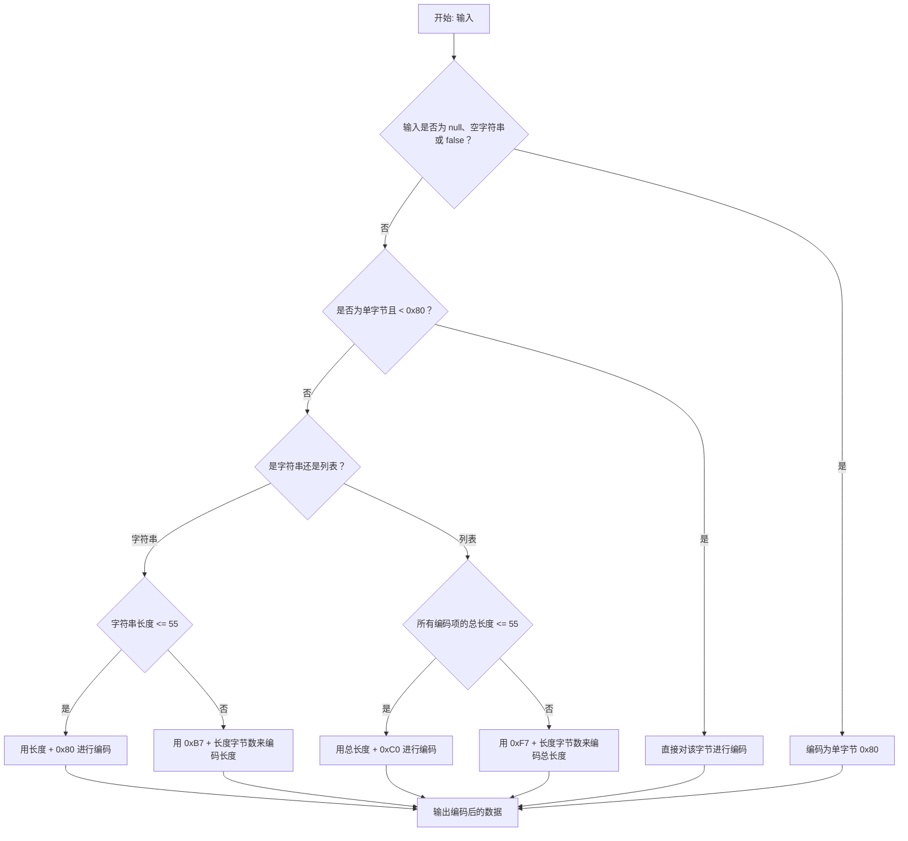
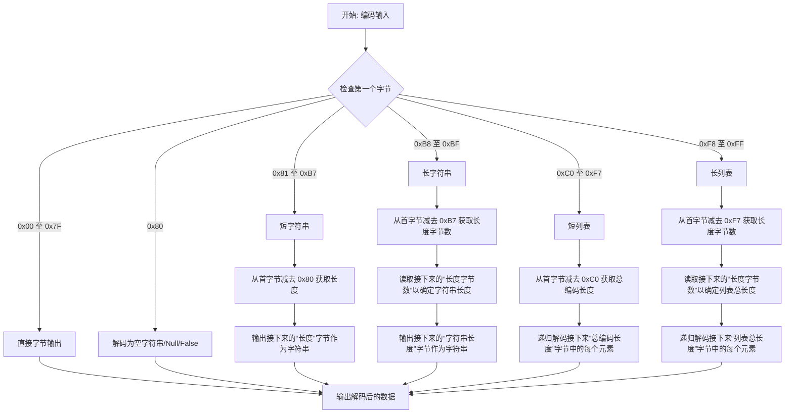

# 递归长度前缀 (Recursive-Length Prefix, RLP) 序列化

递归长度前缀 (Recursive-Length Prefix, RLP) 是执行层 (Execution Layer, EL) 内部用于编码和解析数据的核心序列化协议 (Serialization Protocol)。它旨在序列化数据并产生一个可由所有客户端软件读取的结构。它被广泛应用于从交易数据 (Transaction Data) 到整个区块链状态 (Blockchain State) 的所有内容。本维基页面探讨了 RLP 的内部机制、其编码/解码规则、可用工具以及它在以太坊功能中所扮演的角色。

## 以太坊中的数据序列化 (Data Serialization in Ethereum)

数据序列化 (Data Serialization) 是将数据结构或对象转换为字节流 (Byte Stream) 以便进行存储、传输或后续重建的过程。在像以太坊这样的分布式系统 (Distributed Systems) 中，序列化对于在网络节点 (Network Nodes) 之间可靠且高效地传输数据至关重要。使用不同语言编写的客户端 (Clients) 需要能够以相同的方式处理数据。与其他节点通信或由客户端导出的数据需要具有标准格式。虽然存在 JSON、XML 或 Protobuf 等通用序列化格式，但以太坊因其简单性以及在编码嵌套字节数组 (Nested Arrays of Bytes) 方面的高效性而使用自己的协议。

> 以太坊实际上利用了 2 种格式：RLP 和极简序列化 (Simple Serialize, SSZ)，后者是共识层 (Consensus Layer, CL) 使用的更现代的标准。

## RLP 算法的工作原理 (How RLP Algorithm works)

**RLP 编码算法 (RLP Encoding Algorithm)**

以下是描述 RLP 编码算法如何工作的流程图 (Flow Chart)。

*请注意，在某些 RLP 工具中，某些客户端可能会在流程中添加额外的条件分支。这些额外分支不是标准规范的一部分，但它们对客户端进行正确的数据序列化非常有用，例如 geth 客户端节点与 Nethermind 客户端节点之间的通信。*

_图：RLP 编码流程 (RLP Encoding Flow)_

**RLP 解码算法 (RLP Decoding Algorithm)**

以下是描述 RLP 解码算法如何工作的流程图。

_图：RLP 解码流程 (RLP Decoding Flow)_

## RLP 编码规则 (RLP Encoding Rules)

理解 RLP 编码是如何导出的，需要掌握根据数据的类型和大小应用的具体规则。让我们通过一个例子来探索这些规则，以演示如何对不同类型的数据进行编码。

如果您不熟悉如何将字符串转换为十六进制，可以参考此 [ASCII 字符表 (ASCII chart)](https://www.asciitable.com/)。

### 通过示例详细解释 RLP 编码规则

递归长度前缀 (Recursive-Length Prefix, RLP) 是以太坊中用于将结构化数据编码为字节序列的一种基础数据序列化技术。理解 RLP 编码是如何导出的，需要掌握根据数据的类型和大小应用的具体规则。让我们通过一个例子逐步探索这些规则，以演示如何对不同类型的数据进行编码。

**单字节编码 (Single Byte Encoding)**
  - **条件**：如果输入是单个字节，且其值在 `0x00` 到 `0x7F`（含）之间。
  - **编码**：该字节被直接编码，保持不变。
  - **示例**：直接编码字节 `0x2a` 得到 `0x2a`。

**短字符串编码 (Short String Encoding)（1-55 字节）**
  - **条件**：如果字符串（或字节数组）的长度在 1 到 55 字节之间。
  - **编码**：输出为字符串的长度加上 `0x80`，后跟字符串本身。
  - **示例**：编码字符串 "dog" (`0x64, 0x6f, 0x67`) 会得到 `0x83, 0x64, 0x6f, 0x67`。这里，`0x83` 是 `0x80 + 3`（"dog" 的长度）。

**长字符串编码 (Long String Encoding)（超过 55 字节）**
  - **条件**：如果字符串长度超过 55 字节。
  - **编码**：字符串的长度被编码为大端格式 (Big-Endian) 的字节数组，并加前缀 `0xb7` 加上此长度数组的长度。
  - **示例**：对于长度为 56 的字符串，长度 `0x38` 被编码，前缀为 `0xb8` (`0xb7 + 1`)。得到的编码以 `0xb8, 0x38` 开头，后跟字符串的字节。

**短列表编码 (Short List Encoding)（总有效载荷 1-55 字节）**
  - **条件**：如果列表各项编码后的总有效载荷 (Payload) 长度在 1 到 55 字节之间。
  - **编码**：列表前缀为 `0xc0` 加上编码项的总长度。
  - **示例**：对于列表 `["cat", "dog"]`，每个项首先被编码为 `0x83, 0x63, 0x61, 0x74` 和 `0x83, 0x64, 0x6f, 0x67`。总长度为 8，因此前缀为 `0xc8` (`0xc0` + 8 = `0xc8`)。整个编码为 `0xc8, 0x83, 0x63, 0x61, 0x74, 0x83, 0x64, 0x6f, 0x67`。

**长列表编码 (Long List Encoding)（总有效载荷超过 55 字节）**
  - **条件**：如果列表各项编码后的总有效载荷 (Payload) 长度超过 55 字节。
  - **编码**：类似于长字符串，有效载荷的长度被编码为大端格式，并加前缀 `0xf7` 加上此长度数组的长度。
  - **示例**：对于超过 55 字节的列表 `["apple", "bread", ...]`，假设有效载荷长度为 57。长度 `0x39` 被编码，前导为 `0xf8` (`0xf7 + 1`)，后跟编码后的列表项。

**Null、空字符串、空列表和 False**
  - 空字符串、Null 和 False 的规则：编码为单字节 `0x80`。
  - 空列表的规则：编码为 `0xc0`。
  - 示例：
    - 编码空字符串、null 值或 false（` `, `null`, `false`），结果为 `0x80`。
    - 编码空列表 `[]`，结果为 `0xc0`。

## RLP 解码规则 (RLP Decoding Rules)

RLP 解码过程基于编码数据的结构和特性：

**确定数据类型 (Determine Data Type)**：
  - 编码数据的第一个字节（前缀）决定了后续数据的类型和长度。该字节在指导解码过程中至关重要。
**解码单字节 (Decoding Single Bytes)**：
  - 如果前缀字节在 `0x00` 到 `0x7F` 范围内，该字节本身就代表解码后的数据。这种情况非常直接，因为字节是直接编码的。
**解码字符串和列表 (Decoding Strings and Lists)**：
  - 解码字符串和列表的复杂性源于它们具有不同的长度并且可能包含嵌套结构。
**短字符串 (Short Strings)（0x80 到 0xB7）**：
  - 如果前缀字节在 `0x80` 和 `0xB7` 之间，它表示一个字符串，其长度可以通过从前缀中减去 `0x80` 直接确定。接下来的等长字节即为字符串。
**长字符串 (Long Strings)（0xB8 到 0xBF）**：
  - 对于较长的字符串，如果前缀字节在 `0xB8` 和 `0xBF` 之间，则长度字节的个数通过从前缀中减去 `0xB7` 来确定。随后的字节代表字符串的实际长度，再后面的字节代表字符串本身。
**短列表 (Short Lists)（0xC0 到 0xF7）**：
  - 类似于短字符串，在 `0xC0` 和 `0xF7` 之间的前缀表示一个列表。列表编码数据的长度可以通过从前缀中减去 `0xC0` 来确定。接下来的字节必须递归地解码为单独的 RLP 编码项。
**长列表 (Long Lists)（0xF8 到 0xFF）**：
  - 对于较长的列表，在 `0xF8` 和 `0xFF` 之间的前缀表示接下来的几个字节（通过从前缀中减去 `0xF7` 确定）将指出列表编码数据的长度。这些长度字节之后的数据随后会被递归解码为 RLP 项。

**`[0xc8, 0x83, 0x63, 0x61, 0x74, 0x83, 0x64, 0x6f, 0x67]` 的 RLP 解码示例**

- **识别前缀 (Identify the Prefix)**
  - 序列以字节 `0xc8` 开始。在 RLP 中，列表的长度前缀从 `0xc0` 开始。`0xc8` 和 `0xc0` 之间的差值给出了列表内容的长度。
    - `0xc8 - 0xc0 = 8`
  - 这告诉我们接下来的 8 个字节是列表的一部分。
- **解码列表内容 (Decode the List Content)**
  - 在本例中，列表内容为 `[0x83, 0x63, 0x61, 0x74, 0x83, 0x64, 0x6f, 0x67]`。
  - 我们将逐字节解码此内容以提取单个项。
- **解码第一项 (Decode the First Item)**
  - 列表内容的首个字节是 `0x83`。在 RLP 中，对于长度在 1 到 55 字节之间的字符串，长度前缀从 `0x80` 开始。因此：
    - `0x83 - 0x80 = 3`
  - 这告诉我们第一个字符串的长度为 `3` 字节。
  - 接下来的三个字节是 `0x63, 0x61, 0x74`，对应于 "cat" 的 ASCII 值。
  - 我们现在已经解码了第一项："cat"。
- **解码第二项 (Decode the Second Item)**
  - 解码第一项后，序列中的下一个字节是另一个 `0x83`。
  - 遵循与之前相同的规则：
    - `0x83 - 0x80 = 3`
  - 这表明下一个字符串的长度也是 3 字节。
  - 随后的三个字节是 `0x64, 0x6f, 0x67`，对应于 "dog"。
  - 我们现在已经解码了第二项："dog"。
- 解码输出为 `["cat", "dog"]`。

## 以太坊对 RLP 的需求 (The Need for RLP in Ethereum)

> RLP 旨在成为一种极简的序列化格式；其唯一目的是存储嵌套的字节数组。与 protobuf、BSON 和其他现有解决方案不同，RLP 不尝试定义任何具体的数据类型，如布尔值、浮点数、双精度浮点数或整数；相反，它纯粹是为了以嵌套数组的形式存储结构，并将数组的具体含义留给协议来决定。
> -- 以太坊设计原理 (Ethereum's design rationale)

RLP 伴随以太坊诞生，并量身定制以满足其特定需求：
- 极简设计 (Minimalistic Design)：它纯粹专注于存储结构，而不强加数据类型定义。
- 一致性 (Consistency)：它保证了不同实现之间字节级完美的一致性 (Byte-perfect Consistency)，这对于区块链操作所需的确定性 (Deterministic) 至关重要。

## RLP 工具 (RLP Tools)

以太坊中有许多可用于 RLP 实现的库。以下是其中一些工具：
- [Geth RLP](https://github.com/ethereum/go-ethereum/tree/master/rlp)
- [RLP Dump](https://github.com/ethereum/go-ethereum/tree/master/cmd/rlpdump)
- [适用于 Node.js 和浏览器的 RLP](https://github.com/ethereumjs/ethereumjs-monorepo/tree/master/packages/rlp)
- [Python RLP 序列化库](https://github.com/ethereum/pyrlp)
- [适用于 Rust 的 RLP](https://docs.rs/ethereum-rlp/latest/rlp/)
- [Nethermind RLP 序列化](https://github.com/NethermindEth/nethermind/tree/master/src/Nethermind/Nethermind.Serialization.Rlp)

## 资源 (Resources)

- [以太坊黄皮书 (Ethereum Yellow Paper)](https://ethereum.github.io/yellowpaper/paper.pdf)
- [以太坊 RLP 文档 (Ethereum RLP documentation)](https://ethereum.org/vi/developers/docs/data-structures-and-encoding/rlp/)
- [《以太坊中 RLP 编码的全面指南》- Mark Odayan 著 (A Comprehensive Guide to RLP Encoding in Ethereum by Mark Odayan)](https://medium.com/@markodayansa/a-comprehensive-guide-to-rlp-encoding-in-ethereum-6bd75c126de0)
- [Elixir 中的以太坊 RLP 序列化 (Ethereum's RLP serialization in Elixir)](https://www.badykov.com/elixir/rlp/)
- [《探秘以太坊第三部分（RLP 解码）》 (Ethereum Under The Hood Part 3 (RLP Decoding))](https://medium.com/coinmonks/ethereum-under-the-hood-part-3-rlp-decoding-df236dc13e58)
- [ACL2 中的以太坊递归长度前缀 (Ethereum's Recursive Length Prefix in ACL2)](https://arxiv.org/abs/2009.13769)
