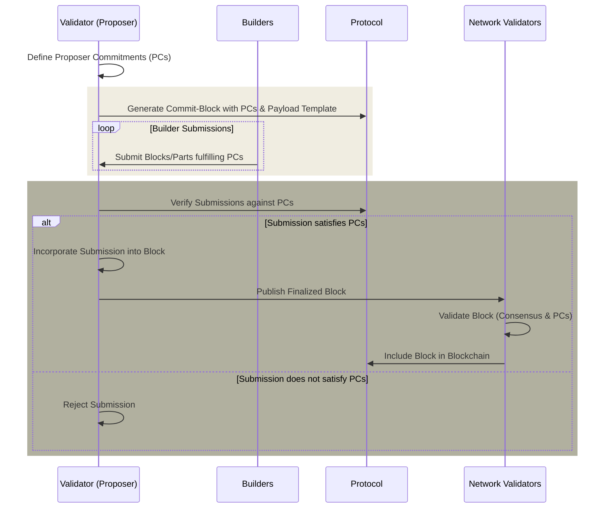

# 协议强制提议者承诺 (Protocol-Enforced Proposer Commitments, PEPC)

协议强制提议者承诺 (Protocol-Enforced Proposer Commitments, PEPC) 是 [提议者-构建者分离 (Proposer-Builder Separation, PBS)](/docs/wiki/research/PBS/pbs.md) 的一种概念性扩展和泛化，它为提议者 (proposers)（验证者 (validators)）承诺区块构建提供了一种更灵活、更安全的方法。与现有的 [MEV-Boost](/docs/wiki/research/PBS/mev-boost.md) 机制不同（该机制依赖于提议者与构建者/中继之间的协议外协定），PEPC 旨在将这些承诺封装在以太坊协议本身中，为这些交互提供无信任 (trustless) 且无许可 (permissionless) 的基础设施[^1][^2]。

## PEPC 的益处及相关权衡 (Benefits and Related Trade-offs of PEPC)

- **增强的安全性和无信任性 (Enhanced Security and Trustlessness)：**
  - **益处 (Benefit)**：在协议内强制执行协定，减少对外部第三方的依赖，并最小化操纵的可能性。
  - **权衡（安全性 vs. 开销）(Trade-off)**：虽然安全性得到了增强，但这种内部化增加了计算需求，可能影响网络效率和可扩展性。

- **区块构建的灵活性增加 (Increased Flexibility in Block Construction)：**
  - **益处 (Benefit)**：允许提议者和构建者之间订立可编程合约 (programmable contracts)，支持多样化的区块构建场景。
  - **权衡（灵活性 vs. 复杂度）(Trade-off)**：这种灵活性引入了复杂性，可能会将参与限制在技术先进的用户，并抬高准入门槛。

- **MEV 机会的去中心化 (Decentralization of MEV Opportunities)：**
  - **益处 (Benefit)**：促进 MEV 在验证者之间的更公平分配。
  - **权衡（MEV 去中心化 vs. 中心化风险）(Trade-off)**：虽然旨在去中心化 MEV，但所需的复杂性可能仍然有利于规模更大、更专业的运营商。

- **可扩展性和效率的改进 (Scalability and Efficiency Improvements)：**
  - **益处 (Benefit)**：简化区块构建和验证过程，增强整体网络的可扩展性。
  - **权衡（长期可扩展性 vs. 短期性能）(Trade-off)**：在验证者适应新复杂性的过程中，最初可能会对网络性能产生影响。

- **经济创新 (Economic Innovation)：**
  - **益处 (Benefit)**：通过允许新型交易和区块构建，培育新颖的经济模型。
  - **权衡（经济创新 vs. 稳定性）(Trade-off)**：引入可能破坏既有收入结构并影响稳定性的经济模型。

## PEPC 如何工作？ (How would PEPC work?)

_图 – PEPC 流程 (PEPC flow)。_

PEPC 的运行包含几个关键组件和步骤，它们共同确保了其在以太坊生态系统中的无缝集成。以下是 PEPC 在实践中如何运行的概述：

**步骤 1：承诺阶段 (Commit Phase)**

- **提案创建 (Proposal Creation)**：验证者（提议者）通过定义一组承诺来准备创建区块。这些承诺代表了指定如何构建区块的协议或合约。这可能包括（例如）承诺包含某些交易、不包含其他交易，或者以特定方式组织区块。

- **承诺区块生成 (Commit Block Generation)**：提议者生成一个承诺区块 (commit-block)，其中除了包含见证等常规共识数据外，还包含这些提议者承诺 (Proposer Commitments, PCs)。该承诺区块尚未包含完整的执行负载 (execution payload)，但指定了负载模板 (payload template) 或基于承诺的预期内容的占位符。

**步骤 2：揭示阶段 (Reveal Phase)**

- **构建者提交 (Builder Submissions)**：作为对提议者发布的承诺的回应，构建者提交其提议的区块或区块部分，以履行这些承诺。这可能涉及提交特定的交易、执行负载或其他由初始承诺定义的区块组件。

- **承诺验证 (Commitment Verification)**：在收到构建者的提交后，提议者或协议本身会验证这些提交是否满足提议者承诺。此验证过程确保只有符合预定义标准的区块或区块部分才会被考虑纳入。

- **区块最终确定 (Block Finalization)**：一旦构建者的提交被验证为履行了提议者承诺，提议者就会通过将构建者的提交并入承诺阶段定义的负载模板或占位符中来最终确定区块。最终确定的区块随后会被发布到网络中。

**步骤 3：验证与包含 (Validation and Inclusion)**

- **网络验证 (Network Validation)**：网络上的其他验证者验证最终确定的区块，确保其遵守以太坊协议规则和特定的提议者承诺。此步骤可能涉及标准的区块验证程序，以及针对承诺履行情况的额外检查。

- **区块包含 (Block Inclusion)**：验证成功后，区块将被包含在区块链中。这种包含取决于区块既满足通常的以太坊共识规则，又满足在承诺阶段概述的特定提议者承诺。

**PEPC 的灵活性和安全性机制 (PEPC's Mechanisms for Flexibility and Security)**

- **可编程合约 (Programmable Contracts)**：PEPC 允许提议者与构建者订立各种可编程合约，范围从全区块到部分区块，甚至是未来的时隙拍卖。这种多功能性支持定制化的区块构建方法，从而最大化效率并优化区块空间使用。

- **原子性和无信任性 (Atomicity and Trustlessness)**：承诺-揭示方案 (commit-reveal scheme) 确保了要么承诺的所有部分都得到履行，要么区块被拒绝，从而保持原子性 (atomicity)。该过程由协议强制执行，减少了对外部信任的依赖，并最小化了操纵风险。

- **动态区块构建 (Dynamic Block Construction)**：通过启用动态的区块构建方法，PEPC 允许根据网络条件、用户需求以及最大可提取价值 (MEV) 提取等新兴机会实时调整区块内容。

## PEPC 使用场景 (PEPC Use Cases)

PEPC 提供了几个引人注目的使用场景[^2]：

**全区块拍卖 (Full-Block Auctions)**

- 验证者将构建整个区块的权利拍卖给构建者。这镜像了当前的 MEV-Boost 机制，但通过将拍卖嵌入到以太坊协议中，增强了安全性和无信任性。
- 确保区块构建过程的透明和公平，潜在地带来更具竞争力的竞价和对验证者更好的奖励。

**部分区块拍卖 (Partial Block Auctions)**

- 验证者可以将区块空间的一部分拍卖给不同的构建者，从而允许多个参与方为单个区块的构建做出贡献。
- 提高区块空间利用效率，鼓励交易包含的多样性，减轻区块构建中潜在的中心化问题。

**并行区块拍卖 (Parallel Block Auctions)**

- 类似于部分区块拍卖，但拍卖专注于区块空间的独立、并行组件，从而支持更细粒度的区块构建方法。
- 为验证者提供对区块内容和结构的更多控制权，潜在地优化了 Gas 使用、交易优先级和 MEV 提取等各种因素。

**时隙 vs. 区块拍卖 (Slot vs. Block Auctions)**

- 验证者提前承诺使用特定构建者的区块或区块部分，区分对“时隙”的承诺（由谁来构建）与对“区块”的承诺（将构建什么）。
- 增强了验证者和构建者的可预测性和规划能力，潜在地带来更具策略性的区块构建和 MEV 提取机会。

**未来时隙拍卖 (Future Slot Auctions)**

- 验证者拍卖未来时隙的区块构建权，本质上是为区块空间创建期货合约。
- 为市场参与者提供更多投机和套期保值的工具，潜在地稳定验证者的收入，并为构建者提供先进的规划能力。

**包含列表 (Inclusion Lists)**

- 验证者承诺在他们的区块中包含特定交易，无论是通过直接列出，还是通过遵守第三方提供的列表。
- 提高交易包含的透明度和可预测性，潜在地减少 Gas 价格波动并改善用户体验。

**动态区块配置 (Dynamic Block Configuration)**

- 验证者使用 PEPC 动态调整区块配置，以应对实时的网络条件和需求。
- 增强网络响应能力和效率，潜在地提高吞吐量并在高峰期减少拥堵。

**抗审查性 (Censorship Resistance)**

- 通过承诺包含某些交易或遵循特定的包含模式，验证者可以提供防范审查的保证。
- 加强以太坊的抗审查属性，确保网络对所有用户保持开放和可达。

**协议升级和特性测试 (Protocol Upgrades and Feature Testing)**

- PEPC 可用于在真实环境中测试新的协议特性或升级，而不会冒险危及网络稳定性，这可以通过承诺包含利用这些特性的交易来实现。
- 为以太坊协议内的创新和演变提供了一条更安全的途径，允许更多实验性的开发方法。

## 与 EigenLayer 的关系和区别 (Relationship and Differences to EigenLayer)

PEPC 和 EigenLayer 具有互补关系，各自解决以太坊可扩展性、安全性和去中心化方面的不同维度，同时也在提高网络效率和灵活性方面共享共同的目标[^3]。

- **安全分层 (Security Layering)**：EigenLayer 引入了一种将以太坊安全性扩展到额外层和服务的机制。相反，PEPC 专注于在以太坊协议本身中嵌入更复杂和灵活的承诺机制。虽然 EigenLayer 试图从外部扩展以太坊的安全模型，但 PEPC 旨在增强以太坊主链的内部运作，特别是在区块提案和交易包含过程方面。

- **验证者承诺 (Validator Commitments)**：PEPC 和 EigenLayer 都涉及验证者做出某些承诺，但这些承诺的性质和范围有所不同。在 EigenLayer 中，验证者可能会通过再质押 (restaking) 他们的 ETH 来承诺保护额外的层或服务。在 PEPC 中，验证者会对区块的构建做出承诺，例如包含某些交易或遵守特定的区块构建标准。

- **MEV 与交易包含 (MEV and Transaction Inclusion)**：这两个项目都间接地解决了与 MEV 和交易包含公平性相关的问题。EigenLayer 可以促进减轻 MEV 负面影响或通过额外共识层改进交易包含的解决方案。PEPC 通过允许更动态和可编程的提议者-构建者协议，可能会带来更公平的 MEV 机会分配和更透明的交易包含机制。

**EigenLayer 中安全的经济边界 (Economic Bound to Security in EigenLayer)**

原则上，如果受 EigenLayer 保护的活动或资产的质押价值超过了以太坊中质押 ETH 的价值，经济激励可能存在失调风险，从而引发对所提供安全性充足性的担忧[^2]。

在更广泛的以太坊生态系统背景下，PEPC 和 EigenLayer 可以被视为互补的，EigenLayer 将以太坊的安全性和实用性扩展到了其核心协议之外，而 PEPC 则增强了核心协议本身的效率和灵活性。实现这两者可能会带来这样一种情景：以太坊不仅在处理交易和区块构建时变得更高效和适应性更强，而且还能将其安全保证扩展到更广泛的去中心化应用和服务中。

## 资源 (Resources)
- [解耦 PBS：迈向协议强制提议者承诺 (PEPC) (Unbundling PBS: Towards protocol-enforced proposer commitments (PEPC))](https://ethresear.ch/t/unbundling-pbs-towards-protocol-enforced-proposer-commitments-pepc/13879/1)
- [PEPC 常见问题解答 (PEPC FAQ)](https://efdn.notion.site/PEPC-FAQ-0787ba2f77e14efba771ff2d903d67e4)
- [EigenLayer 协议 (EigenLayer protocol)](https://docs.eigenlayer.xyz/eigenlayer/overview/whitepaper)
- [关于提议者-构建者分离 (PBS) 的笔记 (Notes on Proposer-Builder Separation (PBS))](https://barnabe.substack.com/p/pbs)
- [Mike Neuder - 迈向封装式提议者-构建者分离 (Towards Enshrined Proposer-Builder Separation)](https://www.youtube.com/watch?v=Ub8V7lILb_Q)
- [PBS 不完全指南 - Mike Neuder 和 Chris Hager (An Incomplete Guide to PBS - with Mike Neuder and Chris Hager)](https://www.youtube.com/watch?v=mEbK9AX7X7o)
- [ePBS – 无穷自助餐 (ePBS – the infinite buffet)](https://notes.ethereum.org/@mikeneuder/infinite-buffet)

## 参考文献 (References)
[^1]: https://ethresear.ch/t/unbundling-pbs-towards-protocol-enforced-proposer-commitments-pepc/13879/1
[^2]: https://efdn.notion.site/PEPC-FAQ-0787ba2f77e14efba771ff2d903d67e4
[^3]: https://docs.eigenlayer.xyz/eigenlayer/overview/whitepaper
