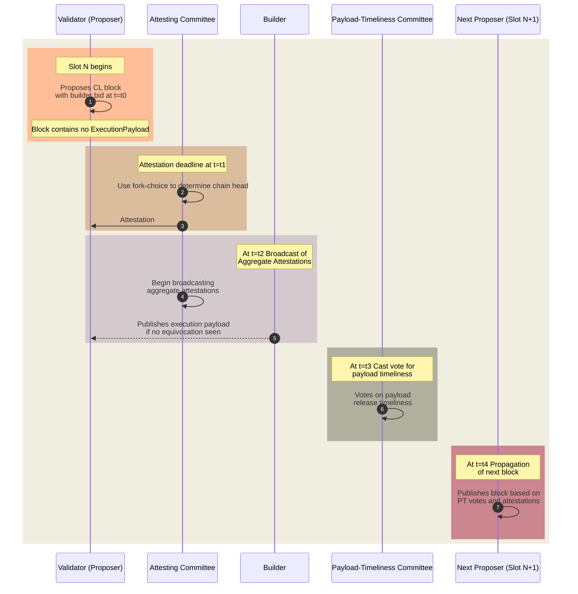

# 负载时效性委员会 (Payload-Timeliness Committee, PTC) (以支持 ePBS)

负载时效性委员会 (Payload-Timeliness Committee, PTC) 提案是一种将 提议者-构建者分离 (Proposer-Builder Separation, PBS) 封装入以太坊协议 (ePBS) 的设计。它代表了确定 区块有效性 (block validity) 机制的演变，并包含了一个 验证者 (validators) 子集，他们对区块 负载 (payload) 的时效性进行投票 [^1][^2][^3]。

## PTC 概述 (PTC Overview)

_图 – 负载时效性委员会流程 (Payload-Timeliness Committee Flow)。_

该提案引入了一种新的 时隙结构 (slot anatomy)，其中包含一个额外的阶段，用于传播 负载时效性投票 (Payload-Timeliness votes, PT votes)。它的目标是优化提议者和构建者在区块创建过程中的角色，确保 提议者 (proposers) 保持轻量化和非专业化实体，以实现 去中心化 (decentralization) 的目标，同时使专业的 构建者 (builders) 能够高效地创建高价值区块。

1. **区块传播 (Block Propagation)**：一个被选中的 权益证明 (Proof-of-Stake, PoS) 验证者 (validator)，即 提议者 (proposer)，在其时隙开始时 (`t=t0`) 广播一个 共识层区块 (Consensus Layer block, CL block)。该区块包含构建者的竞价 (builder bid)，但不包含实际的负载 (payload)（即交易 (transactions)）。
2. **见证聚合 (Attestation Aggregation)**：在见证截止时间 (`t=t1`)，被称为 见证者 (attestors) 的验证者使用其本地的 分叉选择规则 (fork-choice rule) 对感知到的 链头 (chain head) 进行投票。

3. **聚合与负载传播 (Aggregation & Payload Propagation)**：构建者 (builder) 看到共识层区块并发布 执行负载 (execution payload)。验证者委员会 (validator committee) 开始广播 聚合见证 (aggregated attestations)。

4. **负载时效性投票传播 (Payload-Timeliness Vote Propagation)**：在 (`t=t3`)，负载时效性委员会 (Payload-Timeliness Committee) 对负载是否按时释放投出他们的选票。

5. **下一个区块传播 (Next Block Propagation)**：在 (`t=t4`)，下一个提议者 (next proposer) 发布他们的区块，根据他们观察到的负载时效性 (PT) 投票，决定是在完整区块还是空区块上构建。

#### 诚实见证行为 (Honest Attesting Behavior)

诚实的 见证者 (attestors) 在投票时会考虑负载时效性。他们的行为围绕着 PT 投票展开，这些投票会影响后续的区块选择。这些投票表明了负载是否存在、不可用，或者构建者是否存在 双签行为 (equivocation)。分叉选择 (fork-choice) 中给予完整区块或空区块的权重基于这些 PT 投票。

## 属性和潜在的新攻击向量 (Properties and Potential New Attack Vectors)

**属性 (Properties)**：

- **诚实构建者支付安全 (Honest-Builder Payment Safety)**：如果构建者的竞价被处理，他们的负载就会成为 规范链 (canonical chain) 的一部分。

- **诚实提议者安全 (Honest-Proposer Safety)**：如果提议者按时提交单个区块，他们将获得支付。

- **诚实构建者同一时隙负载安全 (Honest-Builder Same-Slot Payload Safety)**：诚实的构建者可以确保他们在一个时隙内的负载不会被同一时隙内的另一个负载所覆盖。

**非属性 (Non-Properties)**：

- **诚实构建者负载安全 (Honest-Builder Payload Safety)**：构建者不能确定他们的负载会成为规范的；该设计并不保护免受下一时隙分裂 (next-slot splitting) 的影响。

**潜在的新攻击向量 (Potential New Attack Vectors)**：

- **提议者发起的劈裂 (Proposer-Initiated Splitting)**：提议者可能会在接近截止时间时释放他们的区块，导致见证委员会的看法产生分裂。

- **构建者发起的劈裂 (Builder-Initiated Splitting)**：构建者可以有选择地向委员会的一部分成员透露负载，以影响下一个提议者的区块，如果委员会的投票存在重大分歧，这可能会导致该区块被 孤立 (orphaned)。

**构建者支付处理 (Builder Payment Processing)**：

- 如果构建者的负载区块头是规范链的一部分，并且没有提议者双签的证据，付款就会被处理。

## 与其他设计的区别 (Differences from Other Designs)*

- 负载时效性 (PT) 投票会影响分叉选择的权重，但不会创建单独的分叉。
- 负载视角会为后续的委员会投票提供信息，这些投票通常与提议者保持一致。
- 在当前的封装式提议者-构建者分离 (ePBS) 设计中[^2][^3]，构建者会获得 提议者权重提升 (proposer boost)。他们不会显式地在不同的分叉之间创建分叉选择权重。相反，他们通过透露或隐匿区块来提升 (boost) 或“降低权重 (deboost)”当前区块。

[ePBS 设计规范 (ePBS design specs)](/docs/wiki/research/PBS/ePBS-Specs.md) 包含了更多关于实现规范和流程的细节。

## 资源 (Resources) 
- [负载时效性委员会 (Payload-timeliness committee, PTC) – 一种 ePBS 设计](https://ethresear.ch/t/payload-timeliness-committee-ptc-an-epbs-design/16054)
- [考虑 ePBS (Consider the ePBS)](https://notes.ethereum.org/@mikeneuder/consider-the-epbs)
- [ePBS 分组讨论室 (ePBS Breakout Room)](https://www.youtube.com/watch?v=63juNVzd1P4)
- [关于提议者-构建者分离 (PBS) 的笔记 (Notes on Proposer-Builder Separation (PBS))](https://barnabe.substack.com/p/pbs)
- [Mike Neuder - 迈向封装式提议者-构建者分离 (Towards Enshrined Proposer-Builder Separation)](https://www.youtube.com/watch?v=Ub8V7lILb_Q)
- [ePBS 设计规范 (ePBS design specs)](/docs/wiki/research/PBS/ePBS-Specs.md)

## 参考文献 (References)
[^1]: https://ethresear.ch/t/payload-timeliness-committee-ptc-an-epbs-design/16054
[^2]: https://hackmd.io/@potuz/rJ9GCnT1C
[^3]: https://github.com/potuz/consensus-specs/pull/2
