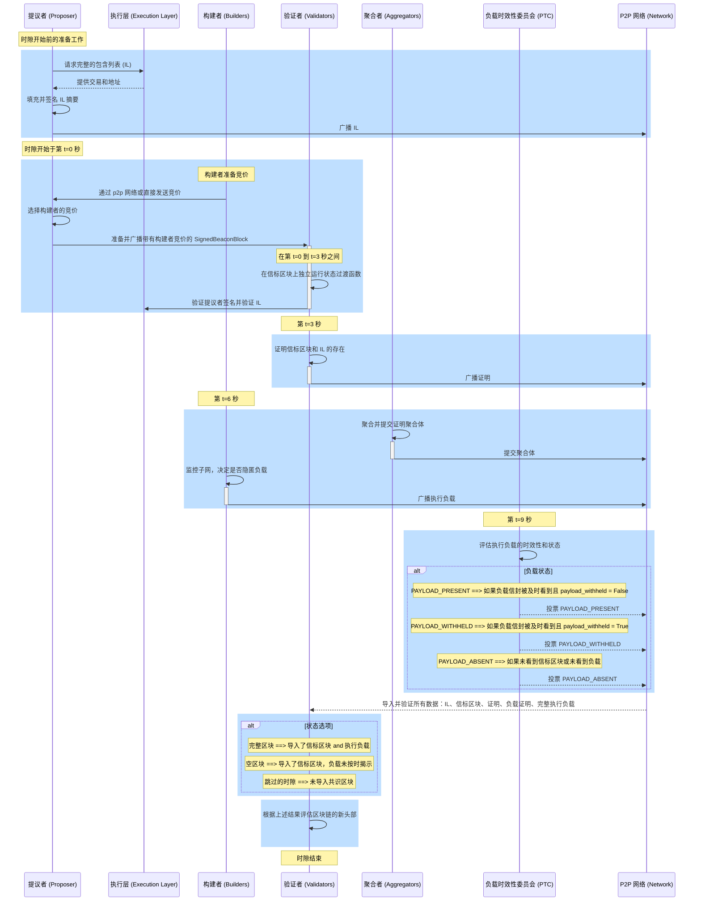

# ePBS 设计规范 (ePBS Design Specifications)

[当前的 ePBS 规范](https://hackmd.io/@potuz/rJ9GCnT1C) 和 [GitHub 仓库](https://github.com/potuz/consensus-specs/tree/epbs_stripped_out/specs/_features/epbs) 解决了解耦以太坊当前 提议者-构建者分离 (Proposer-Builder Separation, PBS) 实现中的一个关键问题[^1][^2][^11]。传统上，提议者和构建者都必须通过 [MEV-Boost](/docs/wiki/research/PBS/mev-boost.md) 依赖中介，正如 [ePBS 文档](/docs/wiki/research/PBS/ePBS.md) 中所概述的那样，这引入了信任和审查方面的隐忧。ePBS 规范框架通过将中介的必要性从“必须 (must)”更改为“可以 (may)”，改变了这种动态，从而允许在以太坊生态系统内进行更加无信任的交互。

## 规范概述 (Specifications Overview)

[ePBS 规范](https://github.com/potuz/consensus-specs/tree/epbs_stripped_out/specs/_features/epbs) 被划分为独立的组件，以构建在现有的以太坊组件规范之上。
- `Beacon-chain.md`：此文档指定了 ePBS 功能的信标链规范[^6]。
- `Validator.md`：此文档指定了 ePBS 功能的诚验证者行为规范[^7]。
- `Builder.md`：此文档指定了 ePBS 功能的诚实构建者规范[^8]。
- `Engine.md`：此文档指定了由于 ePBS 分叉而引起的引擎 API (Engine API) 更改[^9]。
- `fork-choice.md`：此文档指定了由于 ePBS 升级对分叉选择 (fork-choice) 带来的修改[^10]。

## ePBS 规范的主要改进 (Main Improvements of the ePBS specification)

**信任最小化 (Trust Minimization)**：它通过允许提议者和构建者更加独立地运行，减少了对中介信任的必要性，从而降低了操纵风险和信任依赖。

**最小化兼容性更改 (Minimal Changes for Compatibility)**：该设计实现了维持与当前共识和执行客户端运行兼容性所需的最小更改数量。它遵循现有的 12 秒时隙时间 (slot time)，确保网络运行的连续性和稳定性。

**抗审查性 (Censorship Resistance)**：它通过根据 [EIP-7547](https://eips.ethereum.org/EIPS/eip-7547) 引入前向强制包含列表 (forward forced inclusion lists)，增强了抗审查性，确保某些交易必须被包含，这有助于维护网络完整性。

**层级增强 (Layer Enhancements)**：更改主要发生在共识层 (Consensus Layer, CL)，对执行层 (Execution Layer, EL) 所需的调整极少，主要与包含列表 (inclusion lists) 的处理相关。

**安全保证 (Safety Guarantees)**：
- **提议者安全性 (Proposer Safety)**：它确保提议者免受串通的提议者和构建者发起的 1-slot 重组攻击 (reorganization attacks)，即使这些攻击者控制了网络拓扑并且拥有高达 20% 的质押权益 (stake)。
- **构建者安全性 (Builder Safety)**：为构建者提供了防范连续提议者串通和操纵的保证，包括确保被隐匿和被揭示的负载安全性的措施。
- **解包保证 (Unbundling Guarantees)**：构建者在所有攻击场景下都受到保护，确保交易处理和执行的完整性。

**验证者自建 (Self-Building for Validators)**：验证者保留了自行构建其负载的能力，这对于保持独立性和灵活性至关重要。

**可组合性 (Composability)**：该规范旨在与时隙拍卖或执行票证拍卖 (execution ticket auctions) 等其他机制可组合，从而增强未来创新的灵活性和潜力。

**实现细节 (Implementation Details)：**

ePBS 规范引入了特定的角色和职责：
- **构建者 (Builders)**：为负载承诺提交竞价的验证者。
- **PTC (负载时效性委员会, Payload Timeliness Committee)**：一个验证负载时效性和有效性的新委员会。

在每个时隙期间，提议者收集竞价，并在选择某个竞价后，提交包含构建者已签名承诺的区块。验证者随后根据这些承诺在构建者和提议者之间调整经济信用额度 (financial credits)。构建者稍后揭示其执行负载，从而履行其义务。基于区块的生产和揭示情况，时隙结果可能会有所不同——遗漏 (missed)、空块 (empty) 或满块 (full)——其中 PTC 在确定时隙结论的性质方面发挥着关键作用。

该实现包含了对 ePBS 功能至关重要的 [EIP-7251](https://eips.ethereum.org/EIPS/eip-7251) 和 [EIP-7002](https://eips.ethereum.org/EIPS/eip-7002)。EIP-7251 将以太坊验证者的最大有效余额提高到 2048 ETH，同时保持 32 ETH 的最小值，以在不丧失安全性的情况下减少验证者的数量[^3]。EIP-7002 允许验证者使用特殊的提现凭证退出信标链，从而增强了质押的灵活性和安全性[^4]。

## 时隙时间线剖析 (Anatomy of a Slot Timeline)



_图 – 基于 ePBS 规范的新时隙剖析流程。_

基于 ePBS 规范的新时隙剖析流程说明：

### 时隙前的准备工作 (Preparation Before the Slot)

- **提议者**通过向 EL 请求完整的包含列表 (inclusion list, IL)[^9]，填充并签名摘要，然后将其广播到 p2p 网络来进行准备。

**ePBS 中的新机制**：IL 是 EL 中的一个新组件，用于提议者保证网络的抗审查性。它们在“前向包含 (forward inclusion)”基础上运行，提议者和验证者交互以确保交易被准确且高效地向前传递[^5]。

**包含列表容器 (Inclusion List Containers)**：
- **InclusionListSummary**：包含提议者的索引、时隙和执行地址列表。
- **SignedInclusionListSummary**：包含上述摘要以及提议者的签名。
- **InclusionList**：包含已签名的摘要、信标区块的父区块哈希以及交易列表。

**从 EL 请求 IL**：
- 提议者通过调用函数 `get_execution_inclusion_list` 从 execution layer 检索要在下一个区块中包含的交易，从而确保它们根据当前状态是有效的。响应是一个容器 `GetInclusionListResponse`，其中包含 `transactions`（EL 所需的交易对象列表）和 `summary`（`transactions` 的摘要，包括基本的标识符，如“发送方 (from)”地址）。

**构建 IL**：
- 提议者调用函数 `build_inclusion_list` 将接收到的交易组织成结构化格式，准备用于签名的摘要，并确保符合网络标准。响应是一个容器 `InclusionList`，其中包含 `SignedInclusionListSummary`（已签名的交易摘要，验证真实性和完整性）以及 `transactions`（准备好包含的已验证交易列表）。

**广播 IL**：
- 一旦准备好并签署了 IL，提议者就会通过 p2p 将其广播到整个网络。

### 时隙开始于第 t=0 秒 (Start of the Slot at Second t=0)

- **构建者**准备好竞价，并通过 p2p 网络或直接将其发送给提议者。
- **提议者**选择某个构建者的竞价，准备并广播包含该构建者竞价的 **SignedBeaconBlock**（已签名的信标区块）。

**ePBS 中的新机制**：在 `ExecutionPayload` 中包含 `inclusion_list_summary` 属性。该字段与区块内某些交易的包含摘要相关联，从而提供了对区块中包含内容的控制。

**构建者：准备并发送竞价**
- 构建者使用 `ExecutionPayloadHeader` 容器准备竞价，该容器包含父区块哈希、费用接收者和提议的交易费用等基本细节。
- 构建者创建 `SignedExecutionPayloadHeader`（已签署的区块头 `ExecutionPayloadHeader`）并进行广播。
- 竞价要么直接发送给提议者，要么使用 `execution_payload_header` 主题在 p2p 网络上广播。

**提议者：选择竞价并广播已签名的信标区块**
- 提议者基于若干标准（例如竞价金额以及构建者的可靠性或历史表现）评估竞价以选择竞价。
- 提议者构建一个 `BeaconBlockBody`，其中包括 `signed_execution_payload_header` 以及其他标准元素。
- 函数 `process_block_header` 处理区块头，确保所有元素符合共识规则，并且该区块在当前链上下文中是有效的。
- 该区块（现在包含所选的 execution payload header）由提议者签名，以生成 `SignedBeaconBlock`。
- 然后，使用 `beacon_block` 主题在 p2p 网络上广播已签名的区块，使其对所有网络参与者可用。
- 提议者准备的 `BeaconBlockBody` 内的 `ExecutionPayloadHeader` 包含 `parent_block_hash`（连接到执行层中的父区块，确保链的连续性）和 `block_hash`（最终将连接到构建者将要生产的 `ExecutionPayload` 的哈希，这对于验证者验证链的完整性和连续性至关重要）。

### 在第 t=0 秒和 t=3 秒之间 (Between Second t=0 and t=3)

- **验证者**独立运行状态过渡函数以验证信标区块，验证提议者的签名，并验证包含列表。

**验证者：验证信标区块和包含列表**
- 在收到 `SignedBeaconBlock` 后，验证者调用 `process_block` 函数，这是一个处理区块处理不同方面（包括头部验证、RANDAO、提议者罚没、证明等）的综合函数。
- 对于 ePBS，特别关注 `process_execution_payload_header`，它验证区块内的执行负载头。
- 验证者验证在 `ExecutionPayloadHeader` 中被引用的 IL。为此，他们使用 `verify_inclusion_list` 函数从交易有效性、摘要的签名完整性以及与先前同意状态的一致性方面评估 IL 的正确性，并且 IL 内的提议者索引与给定时隙的预期提议者相对应。
- 如果区块和 IL 被成功验证，状态过渡函数 `state_transition` 会更新信标状态以反映新区块。这包括更新验证者状态、根据证明和罚没调整余额以及轮换委员会。

### 大约在第 t=3 秒 (Around Second t=3)

- **验证者**证明信标区块和 IL 的存在，确保到目前为止一切正常。

**验证者：证明信标区块**
- 验证者调用函数 `process_attestation` 来验证和处理针对信标区块做出的每个证明。这包括验证信标区块的时隙、证明的委员会，并根据共识规则确保证明数据的正确性。

### 大约在第 t=6 秒 (Around Second t=6)

- **聚合者**聚合（aggregate）并提交证明聚合体。
- **构建者**构建并广播其执行负载。他们监控网络子网，并根据网络状况和投票决定是否隐匿其负载。
- 构建者将交易执行所需的所有信息打包到执行负载中，放入 `ExecutionPayloadEnvelope` 容器中。这种封装确保了负载已准备好集成到信标链中。他们将字段 `payload_withheld` 设置为 false。
- 此外，如果诚实的构建者没有按时看到共识区块，他们可以通过将 `payload_withheld` 设置为 true 来隐匿负载。
- 他们运行函数 `process_execution_payload` 来根据当前状态处理执行负载以确保其有效性。这涉及验证交易、确保状态过渡正确以及检查负载是否符合共识规则。
- 然后，他们对 `ExecutionPayloadEnvelope` 容器进行签名以生成 `SignedExecutionPayloadEnvelope`，之后通过 p2p 网络将其广播到主题 `execution_payload`。

### 大约在第 t=9 秒 - 负载时效性委员会 (PTC) (Around Second t=9 - Payload Timeliness Committee (PTC))

- 在时隙的第 t=9 秒，PTC 评估执行负载的时效性。该委员会由 512 名验证者组成，根据他们对执行负载的存在性以及相对于共识区块的时间安排的观察进行投票。

**ePBS 中的新机制**：PTC 是此 ePBS 规范中引入的新组件。
- **组成与功能**：
  - **委员会形成**：PTC 成员是从每个信标时隙委员会的首批非构建者成员中选出的。这确保了委员会完全由在此时不担任构建者的验证者组成，从而最小化了利益冲突。
  - **证明奖励与惩罚**：PTC 成员因正确证明负载的存在或不存在而获得标准的证明奖励。准确的证明与实际的负载状态（`full` 或 `empty`）一致，验证者因此获得完整的证明点数（目标、源和头部的及时性）。不正确的证明会导致类似于错过证明的惩罚。
  - **证明处理**：PTC 成员对 CL 区块做出的证明将被忽略，以完全专注于负载验证任务。
  - **区块中包含证明**：时隙 `N+1` 的提议者负责将时隙 `N` 的 PTC 证明包含在区块中。包含不正确证明没有直接的激励；因此，通常每个区块只需要一个 PTC 证明。
- **聚合与广播**：存在两种导入 PTC 证明的方法。聚合后的证明 (`PayloadAttestation`) 被包含在上一时隙的区块中，而未聚合的证明 (`PayloadAttestationMessage`) 会被广播并在当前时隙中实时处理。

**PTC 验证者评估并投票表决执行负载时效性**
- 每个 PTC 验证者独立检查他们是否从应该揭示它的构建者那里收到了有效的 `ExecutionPayload`（根据当前信标区块中包含的已签名 `ExecutionPayloadHeader`）。PTC 验证者基于其存在性以及被接收的时间来对负载的时效性进行投票。

**广播负载时效性证明**
- 如果确认执行负载存在且及时，PTC 验证者生成并广播负载时效性证明，确认这些观察。`PayloadAttestation` 容器捕获了验证者关于负载时效性和存在性的证明。
- 函数 `get_payload_attesting_indices` 通过检查 `PayloadAttestation` 中的聚合位来确定 PTC 中哪些验证者正在证明负载的存在性和时效性。
- 证明通过 `payload_attestation_message` 主题在 p2p 网络上广播。

**在信标区块中聚合并包含负载证明**
- 聚合者收集单个 `PayloadAttestation` 消息，对其进行聚合，并确保它们被包含在即将到来的信标区块中，以记录并最终确定验证者对负载时效性的共识。它们被聚合到一个 `IndexedPayloadAttestation` 容器中，该容器包括做出证明的验证者索引列表、负载证明数据以及集体签名。

**根据证明更新信标链状态**
- 信标链调用 `process_payload_attestation` 函数来处理和验证传入的负载证明。它确保证明数据正确且签名有效，并将此信息集成到信标状态中。信标链状态根据负载证明进行更新。
- 这些证明通过影响各种区块的权重并潜在地导致基于执行负载的感知时效性和存在性的不同链重组来影响分叉选择。

**奖励计算与分配**：对于正确证明负载状态的每个验证者，它设置参与标志并根据预定义的权重 (`PARTICIPATION_FLAG_WEIGHTS`) 计算奖励。奖励被聚合，并且证明的提议者按比例获得奖励，计算中考虑了协议规范中定义的各种权重和分母 (`WEIGHT_DENOMINATOR`、`PROPOSER_WEIGHT`)。

**提议者奖励**：该函数最终计算提议者的奖励，并通过调用 `increase_balance` 方法更新提议者的余额。

### 时隙结束 (End of the Slot)

- 随着时隙的结束，验证者完成了几项关键任务：
  - **导入与验证**：验证者确保他们已导入并验证了包含列表、共识区块、所有单比特和聚合证明、负载证明以及完整的执行负载。
  - **评估区块链的新头部**：基于已验证的数据，验证者对链的状态做出关键决策。他们确定该时隙导致以下哪种情况：
    - **完整区块 (Full Block)**：共识区块和相应的执行负载均已成功导入。
    - **空区块 (Empty Block)**：共识区块已被导入，但关联的执行负载未按时揭示。
    - **跳过的时隙 (Skipped Slot)**：在该时隙期间未导入任何共识区块，导致跳过时隙的场景。
- 分叉选择函数 `get_head` 在考虑了最新的区块提案、负载证明以及任何其他相关信息（例如来自证明和余额的权重）后，确定链的头部。
- 所有节点根据分叉选择的结果同步其状态，确保整个网络的一致性。这种同步包括应用来自已证明区块和执行负载的所有状态过渡和更新。

## 包含列表时间线 (Inclusion List Timeline)

**Gossip 层检查**：
- 验证包含列表的时间安排，确保与当前或下一时隙相关。
- 每个提议者-时隙对被限制在网络上广播一个包含列表，尽管提议者可能会向不同的对等方发送不同的列表。
- 交易数量必须与摘要计数相匹配，且不能超过 `MAX_TRANSACTIONS_PER_INCLUSION_LIST` 中设置的最大值。
- 包含列表签名针对提议者的密钥进行验证，确认其计划的时隙。

**风险与缓解**：
- 在头部改变之前广播下一时隙的包含列表可能会导致可用性问题，尽管该列表仍被认为是可用的。

**on_inclusion_list 处理器**：
- 充当执行层引擎 API 调用的桥梁，假设相应的信标区块已被处理。
- 如果信标区块的父区块为空，则任何新的包含列表都会被自动忽略以防止积压。

**信标状态跟踪**：
- 跟踪最近和之前 IL 的提议者和时隙，以管理履行并在出现新的有效区块时进行更新。

**EL 验证**：
- 使用当前状态检查交易 `inclusion_list.transactions` 是否有效且可包含。
- 确保摘要 `inclusion_list.signed_summary.message.summary` 准确列出包含交易的“发送方 (from)”地址。
- 确保交易的总 gas 限制不超过允许的最大值 `MAX_GAS_PER_INCLUSION_LIST`。
- 确保列出的账户有足够的资金来支付最大潜在 gas 费用 `(base_fee_per_gas + base_fee_per_gas / BASE_FEE_MAX_CHANGE_DENOMINATOR) * gas_limit`。

## 执行负载的时间线 (Execution Payload's Timeline)

ePBS 系统中执行负载的处理包括分布在 gossip、共识和执行层中的几个关键步骤：

**Gossip 层**：执行负载通过 `execution_payload` 发布/订阅主题共享，并进行关键验证：
- 确认与负载相关联的信标区块是有效的。
- 验证构建者索引，并针对信标区块验证负载哈希。
- 验证构建者的签名。

**共识状态过渡**：在 Gossip 之后，负载通过 `on_execution_payload` 分叉选择处理器进行共识验证：
- **签名验证**：确保负载签名的完整性。
- **提现和包含列表验证**：确认提现的正确处理，并遵守信标状态指定的包含列表。
- **负载一致性和 EL 验证**：检查所有负载元素是否与信标状态承诺一致，并将负载发送到执行层进行进一步验证。
- **状态更新与验证**：更新信标状态记录并验证新的状态根以确认准确的状态过渡、`latest_block_hash` 和 `latest_full_slot`。

**执行层状态过渡**：执行层扩展其角色以验证 `InclusionListSummary` 的满足情况：
- **交易与余额验证**：跟踪交易或余额变化中涉及的地址。
- **包含列表满足度**：确保 `InclusionListSummary` 中的每个地址在负载中都是活跃的，考虑当前和先前负载的交易和余额变化。
- **特殊情况处理**：管理独特场景，例如由 [EIP-3074](https://github.com/ethereum/EIPs/blob/master/EIPS/eip-3074.md) 启用的交易。

## 负载证明的时间线 (Payload Attestation's Timeline)

**Gossip 层**：负载证明是由 PTC 成员使用 `PAYLOAD_ATTESTATION_MESSAGE` 对象广播的，在传播前进行严格的检查：
- **当前时隙验证**：仅在 gossip 中传播当前时隙的证明。
- **负载状态验证**：证明必须具有有效的负载状态才能被传播。
- **每位成员限一次证明**：每个 PTC 成员仅共享一次证明。
- **信标区块根存在性**：证明与具有已知信标区块根的时隙相关联。
- **PTC 成员身份检查**：必须确认验证者是 PTC 的成员。
- **签名验证**：证明必须具有有效的签名。

**分叉选择处理器**：在通过 Gossip 验证后，负载证明在分叉选择中通过 `on_payload_attestation_message` 处理器进行处理，其中包括：
- **信标区块验证**：确认关联的信标区块在分叉选择存储中。
- **PTC 时隙验证**：验证证明者在指定时隙的 PTC 中。
- **时隙匹配**：检查信标区块是否与证明时隙对应。
- **当前时隙和签名检查（如果不是来自区块）**：对于 direct broadcasts，验证时隙是当前的并验证签名。
- **PTC 投票更新**：更新在分叉选择中为给定区块根跟踪的 PTC 投票。

## 信标区块的时间线 (Beacon Block's Timeline)

**Gossip 层**：
- **初始验证**：`SignedBeaconBlock` 通过 gossip 或 RPC 进入，关键验证侧重于父信标区块的合法性。

**on_block 处理器**：
- **信标区块验证**：根据两个 parent 元素验证区块：共识层（通过 `block.parent_root`）和派生自 `BeaconBlockBody` 中 `signed_execution_payload_header` 条目的执行层。
- **BeaconBlockBody 调整**：`BeaconBlockBody` 中的修改包括移除执行负载和 blob KZG 承诺，添加 `signed_execution_payload_header` 以及新的 `payload_attestations`。

**状态过渡**：
- **修改的函数**：`process_block` 现在针对 ePBS 更改进行调整，包括对提现处理和同步父负载的修改。
- **提现**：分两个阶段管理；在共识区块处理期间扣除，在执行负载处理期间验证履行。
- **执行负载头**：验证构建者的签名、资金以及将竞价金额立即转移给提议者，状态调整记录在信标状态中。

**负载证明**：负载证明 `PayloadAttestation` 代表信标区块处理中的一个重要组件，为 PTC 的执行负载增加了一层验证。

- **PTC 委员会形成**
  - **委员会选择**：`get_ptc` 函数旨在通过从现有的信标委员会中选择验证者来组建 PTC，特别是针对每个委员会列表末尾的验证者来形成 PTC。选择过程确保了 PTC 得到充分的人员配置，同时将对标准信标委员会结构和功能的影响降至最低。

- **处理负载证明**
  - **证明要求**：负载证明必须属于前一个时隙并与父信标区块根匹配，确保它们及时且准确地引用正确的信标状态。
  - **激励与惩罚**：
    - **一致性检查**：检查每个证明与信标状态以确定一致性。一致的证明（例如，当时隙确实为满时证明 `PAYLOAD_PRESENT`）会为提议者和做出证明的验证者带来奖励。这使他们的激励与负载状态的准确和诚实报告保持一致。
    - **奖励计算**：对于一致的证明，参与标志 `PARTICIPATION_FLAG_WEIGHTS` 会为做出证明的验证者进行设置，并且提议者会收到根据证明者的基础奖励计算的提议者奖励 `proposer_reward`，以确保验证者有动力在 PTC 中积极且正确地参与。
    - **不一致的惩罚**：如果发现证明不一致（例如，在负载存在时证明 `PAYLOAD_ABSENT`），则会施加惩罚。提议者和证明者都会受到惩罚，以阻止包含错误或误导性的证明。提议者的惩罚 `proposer_penalty` 显著加倍，以防止提议者和证明者之间可能存在的任何潜在串通，在这些串通中，他们可能会从包含一致和不一致的证明中获益。

- **实现与合理性**
  - **避免罚没条件**：没有专门针对 PTC 证明等价的罚没条件，以防止过度惩罚的措施打消参与积极性。然而，惩罚的结构旨在确保提交等价证明没有净收益。
  - **提议者惩罚加倍**：将提议者惩罚加倍的理由是确保不存在惩罚和奖励相互抵消的场景，从而维持了对包含冲突证明的威慑。

## 诚实验证者行为 (Honest Validator Behavior)

由于引入了诸如分叉选择考虑、执行负载验证以及 IL 的时机安排等新机制，验证者的角色和行为（特别是对于提议者和 PTC 成员）得到了完善。

**提议者职责**：
- **执行负载和包含列表准备**：
  - 在其指定的时隙之前，提议者需要从构建者中选择一个 `SignedExecutionPayloadHeader`，并请求或构建一个 `InclusionList`。
  - 这些活动可以在时隙开始之前进行，以确保就绪和效率。
- **广播时机**：
  - 鼓励提议者尽早广播其 IL，以增加其区块被证明的可能性，从而确保其区块在链中的位置。
- **构建者交互**：
  - 验证者可以充当他们自己的构建者（自建），或者可以与外部构建者接洽。鼓励与构建者进行直接交互（协议外方法），因为它们可能会实时产生最具竞争力的竞价。
- **战略考虑**：
  - 由于潜在的 MEV 机会，提议者可能会策略性地推迟选择或请求构建者的竞价，直到广播区块的最后可行时刻。这种策略是为了从可用的交易池中提取 MEV。

**提议者的头部确定**：
- **基本原则**：在时隙 `N` 的开始，提议者必须确定链的头部以有效地提议新区块。这涉及评估各种场景（如跳过的时隙、缺失的负载和迟到的负载），并基于最新的有效区块数据做出决策。

**PTC 成员职责**：
- **负载时效性证明**：
  - PTC 成员的任务是验证当前时隙执行负载的时效性，并根据他们的观察投出 `payload_attestation`：
    - `PAYLOAD_PRESENT`：如果观察到当前时隙的有效共识区块和相应的执行负载。
    - `PAYLOAD_WITHHELD`：如果看到了当前时隙的有效共识区块，以及来自构建者的 `payload_withheld = true` 消息。
    - `PAYLOAD_ABSENT`：如果看到了有效共识区块，但没有相应的执行负载。
    - 如果未观察到当前时隙的共识区块，则不做证明。
- **证明条件**：
  - PTC 成员仅导入他们观察到的第一个共识区块，并基于它采取行动，以确保每个时隙有单一、连贯的响应。

**构建负载证明**：
- **运行窗口**：
  - PTC 成员准备在大约 9 秒进入时隙时做出证明，评估执行负载是否及时且与共识区块准确同步。
  - 这包括评估负载是否被正确隐匿，并确保他们的证明反映了负载可用性或缺失的实际状态。

**验证者考虑**：
- 验证者必须娴熟地处理他们的角色，无论是作为提议者、PTC 成员还是普通证明者，驾驭新 ePBS 机制的复杂性以维护网络的完整性和安全性。这涉及战略决策、及时行动和对协议的遵守，以优化他们在网络中的影响力和奖励。

## Honest Builder Behavior

**准备多个负载**：
- **适应性**：构建者被期望为各种潜在的父区块头部准备不同的负载。这种准备使他们能够在最后一刻适应分叉选择的变化。
- **多个竞价**：构建者可以在其预定时间段之前提交多个竞价，从而增加被提议者选中的机会。

**竞价提交策略**：
- **广播竞价**：构建者可以通过协议外服务直接向提议者提交竞价。这种策略允许构建者不断更新和完善他们的竞价，而无需将其暴露给整个网络，这可能会导致包含次优负载。
- **首次看到消息规则**：验证者将仅针对（构建者，时隙）的特定组合传播首次看到的有效消息，这鼓励构建者在流程早期提交其最佳竞价。

**直接竞价请求**：
- **增强的 API 规范**：通过 `SignedBidRequest` 机制引入直接竞价请求将允许验证者直接向构建者请求执行区块头。对构建者 API 的这种小幅修改可以利用现有的客户端代码，并加强验证者和构建者之间的直接互动。

```python
class BidRequest(container):
    slot: Slot
    proposer_index: Validator_index
    parent_hash: Hash32
    parent_block_root: Root

class SignedBidRequest(container):
    message: BidRequest
    signature: BLSSignature
```

- **密码学绑定**：直接请求机制可以被设计为将请求与验证者进行密码学绑定，防止构建者根据其他人的报价调整其竞价，从而降低构建者之间串通和卡特尔化（cartelization）的风险。

**Gossip 作为备用**：
- **备用机制**：尽管直接竞价请求具有优势，但为竞价 Gossip 维持一个全局主题提供了一个关键的备用手段。该系统支持在低端硬件上运行的验证者或那些偏好社区驱动构建者的验证者，确保他们能够获得竞争性竞价。
- **反审查与反卡特尔措施**：通过社区驱动的构建者设置公共最低竞价，系统强制中心化构建者在希望审查某些交易时出价高于这些公共报价。这一特性作为竞价提交中竞争和透明度的基准。
- **垃圾邮件保护**：可以通过仅允许针对给定父区块哈希收到的最高价值竞价被 Gossip，并限制每个构建者每个时隙只能发送一条消息来保护全局主题免受垃圾邮件攻击。

## 提议者与构建者交互的安全分析 (Security analysis of proposer and builder interactions)

**构建者揭示安全性 (Builder Reveal Safety)**：
- **场景**：提议者之间串通，以重组及时揭示其负载的构建者的负载。
- **结果**：安全设计确保了只要攻击者控制的质押权益不超过特定值（在此示例中最高达 40%），构建者的负载就无法被后续提议者重组。
- **关键等式**：如果 \(RB > PB\)，则揭示的负载保持安全，其中 \(RB\) 是构建者的揭示助力 (reveal boost)，\(PB\) 是提议者助力 (proposer boost)。

**构建者隐匿安全性 (Builder Withholding Safety)**：
- **场景**：构建者由于共识区块迟到而决定隐匿负载，旨在避免惩罚。
- **结果**：如果区块不是链的头部或迟到，则 (区块, 时隙) 投票机制支持构建者在没有惩罚的情况下隐匿负载的决定。
- **有效安全**：构建者受到保护，免受提议者操纵区块时间以强迫负载揭示的攻击，确保在未满足安全揭示条件时构建者无需付费。

**提议者安全性 (Proposer Safety)**：
- **场景**：试图通过构建者与下一个提议者之间的协作来重组链。
- **结果**：分析表明，只要攻击者控制少于 20% 的质押权益，诚实行动且及时揭示其区块的提议者就能够保证被包含在链中。
- **详细分析**：展示了系统针对事前和事后重组尝试的韧性，维护了诚实提议者区块免受串通和网络控制的完整性。

**通用安全考量**：
- 所提出的设计通过确保投票仅支持与 PTC 决定一致的链，从而有效地处理不同的负载状态。
- 包含列表的可用性在确定规范链头部方面发挥着关键作用，通过强调经过验证的包含，增强了账本的完整性。
- 负载助力（无论是对于揭示还是隐匿）在分叉选择期间调整权重计算中起着关键作用，这可以根据负载的可用性和行动来影响链的重组和稳定性。

## 分叉选择考量 (Forkchoice Considerations)

ePBS 分叉的引入对分叉选择规则带来了复杂的改变，特别是针对构建者和提议者的安全性。这些更改旨在适应网络延迟和诸如负载隐匿等战略行为。

**ePBS 分叉选择中的关键概念：**
- **(区块, 时隙) 投票**：
  - 此机制确保了如果一个区块迟到，验证者将支持最新的及时区块，而不是迟到的区块。
  - 一致的是，随着验证者继续支持早期的及时区块，迟到的区块会积累更少的权重。
- **负载状态处理**：
  - 负载状态（缺失、为空、为满）影响验证者对链的支持。
  - 投票支持与 PTC 对负载状态决定一致的链，确保负载根据及时的可用性被包含或排除。
- **包含列表可用性**：
  - IL 的存在和验证是至关重要的。验证者可以根据具有完全验证 IL 的最新区块来确定头部。
  - 这一考虑确保了在适当包含的交易上构建的区块受到青睐，从而增强了链的完整性。
- **负载助力的安全分析**：
  - 引入了构建者的揭示助力 (RB) 和隐匿助力 (WB)，根据构建者在揭示或隐匿负载方面的行动对其进行奖励或保护。
  - 这些助力通过改变权重计算显着影响分叉选择，可能导致基于负载可用性和完整性的重组或链的稳定。

**实际例子：**
- **正常情况 (Happy cases)** 展示了所有区块和负载按时到达并获得完全支持的正常运行。
- **迟到的区块和负载** 插图说明了验证者将其支持转向早期区块的场景，影响了潜在链分叉之间的权重分配。
- **负载状态场景** 展示了投票如何根据负载可用性与 PTC 投票一致，从而支持或排除某些区块。
- **包含列表考量** 突出了这些列表对确定规范头部的影响，特别是在包含数据缺失或迟到的情况下。

## 资源 (Resources)

- [ePBS 规范笔记 (ePBS specification notes)](https://hackmd.io/@potuz/rJ9GCnT1C)
- [没有 Max EB 和 7002 的最小 ePBS (Minimal ePBS without Max EB and 7002)](https://github.com/potuz/consensus-specs/pull/2)
- [EIP-7251 最大有效余额 (MaxEB) (EIP-7251 Maximum effective balance (MaxEB))](https://eips.ethereum.org/EIPS/eip-7251)
- [EIP-7002 执行层可触发的提现 (EIP-7002 Execution layer triggerable withdrawals)](https://eips.ethereum.org/EIPS/eip-7002)
- [epbs - 信标链规范 (epbs - beacon-chain specs)](https://github.com/potuz/consensus-specs/blob/epbs_stripped_out/specs/_features/epbs/beacon-chain.md)
- [epbs - 诚实验证者规范 (epbs - honest validator specs)](https://github.com/potuz/consensus-specs/blob/epbs_stripped_out/specs/_features/epbs/honest-validator-specs)
- [epbs - 诚实构建者规范 (epbs - honest builder specs)](https://github.com/potuz/consensus-specs/blob/epbs_stripped_out/specs/_features/epbs/builder.md)
- [epbs - 引擎 API 规范 (epbs - Engine API specs)](https://github.com/potuz/consensus-specs/blob/epbs_stripped_out/specs/_features/epbs/engine.md)
- [epbs - 分叉选择规范 (epbs - fork-choice specs)](https://github.com/potuz/consensus-specs/blob/epbs_stripped_out/specs/_features/epbs/fork-choice.md)
- [EIP-7547 包含列表 (EIP-7547 Inclusion Lists)](https://eips.ethereum.org/EIPS/eip-7547)

## 参考文献 (References)

[^1]: https://hackmd.io/@potuz/rJ9GCnT1C
[^2]: https://github.com/potuz/consensus-specs/pull/2
[^3]: https://eips.ethereum.org/EIPS/eip-7251
[^4]: https://eips.ethereum.org/EIPS/eip-7002
[^5]: https://eips.ethereum.org/EIPS/eip-7547
[^6]: https://github.com/potuz/consensus-specs/blob/epbs_stripped_out/specs/_features/epbs/beacon-chain.md
[^7]: https://github.com/potuz/consensus-specs/blob/epbs_stripped_out/specs/_features/epbs/validator.md
[^8]: https://github.com/potuz/consensus-specs/blob/epbs_stripped_out/specs/_features/epbs/builder.md
[^9]: https://github.com/potuz/consensus-specs/blob/epbs_stripped_out/specs/_features/epbs/engine.md
[^10]: https://github.com/potuz/consensus-specs/blob/epbs_stripped_out/specs/_features/epbs/fork-choice.md
[^11]: https://github.com/potuz/consensus-specs/tree/epbs_stripped_out/specs/_features/epbs