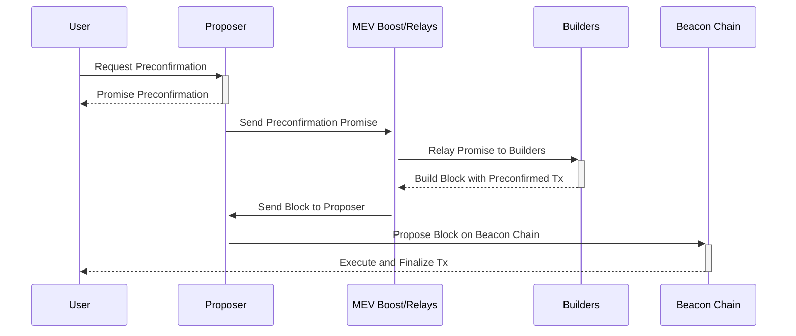

# 带有预确认的基于以太坊的排序 (Ethereum Based Sequencing with Preconfirmations)

## [概述](#overview) (Overview)

以太坊 (Ethereum) 不断发展的生态系统 (ecosystem) 旨在为 Rollup (rollups) 和链交互 (chain interactions) 引入新的范式，强调无缝过渡和增强的用户体验 (user experience)。本维基文章介绍了一个由 Justin Drake 提出的以太坊排序 (sequencing) 和预确认 (preconfirmations) 框架[^1][^4]，这是实现这一愿景的一步，为所有以太坊链和 Rollup (rollups) 提供了一个统一的平台。

## [动机](#Motivation) (Motivation)

### [以太坊联合链](#united-chains-of-ethereum) (United Chains of Ethereum)

以太坊 (Ethereum) 的愿景不仅是一个个孤立链的网络，而是一个所有 Rollup (rollups) 和链无缝共存的紧密生态系统 (ecosystem)，被称为“以太坊联合链 (United Chains of Ethereum)”。这一概念设想了一个用户可以轻松在不同状态（Rollup (rollups)）之间移动的场景，类似于跨越州界而不需要护照或征收关税。这样的环境不仅能增强用户体验 (user experience)，还能促进一个更集成、更高效的区块链 (blockchain) 生态系统 (ecosystem)。

_图：以太坊联合链，图片来源 Justin Drake_

### [以太坊为 Rollup 提供的服务](#ethereums-services-for-rollups) (Ethereum's Services for Rollups)

- **当前服务：** 以太坊当前向 Rollup (rollups) 提供两个关键服务：结算 (settlement) 和数据可用性 (data availability)。这些服务为 Rollup 在以太坊的去中心化平台上有效运行奠定了基础。

- **引入以太坊排序：** 提出了以太坊排序 (Ethereum sequencing)[^2][^3]来补充现有服务，提供了一种 Rollup (rollups) 可以利用的新资源，以进一步优化其运营。虽然排序 (sequencing) 一直是以太坊固有的属性，但它作为 Rollup 专用服务的潜力代表了一项创新应用，类似于将核心数据自适应地用于新功能。

### [当前的排序选择](#current-sequencing-options) (Current Sequencing Options)

_图：不同的排序选择及其问题空间，图片来源 Justin Drake_

#### [去中心化排序](#decentralized-sequencing) (Decentralized Sequencing)

**概述：** 去中心化排序 (Decentralized sequencing) 将交易排序 (transaction ordering) 的职责分配给多个节点 (nodes)，而不是单个中心化机构。这种方法增强了安全性和抗审查性，因为没有单个节点可以独自决定交易顺序。

**问题与挑战：**
- **协调的复杂性：** 由于交易排序涉及多个节点 (nodes)，达成共识 (consensus) 可能具有挑战性且复杂，特别是在节点具有不同动机时。
- **网络完整性维护：** 确保所有参与节点遵守协议且无任何恶意行为可能很难强制执行。
- **抢跑与 MEV：** 矿工或验证者 (validators) 可能会利用他们排序交易的能力来提取最大可提取价值 (Maximal Extractable Value, MEV)，这可能导致不公平的交易处理和负面的用户体验 (user experience)。
- **抗审查性：** 虽然去中心化排序使审查变得更加困难，但它并不能消除这种可能性，尤其是当发生节点合谋时。

#### [共享排序](#shared-sequencing) (Shared Sequencing)

**概念：** 共享排序 (Shared sequencing) 是去中心化排序 (decentralized sequencing) 的一种形式，其中交易排序的任务在多个实体之间共享，通常跨越不同的层级或平台。这种方法旨在进一步去中心化该流程，并减少任何单个参与者对交易顺序 (sequence of transactions) 的影响。

**应用：** 在以太坊中，共享排序可能涉及协调管理交易顺序的各种 Rollup (rollups) 解决方案。这种协调有助于确保交易得到高效、公平的处理，减少瓶颈或有偏见的排序行为的潜在可能性。

**优势：** 共享排序旨在通过分配交易处理负载和提高网络的吞吐量 (throughput) 来促进可扩展性 (scalability)。它还致力于交易处理的中立性 (neutrality) 和公平性，这对于维护去中心化生态系统中的信任至关重要。

**问题与挑战：**
- **MEV 共享：** 协调 MEV 共享（如 Espresso 正在调查的方法）需要复杂的机制在参与的 Rollup (rollups) 和链之间公平地分配 MEV[^5]。
- **存款共享：** 像 zkSync 的存款共享 (deposits sharing) 这样的解决方案虽然具有创新性，但需要不同 Rollup 之间的广泛采用和信任才能有效运行，这可能会导致信任的中心化[^6]。
- **执行共享：** 执行共享 (execution sharing) 策略的实现（如 Polygon 的聚合层 (aggregation layer)）需要不同 Rollup 之间的标准化和集成，以确保兼容性和无信任原子性 (trustless atomicity)[^7]。

**基于以太坊的排序 (Based Sequencing)：**

**概念：** 去中心化排序 (decentralized sequencing) 的一种特化形式，它利用以太坊的基础层 (base layer) —— 信标链 (Beacon chain) 来管理交易排序。该方法利用信标链的安全性与共识机制 (consensus mechanisms)，确保以无信任的方式对交易进行排序。

**重点：** 基于以太坊的排序 (Based sequencing) 旨在将信标链强大的安全特性集成到交易排序中，减少对外部排序器 (sequencers) 或中心化系统的依赖。它通过使用现有的以太坊基础设施 (infrastructure) 来确保交易顺序，从而与以太坊的去中心化原则保持一致。

**与共享排序的集成：** 基于以太坊的排序可以成为更大的共享排序 (shared sequencing) 战略的关键部分，提供一个可靠、安全的基础，供其他层或 Rollup (rollups) 进行构建。它确保交易排序流程中至少有一层与以太坊区块链经过高度安全、充分测试的共识机制紧密相连。

**问题与挑战：**
- **提议者责任：** 提议者 (proposers) 必须通过提交抵押品 (collateral) 来选择加入基于以太坊的排序，这给他们的角色增加了财务风险和责任。
- **纳入列表管理：** 必须仔细维护和管理纳入列表 (inclusion lists) 的概念，以确保公平的交易纳入。
- **共识机制依赖：** 基于以太坊的排序本质上与底层的共识机制绑定，这意味着共识的任何问题都可能直接影响交易排序。
- **预确认的复杂性：** 实现预确认 (preconfirm) 机制（在此机制中，用户可以从提议者处获得交易执行的保证）增加了交易处理的复杂性，并需要用户与提议者之间建立全新的信任与交互水平。

## [技术构建](#technical-construction) (Technical Construction)

### [基于以太坊的排序](#based-sequencing) (Based Sequencing)

- **机制：** 基于以太坊的排序 (based sequencing) 提案涉及利用信标链的前瞻期 (look-ahead period)，邀请提议者 (proposers) 通过提交抵押品 (collateral) 选择加入提供排序服务。该方法利用以太坊现有的结构，为 Rollup (rollups) 引入了新的功能层。

- **前瞻期：** 通过利用信标链预测下一组提议者的能力，系统可以准备并指定特定的提议者 (proposers) 来承担排序器 (sequencers) 的附加角色，确保 Rollup (rollups) 拥有可预测且可靠的排序服务。

### [预确认机制](#preconfirm-mechanism) (Preconfirm Mechanism)

在 [预确认 (Preconfirmations)](/wiki/research/Preconfirmations/Preconfirmations.md) 文章中，我解释了预确认的工作原理以及承诺获取流程的详细信息[^2][^3]。

- **用户与提议者的交互：** 用户可以识别前瞻期 (look-ahead period) 内的哪些提议者 (proposers) 选择了基于以太坊的排序，并向他们请求预确认 (preconfirmations)。这些预确认类似于对用户的交易将在未来被纳入和执行的承诺，如果未能履行，将受到惩罚。

- **未履行的罚没：** 系统对未能履行预确认的提议者施加惩罚，即罚没 (slashing)。这增加了一层问责制，确保提议者 (proposers) 有动力履行其承诺。

### [前瞻预确认构建](#look-ahead-preconf-construction) (Look-Ahead Preconf Construction)

_图：预确认的前瞻机制，图片来源 Justin Drake_

- **前瞻期 (Lookahead Period)：** 在以太坊信标链上，存在一个前瞻期，在该期间，区块时隙 (block slots) 的即将到来的提议者是提前为人所知的。该期间通常可以包括下 32 个时隙 (slots) 中的设定数量。
- **预确认请求：** 想要进行交易的用户向计划在不久的将来（在前瞻期内）创建区块的提议者 (proposer) 发送预确认请求。该请求包括交易详情，可能还包括小费报价。
- **签发承诺：** 收到预确认请求后，被选中的提议者（被称为预确认者 (preconfer)）会评估交易并决定是否做出承诺。如果提议者同意，他们将向用户签发一个承诺，承诺在轮到他们提议的未来区块中纳入并执行该交易。该承诺由提议者提交的抵押品支持，如果他们未能履行承诺，这些抵押品可能会被罚没 (slashed)。
- **已预确认交易的纳入：** 当提议者的时隙（上图中的 n+1）到来时，他们必须按照承诺纳入并执行已预确认的交易。如果提议者在没有正当理由的情况下未能做到这一点，他们将面临被罚没的风险。
- **共享预确认：** 提议者所做的承诺可能需要传达给网络中的其他人，尤其是如果存在多个可能在提议者的时隙到来之前纳入该交易的提议者。这种通信可以通过各种手段（包括 MEV-Boost 中继）进行促进，以确保交易得到适当的结算和纳入。
- **交易的执行：** 一旦轮到提议者，并且他们没有被更早的提议者抢先，他们就会将已预确认的交易纳入他们所提议的区块中。这确保了交易按照对用户的承诺在链上执行。

### [通过 MEV-Boost 进行通信](#communication-through-mev-boost) (Communication through MEV Boost)

预确认与 MEV-Boost (MEV Boost) 的集成代表了技术构建的关键方面，促进了用户、提议者、构建者 (builders) 和以太坊网络之间高效的信息流。通过 MEV-Boost 路由预确认的详细信息，系统可以确保构建者 (builders) 了解已预确认的交易，并能够相应地构建区块。这一过程不仅优化了交易的纳入，而且维护了所构建区块的完整性与价值，与以太坊排序和预确认框架的总体目标保持一致。

## [通过 MEV-Boost 的预确认流程](#preconfirmations-flow-through-mev-boost) (Preconfirmations Flow through MEV Boost)

_图：通过 MEV-Boost 的预确认流程_

在以太坊基础层排序和预确认的背景下，预确认将如何通过 MEV-Boost 进行流转的过程涉及几个关键步骤和实体，进行详细讨论是很有价值的。该机制旨在确保由提议者（已选择加入提供排序服务的提议者）预确认的交易能够通过 MEV-Boost 中的中继 (Relays) 有效地传达给构建者 (builders)，并最终纳入所构建的区块中。以下是该过程的详细步骤说明：

- **用户请求预确认：**
  - 用户识别信标链前瞻期 (look-ahead period) 内已通过提交抵押品选择加入提供基于以太坊的排序服务的提议者。
  - 然后，用户向这些提议者中的一个发送预确认请求，寻求其交易将在未来的时隙 (slot) 中被纳入和执行的保证。

- **提议者提供预确认：**
  - 被选中的提议者评估该请求，如果接受，则向用户提供预确认。该预确认本质上是在指定的未来时隙 (slot) 中纳入和执行用户交易的承诺，受某些条件的约束，且如果未履行将受到惩罚。

- **提议者与 MEV-Boost 通信：**
  - 一旦提议者签发了预确认，他们就会将此信息传达给 MEV-Boost。MEV-Boost 充当中间件，促进提议者（现在充当其各自时隙的排序器 (sequencers)）、构建者 (builders) 以及最终以太坊网络之间的通信。

- **MEV-Boost 向构建者中继预确认：**
  - MEV-Boost 将预确认详细信息中继给负责构建区块的构建者 (builders)。构建者收到关于所有已预确认交易的信息，他们在构建区块时必须考虑这些信息。

- **构建者考虑预确认来构建区块：**
  - 拥有预确认详细信息后，构建者 (builders) 会构建遵守这些预确认的区块。这涉及将已预确认的交易纳入指定时隙的区块中，并确保满足预确认中承诺的执行条件。

- **向网络提议区块：**
  - 一旦构建者构建了一个尊重所有预确认并针对其他因素（如 MEV）进行优化的区块，该区块就会被提议给以太坊网络。负责相关时隙且最初签发了预确认的提议者有责任确保该区块被提交。

- **执行与结算：**
  - 如果区块成功纳入区块链，已预确认的交易将按照承诺执行，履行提议者对用户的承诺。如果提议者未能履行预确认，可能会根据故障的性质（例如活性故障、安全属性故障）施加惩罚（罚没）。

**其他注意事项：**

- **罚没机制：** 该过程结合了罚没机制 (slashing mechanism)，以在提议者未能履行预确认时对其进行惩罚。这确保了系统中的问责制和信任水平。
- **动态通信：** 通过 MEV-Boost 的信息流允许根据实时条件进行动态调整，例如交易优先级的变化或网络拥堵情况。

## [未来的研究领域](#future-areas-of-research) (Future Areas of Research)

此前关于带有预确认的以太坊基于以太坊的排序的讨论[^4]表明，该框架的设计空间涉及许多复杂的话题，并留下了社区提出的一些开放性问题和担忧。以下是涉及的一些研究领域和复杂性：

- **次优区块价值 (Suboptimal Block Value)**：预确认可能导致验证者获得的区块价值降低，因为已预确认交易施加的限制可能会限制 MEV 机会。
- **多重预确认的复杂性 (Complexity with Multiple Preconfirms)**：管理和协调多重预确认 (multiple preconfirms) 可能会使执行状态复杂化，并对交易排序的统一性提出挑战。
- **定价与经济激励 (Pricing and Economic Incentives)**：确定预确认小费的合适价格是复杂的，因为预确认可能会影响预期的 MEV，从而影响提议者和用户的经济激励。
- **执行保证 (Execution Guarantees)**：预确认执行保证的可变性可能需要提议者具备不同程度的专业性，更复杂的预确认可能需要更高的能力。
- **中心化风险 (Centralization Risks)**：一些人表示担忧预确认系统可能导致中心化，由少数实体控制交易顺序。
- **活性与安全属性故障 (Liveness and Safety Faults)**：理解和实施系统中对活性与安全属性故障的适当响应，包括故障的正确归属以及相关罚没的管理，是十分复杂的。
- **基础设施需求 (Infrastructure Requirements)**：验证者需要运行全节点、管理带宽并提供拒绝服务保护 (Denial-of-Service protection, DoS protection)，这增加了运营复杂性。
- **抵押品提交 (Collateral Posting)**：管理预确认抵押品的提交和效率是一个重大考虑因素，特别是关于抵押品相对于交易价值的扩展。
- **用户体验 (User Experience)**：用户如何体验该过程，包括预确认的速度与可靠性，以及系统的透明度。
- **中继信任 (Relay Trust)**：对中继的信任及其在预确认过程中的作用，考虑到中继必须平衡各种网络参与者的利益并管理相关风险。
- **通信渠道 (Communication Channels)**：在用户、提议者、中继和构建者之间建立安全且高效的通信渠道。
- **前瞻与选择机制 (Lookahead and Selection Mechanisms)**：前瞻机制对预确认者选择的影响，以及替代选择机制是否会更有利。
- **Layer 1 与 Layer 2 协调 (Layer 1 and Layer 2 Coordination)**：在信标链提议者与 Layer 2 排序器之间进行协调，特别是当 Rollup 指定其自身的排序器时，可能会面临挑战。
- **法律与监管考虑 (Legal and Regulatory Considerations)**：预确认流程的潜在法律和监管影响，尤其是关于金融交易的影响。
- **技术适应性 (Technological Adaptability)**：系统需要适应新技术，例如执行票 (execution tickets) 的最终整合，这可能会改变预确认的格局。

## 资源 (Resources)
- [Ethereum Sequencing](https://docs.google.com/presentation/d/1v429N4jdikMIWWkcVwfjMlV2LlOXSawFCMKoBnZVDNU/)
- [Based preconfirmations](https://ethresear.ch/t/based-preconfirmations/17353)
- [Preconfirmations](/docs/wiki/research/Preconfirmations/Preconfirmations.md)
- [Ethereum Sequencing and Preconfirmations Call #1](https://youtu.be/2IK136vz-PM)
- [Espresso Shared Sequencing](https://hackmd.io/@EspressoSystems/SharedSequencing)
- [Zksync Deposit Sharing](https://docs.zksync.io/zksync-protocol/contracts/l1-contracts/shared-bridges)
- [Polygon Aggregate Layer](https://polygon.technology/blog/aggregated-blockchains-a-new-thesis)

## 参考文献 (References)
[^1]: https://docs.google.com/presentation/d/1v429N4jdikMIWWkcVwfjMlV2LlOXSawFCMKoBnZVDNU/
[^2]: https://ethresear.ch/t/based-preconfirmations/17353
[^3]: https://epf.wiki/#/wiki/research/Preconfirmations/Preconfirmations
[^4]: https://youtu.be/2IK136vz-PM
[^5]: https://hackmd.io/@EspressoSystems/SharedSequencing
[^6]: https://docs.zksync.io/zksync-protocol/contracts/l1-contracts/shared-bridges
[^7]: https://polygon.technology/blog/aggregated-blockchains-a-new-thesis
