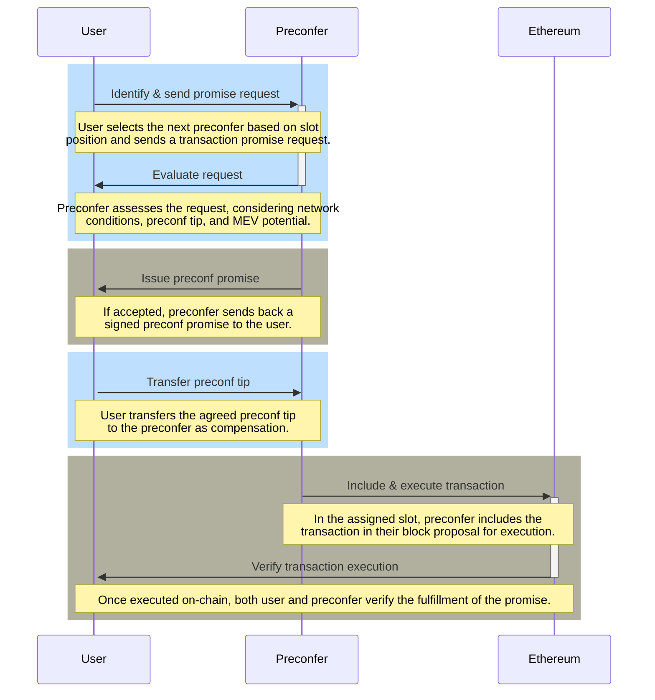

# 基于以太坊的预确认 (Ethereum Based Preconfirmations)

## [概述](#overview) (Overview)

基于以太坊的预确认 (Based preconfirmations, preconfs) 代表了以太坊交易处理 (transaction processing) 的重大进步，为用户提供了快速且可靠的执行。通过结合链上基础设施 (on-chain infrastructure)、提议者问责机制 (proposer accountability mechanisms) 以及灵活的承诺获取流程 (promise acquisition processes)，预确认 (preconfs) 能够显著增强以太坊交互中的用户体验 (user experience)。这项技术不仅降低了交易延迟 (transaction latency)，还为生态系统 (ecosystem) 引入了以前从未有过的安全性和效率[^1]。

## [预确认承诺的构建](#construction-of-preconf-promises) (Construction of Preconf Promises)

预确认承诺 (preconfirmation promises) 或“预确认 (preconfs)”，依赖于两个基础的链上基础设施 (on-chain infrastructure) 组件[^2][^3]：

- **提议者罚没 (Proposer Slashing)**：提议者 (proposers) 可以选择加入额外的罚没条件 (slashing conditions) 以确保可靠性和问责制。这种方法受到 EigenLayer 模型的启发，该模型使用再质押 (restaking) 作为强制执行这些罚没机制的手段。

- **提议者强制纳入 (Proposer Forced Inclusions)**：为了确保交易的无缝执行，提议者 (proposers) 有权授权在链上强制纳入 (inclusion) 特定交易。在提议者-构建者分离 (Proposer-Builder Separation, PBS) 导致自主构建 (self-building) 在经济上不可行的情况下，这一权力至关重要。该机制的实现通常涉及纳入列表 (inclusion lists) 的使用。

当信标链验证者 (Beacon Chain validator) 决定成为一个“预确认者 (preconfer)”时，他们本质上同意遵守与预确认承诺 (preconf promises) 相关的两个不同的罚没条件 (slashing conditions)。为了回报他们的服务，预确认者 (preconfer) 向用户签发签署的承诺，并通过成功履行这些承诺来获得小费 (tips) 补偿。预确认者 (preconfer) 之间的层级关系是根据他们在一个纪元 (epoch) 内的时隙顺序 (slot order) 位置决定的，时隙 (slot) 分配较早的验证者具有优先权。

获得预确认承诺 (preconf promise) 的交易有资格由该承诺签发者（预确认者 (preconfer)）之前的任何提议者 (proposer) 立即在链上纳入和执行。预确认者 (preconfer) 的主要义务是在其指定的时隙 (slot) 内履行所有此类承诺，利用纳入列表 (inclusion list) 来促进这一过程[^3]。

存在两种主要的与承诺相关的故障，每种都具有被罚没 (slashing) 的潜在可能：

1. **活性故障 (Liveness Faults)**：当预确认者 (preconfer) 因为错过了其指定的时隙 (slot) 而未能将承诺的交易纳入链中时，就会发生此类故障。

2. **安全属性故障 (Safety Faults)**：当预确认者 (preconfer) 在没有错过其时隙的情况下，将与做出的承诺直接冲突的交易纳入链中时，就会发生此类故障。

为了确保获得预确认承诺 (preconf promises) 的交易能够获得优先级，为缺乏此类承诺的交易建立了一个特定的执行队列 (execution queue)。这种安排保证了获得预确认的交易会在其他交易之前执行。

预确认者 (preconfer) 并不局限于单一类型的预确认承诺。他们可以提供一系列承诺，从基于特定状态根 (state roots) 的严格执行保证，到更简单的交易纳入 (transaction inclusion) 承诺。这种灵活性允许预确认者满足广泛的用户需求和偏好。

## [预确认的关键要素](#key-elements-of-preconfs) (Key Elements of Preconfs)

在以太坊网络中为交易获取预确认承诺 (preconfirmation promise) 的过程是从与下一个可用的预确认者 (preconfer) 建立连接开始的。这一过程需要一系列关键步骤和因素，包括[^1]：

- **终端节点 (Endpoints)**：预确认者 (preconfer) 可以提供直接的 API 终端节点 (API endpoints) 或利用去中心化的点对点网络 (peer-to-peer networks, p2p) 进行承诺交换，在快速响应时间和广泛可用性之间取得平衡。

- **延迟 (Latency)**：利用直接通信渠道，该过程旨在实现快至 100 毫秒 (milliseconds) 的预确认时间，确保快速的交易处理。

- **启动/引导 (Bootstrapping)**：L1 验证者 (L1 validators) 作为预确认者 (preconfer) 的高参与率至关重要。这确保了在提议者前瞻窗口 (proposer lookahead window) 内，始终有很大的机会遇到准备签发承诺的预确认者 (preconfer)。

- **活性回退 (Liveness Fallback)**：用户可以通过从多个预确认者 (preconfer) 处获取承诺来提高交易的可靠性，从而防止单个预确认者因错过时隙 (slots) 而无法履行承诺。

- **并行化 (Parallelization)**：系统适应各种承诺类型，从执行后状态的严格承诺到更灵活、基于意图的承诺。

- **重放保护 (Replay Protection)**：确保交易免受重放攻击 (replay attacks)，这对于维护预确认交易的完整性和安全性至关重要。

- **单一秘密领导者选举 (Single Secret Leader Election, SSLE)**：该机制允许在前瞻期内机密地识别预确认者 (preconfer)，使他们能够验证自己的状态，而不会过早地透露自己的身份。

- **委托预确认 (Delegated Preconf)**：为受限于有限网络带宽 (network bandwidth) 或处理能力的提议者 (proposers) 提供条款，允许他们委托其预确认职责，以确保承诺的高效处理。

- **公平交易 (Fair Exchange)**：系统解决了用户与预确认者 (preconfer) 之间关于承诺请求和收取预确认小费的公平交易困境。解决方案包括出于透明度目的公开流式传输承诺、由可信中继 (trusted relays) 进行协调，或者使用密码学公平交易协议 (cryptographic fair exchange protocols) 来平衡所有相关方的利益。

- **小费定价 (Tip Pricing)**：预确认小费的协商考虑了交易对提议者提取最大可提取价值 (Maximal Extractable Value, MEV) 能力的潜在影响。通过双方协议或可信中继 (trusted relays) 的协助，用户和预确认者 (preconfer) 可以确定预确认的公平补偿。

- **负小费 (Negative Tips)**：预确认者 (preconfer) 可以接受负小费，以获取能够增强其 MEV 机会的交易，例如影响去中心化交易所价格并创造套利机会的交易。

这些要素中的每一个都在基于预确认的功能和效率中发挥着至关重要的作用，确保以太坊生态系统中交易不仅能够快速处理，而且能够安全、公平地处理。

## [预确认获取流程图](#preconfs-acquisition-process-flow) (Preconfs Acquisition Process Flow)

*图：预确认承诺获取流程图。来源：Justin Drake*

*这里是一个时序图 (sequence diagram)，解释了典型预确认获取流程图中的交互。*

在以太坊的排序和预确认机制中，承诺获取过程是一个关键方面，确保交易能够从提议者或排序器获得预确认或“承诺”。该过程包含几个步骤，每个步骤对于在指定时间范围内确保交易在链上纳入和执行的承诺都是不可或缺的。上图通过一系列交互显示了预确认承诺的获取流程[^2]。以下是获取流程的详细说明：

**1. 用户识别下一个预确认者 (User Identifies Next Preconfer)**

- **起点**：用户或智能合约 (smart contract) 通过在以太坊网络的提议者前瞻窗口 (proposer lookahead window) 内识别下一个可用的预确认者 (preconfer)（已选择加入提供预确认服务的提议者）来启动该过程。

- **选择标准**：选择基于提议者在提议者前瞻窗口中的时隙 (slot) 位置，在此处提议者已通过提交抵押品 (collateral) 声明了其签发预确认的能力和意愿。

**2. 向预确认者发送承诺请求 (Promise Request Sent to Preconfer)**

- **发起**：用户向识别出的预确认者 (preconfer) 发送承诺请求。该请求包含寻求预确认的交易的详细信息，以及任何特定条件或要求。

- **通信渠道**：可以通过预确认者 (preconfer) 建立的各种链下通信渠道发送请求，例如专用的 API 终端节点 (API endpoint) 或点对点消息传递系统。

**3. 预确认者评估请求 (Preconfer Evaluates the Request)**

- **评估**：收到请求后，预确认者 (preconfer) 会根据几个因素对其进行评估，包括当前的网络条件、用户提出的预确认小费金额以及执行该交易的总体风险。

- **决策**：预确认者 (preconfer) 决定接受还是拒绝承诺请求。该决策可能涉及计算潜在的 MEV 并评估该交易是否符合预确认者 (preconfer) 的标准。

**4. 签发预确认承诺 (Issuance of Preconf Promise)**

- **生成承诺**：如果预确认者 (preconfer) 决定接受请求，他们将生成一个签署的预确认承诺。该承诺包括预确认者对确保交易在其即将到来的时隙 (slot) 内按照约定条件纳入和执行的承诺。

- **传达承诺**：然后将预确认承诺传达回用户，为他们提供交易执行的保证。使用的通信方法与初始请求类似，以确保安全且可验证的交付。

**5. 支付预确认小费 (Payment of Preconf Tip)**

- **小费转账**：收到预确认承诺后，用户将约定的预确认小费转账给预确认者 (preconfer)。该小费作为所提供服务的报酬，并激励预确认者 (preconfer) 履行承诺。

- **托管机制 (Escrow Mechanisms)**：在某些实现中，小费可能会保存在托管账户中，直到承诺履行，从而为用户增加了一层额外的安全性。

**6. 交易的纳入与执行 (Inclusion and Execution of Transaction)**

- **链上履行**：预确认者 (preconfer) 在其指定的时隙 (slot) 期间将预确认交易纳入其提议的区块中，并按照预确认承诺中概述的条款执行它。

- **履行验证**：一旦交易在链上被纳入和执行，预确认者 (preconfer) 和用户都可以验证承诺是否已履行，从而完成该过程。

**其他注意事项：**

- **回退机制 (Fallback Mechanisms)**：在发生意外问题或第一名预确认者未纳入交易的情况下，用户可以拥有回退选项，例如并行地向多名预确认者 (preconfer) 请求承诺。

- **纠纷解决 (Dispute Resolution)**：系统可以包含在对承诺是否已得到充分履行存在争议时解决纠纷 (dispute resolution) 的机制。

## 参考文献 (References)
[^1]: https://ethresear.ch/t/based-preconfirmations/17353 
[^2]: https://www.youtube.com/watch?v=2IK136vz-PM
[^3]: https://notes.ethereum.org/@JustinDrake/rJ2eXRcKa
