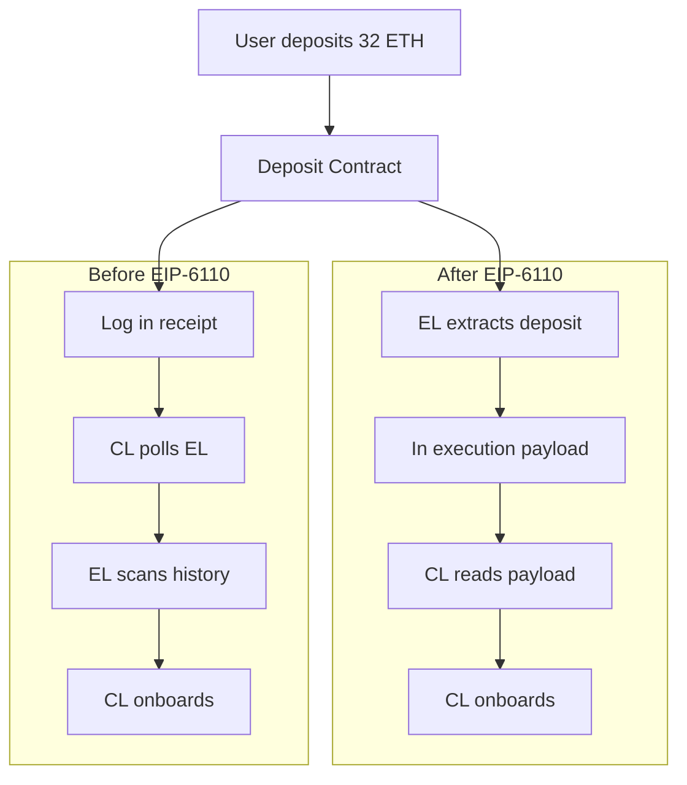
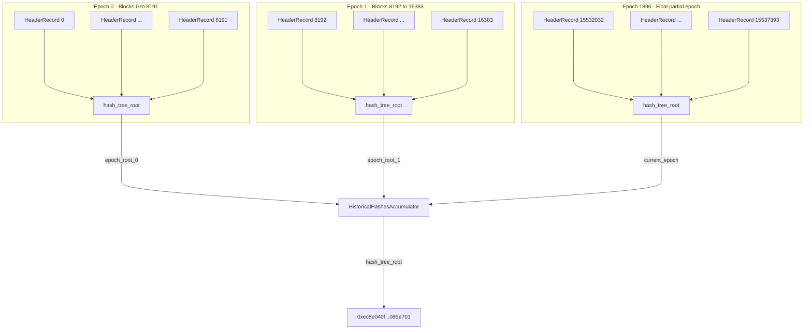

# 以太坊的历史数据过期 (History Expiry In Ethereum)

> **推荐预读 (Recommended pre-reading)**
> - [以太坊节点架构 (Ethereum Node Architecture)](/wiki/EL/el-specs.md)
> - [执行层规范 (Execution Layer Specification)](/wiki/EL/el-specs.md)
> - [DevP2P 协议 (DevP2P protocol)](/wiki/EL/devp2p.md)
> - [数据结构和编码 (Data structures and encoding)](/wiki/EL/data-structures.md)
> - [EIP-4444: 执行客户端中的绑定历史数据 (EIP-4444: Bound Historical Data in Execution Clients)](https://eips.ethereum.org/EIPS/eip-4444)
> - [EIP-7643: 前 PoS 数据的历史累加器 (EIP-7643: History Accumulator for Pre-PoS Data)](https://eips.ethereum.org/EIPS/eip-7643)

历史数据过期 (History expiry) 是指不应要求节点 (nodes) 永久存储历史数据 (historical data)。每个以太坊全节点 (full node) 都存储两类数据。状态 (State) 是当前的账户 (account)、合约存储 (contract storage) 和代码 (code)。历史数据 (History) 是过去的区块头 (block headers)、区块体 (bodies) 和收据 (receipts)。

直到最近，全节点 (full nodes) 还被期望通过点对点网络提供并服务所有的历史数据，即使验证区块时并不需要这些数据。自创世 (genesis) 区块以来，这些数据随着每个区块的产生而增长。如今，运行一个全节点需要超过 1 TB 的磁盘空间，而且即使链的容量保持不变，客户端负载和同步时间也在不断增加。删除这些数据听起来可能有风险，但以太坊的默认同步策略本来就不去验证自创世以来的每一个区块。[快照同步 (Snap sync)](https://ethereum.org/en/developers/docs/nodes-and-clients/#snap-sync) 从最近的状态快照 (snapshot) 开始，而[弱主观性检查点 (weak subjectivity checkpoints)](https://epf.wiki/#/wiki/CL/syncing) 将链锚定在可信的已最终化点上。虽然历史验证 (historical validation) 仍然是可能的，但它不是强制性的。

为了解决这个问题，[EIP-4444](https://eips.ethereum.org/EIPS/eip-4444) 建议节点可以修剪 (prune) 早于设定阈值的历史数据 (historical data) 和收据 (receipts)，并停止在点对点网络上服务它们。一旦客户端同步到链的顶端，历史数据只有在通过 JSON-RPC 显式请求时，或者当同伴 (peer) 尝试同步时才会被检索。为了实现这一点，点对点协议本身需要进行更改。

## DevP2P 的改变 (DevP2P Changes)

在 `eth/68` 和更早的 `eth` 协议下，节点假设每个同伴 (peer) 都存储了自创世以来的完整链。一个修剪了旧历史但仍在 `eth/68` 上宣称自己的节点会破坏该假设，并扰乱请求旧区块的同伴的同步。[EIP-7642](https://eips.ethereum.org/EIPS/eip-7642) 引入了 `eth/69`，它移除了这一假设。在 `eth/69` 之前，当两个节点连接时，它们会交换一条状态消息 (Status message)，其中包含网络 ID、创世哈希、分叉 ID 和该节点最新区块的哈希。但现在的状态握手 (status handshake) 包含了两个新字段：`earliestBlock`（最早区块）和 `latestBlock`（最新区块），用来存储区块范围。

```python
    # Old eth/68 Status
    # [version, networkid, td, blockhash, genesis, forkid]

    # New eth/69 Status
    # Now includes earliestBlock and latestBlockHash.
    # td (totalDifficulty) is removed as it is useless since the merge.
    # [version, networkid, genesis, forkid, earliestBlock, latestBlock, latestBlockHash]

    # BlockRangeUpdate message, sent when a node's range changes.
    # Sent at most once per epoch (32 blocks).
    # [earliestBlock, latestBlock, latestBlockHash]
```

`eth/69` 还添加了一条新消息：BlockRangeUpdate。当一个节点修剪 (prunes) 了更多数据或下载了更多历史时，它会向其连接的同伴发送此消息，以便同伴更新其对该节点可以服务的区块的视图。这每个纪元 (epoch) 只需要发送一次。

`eth/69` 的线性范围适用于第一阶段 (Phase 1)，在该阶段节点要么持有 Merge（合并）前（旧 PoW 链）的数据，要么不持有。对于第二阶段 (Phase 2)，节点可能持有不连续的历史分片，类似于 [EIP-7801](https://eips.ethereum.org/EIPS/eip-7801) 的提案，它引入了一个基于位掩码 (bitmask) 的子协议 (subprotocol)，称为 `etha`，允许节点精确宣传它们存储了链的哪些片段。虽然 eth 协议继续处理实时链操作，如区块传播 (block propagation)、交易流言 (transaction gossip) 和同步到顶端，但 `etha` 子协议完全专用于服务历史数据 (historical data)。这意味着历史区块请求将不再与实时链使用相同的通道传输，因此寻找旧区块的节点会在 etha 上查询同伴，而不支持历史分片 (history sharding) 的节点将再也不会被这些请求打扰。

`etha` 的核心思想是将链历史划分为 1,064,960 个区块的重复窗口 (repeat windows)。每个窗口被分成 10 个等长的跨度 (spans)，每个跨度为 106,496 个区块。位掩码 (bitmask) 中的每一位代表其中一个跨度。如果一个节点设置了第 3 位，该节点就承诺持有每 10 个跨度中的第 3 个，不仅在单个片段中，而是整条链自区块 0 到 1,064,960，以及从区块 1,064,960 到 2,129,920，以此类推，一直延伸到链头。随着新区块的产出和新跨度的创建，该节点必须继续存储与其承诺位对应的跨度。

**窗口 (Window)：区块 0 — 1,064,960**

|              | 跨度 0 (Span 0) | 跨度 1 (Span 1) | 跨度 2 (Span 2) | 跨度 3 (Span 3) | 跨度 4 (Span 4) | 跨度 5 (Span 5) | 跨度 6 (Span 6) | 跨度 7 (Span 7) | 跨度 8 (Span 8) | 跨度 9 (Span 9) |
|--------------|--------|--------|--------|--------|--------|--------|--------|--------|--------|--------|
| 节点 A (Node A) |   X    |        |        |        |        |        |        |        |        |        |
| 节点 B (Node B) |        |        |        |   X    |        |        |        |        |        |        |
| 节点 C (Node C) |        |        |        |        |        |        |        |   X    |        |        |
| 节点 D (Node D) |        |   X    |        |        |        |        |        |        |        |        |
| 节点 E (Node E) |        |        |        |        |        |   X    |        |        |        |        |
| 节点 F (Node F) |        |        |        |        |        |        |        |        |        |   X    |

106,496 的跨度大小并非是随意的。每个跨度都是 8,192 个区块的倍数，这也是 ERA1 文件的最大区块范围。这使得节点的存储和检索与数据的打包分发直接对齐，并使回填分片 (shard) 变得简单。最低要求是每个参与节点至少保留一位，这相当于总链历史的约 10%，与持有全部历史相比减少了 90% 的存储空间。同步节点能否找到特定分片取决于其有多少个同伴持有该分片。没有任何同伴持有给定分片的概率模型为 $(0.9)^n$，其中 $n$ 是连接的同伴数量。在拥有 25 个同伴的情况下，分片缺失的概率约为 7%，而在拥有 32 个同伴时，这一概率降至约 3.4%。

| 连接同伴数量 (Number of Connected Peers, $n$) | 没有同伴持有给定分片的概率 (Probability No Peer Holds a Given Shard, $P = (0.9)^n$) | 至少有一个同伴持有它的概率 (Probability At Least One Peer Holds It, $1 - (0.9)^n$) |
|---------------------------------|-------------------------------------------------------|-------------------------------------------------------|
| 10                              | 34.9%                                                 | 65.1%                                                 |
| 15                              | 20.6%                                                 | 79.4%                                                 |
| 20                              | 12.2%                                                 | 87.8%                                                 |
| 25                              | 7.2%                                                  | 92.8%                                                 |
| 32                              | 3.4%                                                  | 96.6%                                                 |
| 50                              | 0.5%                                                  | 99.5%                                                 |

当两个节点通过 etha 连接时，它们会交换一个包含与 eth/69 相同字段以及 `blockBitmask` 的握手 (handshake)。从那时起，节点就可以使用直接复用自 eth/69 且具有相同编码的四条消息来服务历史数据，例如 `GetBlockBodies`、`BlockBodies`、`GetReceipts` 和 `Receipts`。这使得数据检索流程保持一致，且不需要新的消息类型。

```python
    # eth/69 Status Handshake
    # [version, networkid, genesis, forkid, earliestBlock, latestBlock, latestBlockHash]

    # etha Handshake (EIP-7801)
    # Same fields as eth/69, plus a 10-bit blockBitmask
    # [version, networkid, genesis, forkid, blockhash, blockBitmask]

    # etha reuses these four messages from eth/69 with identical encoding
    # GetBlockBodies  (0x05)
    # BlockBodies     (0x06)
    # GetReceipts     (0x0f)
    # Receipts        (0x10)
```

## 存款日志依赖 (Deposit Log Dependency)

历史数据过期 (History expiry) 不仅影响执行层，还会对共识层 (consensus layer) 产生直接影响。在 [Pectra 硬分叉 (Pectra hardfork)](https://eips.ethereum.org/EIPS/eip-7600) 之前，当有人存入 32 ETH 成为验证者 (validator) 时，该交易会发送到执行层上的存款合约 (deposit contract)，然后触发 `DepositEvent` 日志，其中包含验证者的公钥 (public key)、取款凭证 (withdrawal credentials)、存款金额、签名 (signature) 和索引 (index)。共识层需要这些信息来让验证者入网。

```python
    # From github.com/ethereum/consensus-specs
    # event DepositEvent(
    #     bytes pubkey,                  # The validator's public key
    #     bytes withdrawal_credentials,  # Address to receive the validator's balance when it exits
    #     bytes amount,                  # How much ETH was deposited
    #     bytes signature,               # Validator's signature
    #     bytes index                    # Index tracks the number of deposits
    # )
```

共识层客户端通过名为 Eth1Data 轮询的机制获取此数据。每个信标区块都包含一个 `eth1_data` 字段，区块提议者 (block proposer) 在其中对存款合约的最近状态进行投票。为了能够投票，提议者的共识客户端会通过 JSON-RPC 查询执行客户端，要求其读取历史执行层区块中的存款合约日志。执行客户端将向后扫描旧区块以找到相关的存款事件，而这正是历史数据过期打破常规的地方。



这些存款日志存在于历史区块中，如果执行客户端节点修剪了其历史数据，共识客户端将无法再读取它所依赖的存款日志。`Eth1Data` 轮询机制将会失败，因为其轮询的数据在节点上已不复存在。

除了历史数据过期问题外，`Eth1Data` 轮询流程也非常脆弱。共识客户端依赖于对执行客户端的 JSON-RPC 调用 (JSON-RPC calls)，而不同执行客户端实现之间的一致性差异会导致故障。区块提议者 (Block proposers) 需要维护和分发存款合约快照才能参与。从存款交易在执行层落地到共识层处理它之间存在大约 12 小时的延迟。而且，提议者就其认为的存款合约状态进行投票的整个机制，引入了直接读取所不会具有的攻击面。

现在，为了解决上述所有问题，[EIP-6110](https://eips.ethereum.org/EIPS/eip-6110) 建议将存款处理作为每个区块中从执行层发送到共识层的执行有效载荷 (execution payload) 的一部分。因此，当区块中包含存款交易时，执行客户端会立即从该区块的收据中解析 `DepositEvent` 日志，将它们打包到 `deposit_requests` 列表中，并将其包含在执行有效载荷中。这彻底消除了 `Eth1Data` 投票机制，并完全移除了共识层对历史执行层数据的依赖。EIP-6110 作为 [Pectra 升级 (Pectra upgrade)](https://eips.ethereum.org/EIPS/eip-7600) 的一部分发布，清除了这一依赖。

## ERA 文件 (ERA Files)

一旦节点停止服务旧历史，该数据仍然需要能够在某个地方被检索到。ERA 文件 (ERA files) 是包含已最终化历史区块的扁平文件存档 (flat-file archives)。它们构建在 [e2store](https://github.com/status-im/nimbus-eth2/blob/stable/docs/e2store.md) 之上，e2store 是一种专为以太坊数据的长期冷存储而设计的类型-长度-值 (Type-Length-Value) 文件格式。e2store 文件中的每个条目都有一个 8 字节的头部，后面跟着数据本身。头部被划分为：

- 2 字节用于类型 (type)
- 4 字节用于长度 (length)
- 2 字节保留 (reserved)

存在几种 [e2store 格式 (e2store formats)](https://github.com/eth-clients/e2store-format-specs)，每种都涵盖了其自身的数据分片。ERA1 文件存储了合并前的执行层历史。每个 ERA1 文件都打包了 8,192 个区块的头部 (headers)、区块体 (bodies)、收据 (receipts) 和总难度 (total difficulty) 值，全部经过 Snappy 压缩 (Snappy-compressed)。ERA 文件存储了合并后的信标链历史 (beacon chain history)，包括信标区块和状态，同样以 8,192 个时隙 (slots) 为一批（~27 小时的链上时间）。E2HS 文件覆盖了自创世到最新完整的执行层历史，其头部附带有规范性证明。仍在开发中的 Erb 文件是 Blob 旁支 (blob sidecars) 的等价物。E2SS 文件存储了执行状态 (state) 快照。

```python
    # e2store entry layout
    # [type: 2 bytes | length: 4 bytes | reserved: 2 bytes | data: length bytes]

    # ERA1 file structure
    # era1 := Version | block-tuple* | other-entries* | Accumulator | BlockIndex
    # block-tuple := CompressedHeader | CompressedBody | CompressedReceipts | TotalDifficulty
```

8,192 区块的批次大小来自于 [EIP-7643](https://eips.ethereum.org/EIPS/eip-7643) 中定义的累加器 (accumulator) 大小限制。每个 ERA1 文件都包含一个累加器，它是多达 8,192 个头部记录 (header records) 的 SSZ 哈希树根 (SSZ hash tree root)。头部记录是一对区块哈希 (block hash) 和总难度 (total difficulty)。累加器作为对文件内容的密码学承诺。

```python
    # Header record used in the accumulator
    # header_record = { block_hash: Bytes32, total_difficulty: Uint256 }

    # Accumulator is the hash tree root of up to 8192 header records
    # accumulator = hash_tree_root(List[header_record], max_length=8192)
```

任何下载 ERA1 文件的人都可以从其中的区块头重建纪元累加器，并将结果与已知的累加器根进行对比。EIP-7643 中定义了全套的合并前累加器根，并且区块 15,537,394（合并区块）之前所有数据的整个 `HistoricalHashesAccumulator` 的哈希树根是一个单一的固定值，这使其具有无信任性。

### 累加器验证 (Accumulator Verification)

累加器与三种数据结构配合使用。

```python
    EPOCH_SIZE = 8192  # blocks per ERA1 file
    MAX_HISTORICAL_EPOCHS = 2048  # upper bound on pre-merge epochs

    # A record for a single block
    # HeaderRecord = Container[
    #     block_hash: bytes32,
    #     total_difficulty: uint256
    # ]

    # All header records within a single 8192-block epoch
    # EpochRecord = List[HeaderRecord, max_length=EPOCH_SIZE]

    # The top-level accumulator
    # HistoricalHashesAccumulator = Container[
    #     historical_epochs: List[bytes32, max_length=MAX_HISTORICAL_EPOCHS],
    #     current_epoch: EpochRecord
    # ]
```

`HeaderRecord` 将区块哈希与其在该高度的总难度配对。`EpochRecord` 收集了多达 8,192 个此类记录。`HistoricalHashesAccumulator` 存储了 `historical_epochs` 中所有已完成纪元的默克尔根，以及 `current_epoch` 中留存的任何部分纪元。

例如，如果您以主网上的前三个区块为例，每个区块都会生成一个 `HeaderRecord`。

```python
    # Block 0 (genesis)
    # header_record_0 = { block_hash: 0xd4e5..c520, total_difficulty: 17_179_869_184 }

    # Block 1
    # header_record_1 = { block_hash: 0x88e9..4c2d, total_difficulty: 34_359_738_368 }

    # Block 2
    # header_record_2 = { block_hash: 0xb495..cd62, total_difficulty: 51_539_607_552 }

    # ... continue for all 8192 blocks in epoch 0
```

一旦收集了纪元 0 的所有头部记录，就会通过 SSZ 默克尔树哈希来计算纪元根。它提取 8,192 个 `HeaderRecords` 列表，将每个记录序列化为 SSZ（作为 bytes32 的 block_hash + 作为 uint256 的 total_difficulty，使得每个记录为 64 字节），然后在叶节点上构建二叉默克尔树。每对叶节点都使用 SHA256 哈希到一起，然后每对中间节点再次进行哈希，直到根节点。由于列表的最大长度为 8,192，因此该树始终填充为 8,192 个叶节点（$\log_2(8192) = 13$ 层深）。最后的“混合长度”步骤将树根与实际列表长度进行哈希，以产生纪元根。

```python
    # epoch_root_0 = hash_tree_root([header_record_0, header_record_1, ..., header_record_8191])
    # epoch_root_0 = 0x5ec1ffb8c3b146f42606c74ced973dc16ec5a107c0345858c343fc94780b4218
```

刚刚计算出的根是 `historical_epochs` 列表中的第一个条目。对于整个合并前链上的每个区块批次，该过程都会重复。



合并发生在区块 15,537,394。这意味着有 1,896 个完整纪元 (epochs)（$1,896 \times 8,192 = 15,531,008$ 区块），加上最后的 6,386 个区块的部分纪元 ($15,537,394 - 15,531,008$)。完成的纪元以 1,896 个根的列表形式存入 `historical_epochs`。最后的 6,386 个头部记录存入 `current_epoch`。整个 `HistoricalHashesAccumulator` 的 `hash_tree_root` 生成一个硬编码到客户端中的单一固定值。它永远不会改变，因为合并前链是冻结的。

```python
    # Final pre-merge accumulator root (from EIP-7643)
    # 0xec8e040fd6c557b41ca8ddd38f7e9d58a9281918dc92bdb72342a38fb085e701
```

当节点下载 ERA1 文件时，验证分为四个步骤：从文件中提取所有的区块头；为每个区块构建一个 `HeaderRecord`；在记录上计算 `hash_tree_root`；将结果与 EIP-7643 发布表中的已知纪元根进行对比。如果根匹配，则该文件是规范的。如果它们不匹配，则说明文件已损坏或被篡改，应予以拒绝。

### 纳入证明 (Proof of Inclusion)

累加器还为单个区块启用了紧凑的默克尔证明 (Merkle proofs)。在 EIP-7643 之前，证明特定区块是规范的证明需要沿着整个父哈希链向后遍历，这需要 $O(n)$ 的时间复杂度。有了累加器，从叶节点（特定的 `HeaderRecord`）到纪元根的默克尔证明仅需 $O(\log n)$ 的时间，特别是对于纪元内的任何区块，只需要 $O(\log_2 8192) = 13$ 次哈希。为了针对完整的累加器根进行证明，您只需添加从纪元根到 `HistoricalHashesAccumulator` 根的另外一个证明步骤。

以区块 500,000 为例：

$$\text{epoch} = \left\lfloor \frac{500{,}000}{8{,}192} \right\rfloor = 61$$

$$\text{position within epoch} = 500{,}000 \mod 8{,}192 = 888$$

从索引 888 处的 `HeaderRecord` 到 `epoch_root_61` 的默克尔证明需要：

$$\log_2(8192) = 13 \text{ 兄弟节点哈希 (sibling hashes)}$$

从 `epoch_root_61` 到完整累加器根的默克尔证明需要：

$$\log_2(2048) = 11 \text{ 兄弟节点哈希 (sibling hashes)}$$

总证明大小为：

$$13 + 11 = 24 \text{ 次哈希 (hashes)} \times 32 \text{ 字节 (bytes)} = 768 \text{ 字节 (bytes)}$$

用以证明任何合并前区块是规范的。

这正是[门户网络 (Portal Network)](https://www.ethportal.net/) 所设计使用的验证机制。当节点从网络中请求历史区块时，响应将包括区块数据，外加针对累加器的默克尔证明 (Merkle proof)。

### 分发 (Distribution)

ERA1 文件遵循 `<network>-<epoch>-<hexroot>.era1` 的命名约定，例如主网前 8,192 个区块的文件名为 `mainnet-00000-5ec1ffb8.era1`。16 进制部分是截断的累加器根，因此文件名本身就是快速完整性检查。文件末尾的 BlockIndex 存储了每个区块元组的相对偏移量，从而使得无需扫描整个文件就可以通过区块号进行随机访问。

[eth-clients/history-endpoints](https://github.com/eth-clients/history-endpoints) 注册表维护了一个通过 HTTP 和种子服务提供 ERA1 和 ERA 文件的社区提供商列表。像 [ethPandaOps](https://ethpandaops.io/data/history/) 这样的提供商托管了完整的主网 ERA1 文件集，并带有用于验证的 SHA256 校验和。文件也可以通过 [BitTorrent 种子](magnet:?xt=urn:btih:edcc7c112bae520e3226065a61817d3575904e0d&dn=EthereumMainnetPreMergeEraFiles&xl=458498121702&tr=udp%3A%2F%2Ftracker.opentrackr.org%3A1337%2Fannounce&tr=udp%3A%2F%2Fopen.tracker.cl%3A1337%2Fannounce&tr=udp%3A%2F%2Fbt1.archive.org%3A6969%2Fannounce)进行共享。我们的目标是不需要依赖单一的提供商，并且可以通过多个独立的渠道来获取数据。

客户端支持已经到位。[Geth](https://geth.ethereum.org/docs/fundamentals/downloadera)、[Nimbus](https://nimbus.guide/era-store.html)、[Besu](https://besu.hyperledger.org/public-networks/how-to/era1-file-full-sync) 和 [Reth](https://reth.rs/docs/reth_era/index.html) 都支持 ERA1 导入。每个 106,496 区块的 etha 跨度恰好是 13 个 ERA1 文件 ($13 \times 8,192 = 106,496$)，因此 etha 下节点的存储边界直接映射到完整的 ERA1 文件。

## 门户网络 (Portal Network)

ERA 文件解决了存档问题，但它们是静态的。一个需要单个旧区块的节点不应该为了获得它而必须下载整个 8,192 区块的文件。[门户网络 (Portal Network)](https://www.ethportal.net/) 提供了按需检索层。它是一个轻量级的点对点网络，其中每个参与节点存储以太坊数据的一小片并在被请求时提供它。与现有的每个全节点都需要持有所有内容的 DevP2P 网络不同，门户网络旨在让每个加入的节点都增加容量，而不是消耗容量。

门户网络运行在 UDP 上的 [Discovery v5](https://github.com/ethereum/devp2p/blob/master/discv5/discv5.md) 之上，并被划分为用于历史、信标链数据和状态的独立子网络。每个子网络形成其自身的覆盖式 DHT (overlay DHT)。数据通过从全节点拉取 JSON-RPC 并推送到相应子网络的桥接节点 (bridge nodes) 进入。每条数据都由一个内容键 (content key) 标识，每个节点根据其到该键的 XOR 距离 (XOR distance) 来存储内容，这受控于自我声明半径 (self-declared radius)。检索使用针对合并前数据的累加器证明和针对合并后数据的信标链 `historical_summaries` 进行验证。

然而，门户网络的开发在很大程度上已经停滞，它目前并不是历史数据过期路线图中的活跃部分。虽然存在四种客户端实现（[Trin](https://github.com/ethereum/trin)、[Fluffy](https://github.com/status-im/nimbus-eth1/tree/master/fluffy)、[Ultralight](https://github.com/ethereumjs/ultralight)、[Shisui](https://github.com/optimism-java/shisui)），但目前的主动开发工作已显著放缓。

## 当前状态 (Current Status)

随着 EIP-6110 作为 Pectra 升级的一部分发布，历史数据过期的第一阶段 (Phase 1) 已经在进行中。第一阶段针对的是合并前 (PoW) 历史，这占了大多数节点存储数据的大部分。第二阶段涵盖了通过 etha (EIP-7801) 进行非连续分片的合并后历史，目前仍在活跃开发中。

## 资源 (Resources)

- [EIP-4444: Bound Historical Data in Execution Clients](https://eips.ethereum.org/EIPS/eip-4444), [archived](https://web.archive.org/web/20240601000000*/https://eips.ethereum.org/EIPS/eip-4444)
- [EIP-6110: Supply validator deposits on chain](https://eips.ethereum.org/EIPS/eip-6110), [archived](https://web.archive.org/web/20240601000000*/https://eips.ethereum.org/EIPS/eip-6110)
- [EIP-7642: eth/69 - history expiry and simpler receipts](https://eips.ethereum.org/EIPS/eip-7642), [archived](https://web.archive.org/web/20240601000000*/https://eips.ethereum.org/EIPS/eip-7642)
- [EIP-7643: History accumulator for pre-PoS data](https://eips.ethereum.org/EIPS/eip-7643), [archived](https://web.archive.org/web/20240601000000*/https://eips.ethereum.org/EIPS/eip-7643)
- [EIP-7801: etha - Sharded Blocks Subprotocol](https://eips.ethereum.org/EIPS/eip-7801), [archived](https://web.archive.org/web/20240601000000*/https://eips.ethereum.org/EIPS/eip-7801)
- [e2store format specifications](https://github.com/eth-clients/e2store-format-specs)
- [ERA1 format specification](https://github.com/eth-clients/e2store-format-specs/blob/main/formats/era1.md)
- [Ethereum historical data endpoints](https://github.com/eth-clients/history-endpoints)
- [Portal Network specifications](https://github.com/ethereum/portal-network-specs)
- [Portal Network design requirements](https://blog.ethportal.net/posts/design-requirements-for-portal-network)
- [Portal Network FAQ](https://notes.ethereum.org/@Kolby-ML/HJ-9D5aYp)
- [ethPandaOps ERA1 data](https://ethpandaops.io/data/history/)
- [Nimbus ERA store guide](https://nimbus.guide/era-store.html)
- [Geth ERA download guide](https://geth.ethereum.org/docs/fundamentals/downloadera)
- [Besu ERA1 import guide](https://besu.hyperledger.org/public-networks/how-to/era1-file-full-sync)
- [The Portal Network on ethereum.org](https://ethereum.org/developers/docs/networking-layer/portal-network/)